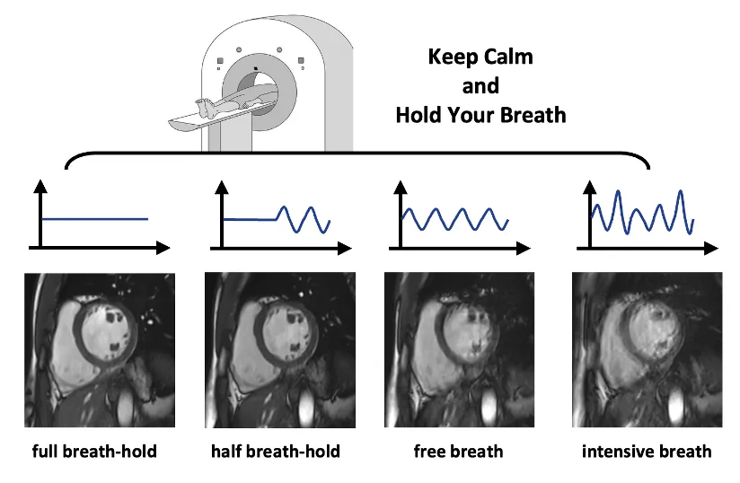
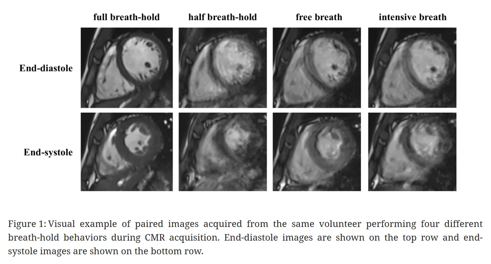
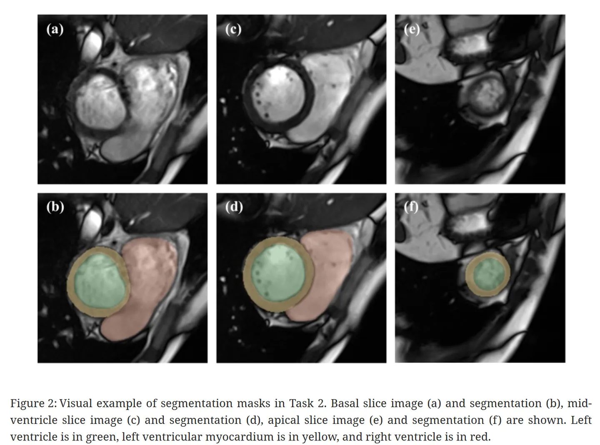
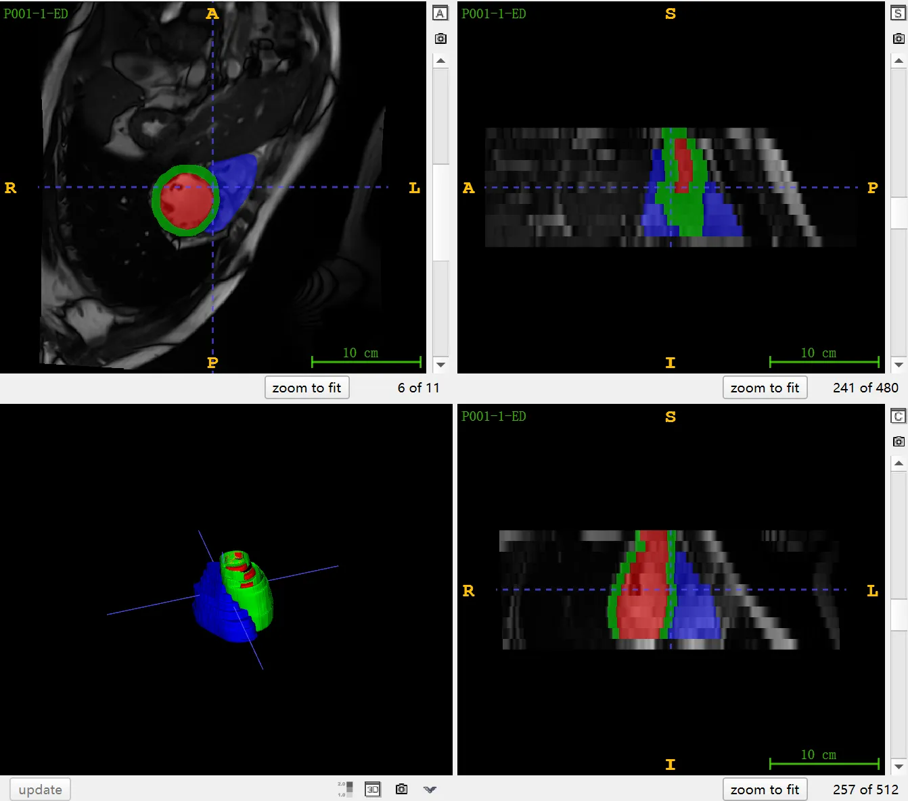

# CMRxMotion

<div align="center">
    <a href="https://github.com/openmedlab/"></a>
</div>
<p style="text-align:center;font-size:10px;"><em></em></p>

## Dataset Information

**CMRxMotion** (Extreme Cardiac MRI Analysis Challenge under Respiratory Motion) is one of the challenges at MICCAI 2022, aimed at exploring cardiac MRI analysis under extreme conditions of respiratory motion. It includes two tasks: 1) image quality assessment and 2) segmentation. The challenge consists of a training set with 160 cases (20 volunteers x 4 scans x 2 frames), a validation set with 40 cases (5 volunteers x 4 scans x 2 frames), and a test set with 160 cases (20 volunteers x 4 scans x 2 frames), all collected from the same MRI scanner (Siemens 3T MRI scanner MAGNETOM Vida). Volunteers were trained to behave in 4 different ways: a) follow breath-holding instructions; b) halve the breath-holding time; c) breathe freely; and d) breathe intensively. Each volunteer underwent imaging at these four different levels of respiratory motion to acquire multiple sets of CMR images. Radiologists first assess the image quality, **selecting those that meet diagnostic standards**, and then perform precise segmentation of the left ventricle, left ventricular myocardium, and right ventricle on images of diagnostic quality.

Cardiac Magnetic Resonance (CMR) imaging, as the current gold standard for evaluating cardiac structure and function, its image quality is crucial. However, models still face challenges from machine variability, patient diversity, and irregular body movement in actual clinical applications. In CMR image processing, respiratory motion interference is particularly prominent. Patients with heart failure or children often have difficulty following breath-holding instructions, leading to a significant decline in image quality, which affects the accuracy of analysis results. Therefore, the CMRxMotion challenge aims to establish a public dataset, evaluate the impact of respiratory motion on image quality, and test the robustness of segmentation models in handling such interference.

## Dataset Meta Information

| Dimensions | Modality | Task Type | Anatomical Structures          | Anatomical Area | Number of Categories | Data Volume | File Format |
|------------|----------|-----------|--------------------------------|-----------------|----------------------|-------------|-------------|
| 3D         | MR       | Segmentation | Left and right ventricles, myocardium | Heart           | 3                    | 360         | .nii.gz     |


### Resolution Details

| Dataset Statistics | spacing (mm)     | size            |
|--------------------|------------------|-----------------|
| min                | (0.66, 0.66, 9.6)              | (400, 416, 9)     |
| median             | (0.66, 0.66, 10.0)           | (432, 512, 11) |
| max                | (0.76, 0.76, 10.0)              | (512, 512, 13) |

Number of two-dimensional slices of training data: 1501 (statistics of 139 cases of data provided with annotation)

## Label Information Statistics

It is worth noting that out of the 160 cases in the training set, only 139 cases come with annotations. The unannotated data could not be labeled due to poor image quality.

| Anatomical Structure    | Left Ventricle (LV) | Myocardium (Myo) | Right Ventricle (RV) |
|-------------------------|---------------------------|----------------------|----------------------------|
| Number of Cases         | 139                       | 139                  | 139                        |
| Percentage              | 100%                      | 100%                 | 100%                       |
| Minimum Volume (cm³)    | 34                        | 54                   | 44                         |
| Median Volume (cm³)     | 107                       | 92                   | 121                        |
| Maximum Volume (cm³)    | 222                       | 167                  | 257                        |


## Visualization

<div align="center">
    <a href="https://github.com/openmedlab/"></a>
</div>
<p style="text-align:center;font-size:10px;"><em> Official website visualization. Comparison of cardiac MR image quality in four respiratory modes.</em></p>

<div align="center">
    <a href="https://github.com/openmedlab/"></a>
</div>
<p style="text-align:center;font-size:10px;"><em> Official arxiv paper visualization. The first row shows end-diastolic images of the heart in four different breathing modes. The second row shows end-systolic images of the heart in four different breathing modes.</em></p>

<div align="center">
    <a href="https://github.com/openmedlab/"></a>
</div>
<p style="text-align:center;font-size:10px;"><em> Official arxiv paper visualization. The left ventricle is marked in green, the left myocardium in yellow, and the right ventricle in red.</em></p>


<div align="center">
    <a href="https://github.com/openmedlab/"></a>
</div>
<p style="text-align:center;font-size:10px;"><em> ITK-SNAP Visualization.</em></p>

## File Structure

The structure of the CMRxMotions dataset includes two parts: the training set and the validation set. Each case is named using a specific convention, formatted as "Pxxx-x-ED(ES).nii.gz." Here, the number sequence following the "P" represents the patient's sequence number, and the second number "x" represents the image acquired under different breathing patterns. "ED" and "ES" respectively indicate images of the end-diastolic and end-systolic frames of the heart. This naming convention not only facilitates the organization and retrieval of data but also clearly indicates the specific content of each file.

``` 
CMRxMotion
│
├── CMRxMotion Training Dataset
│   ├── data
│   │   ├── P001-1
│   │   │   ├── P001-1-ED.nii.gz
│   │   │   ├── P001-1-ED-label.nii.gz
│   │   │   ├── P001-1-ES.nii.gz
│   │   │   └── P001-1-ES-label.nii.gz
│   │   ├── P001-2
│   │   │   ├── P001-2-ED.nii.gz
│   │   │   ├── P001-2-ED-label.nii.gz
│   │   │   ├── P001-2-ES.nii.gz
│   │   │   └── P001-2-ES-label.nii.gz
│   │   ├── ...
│   │   └── P00X-X
│   └── IQA.csv
│
└── CMRxMotion_validation
    ├── P022-1
    ├── P022-2
    ├── ...
    └── P0XX-X
```

## Authors and Institutions

Shuo Wang (Digital Medical Research Center, School of Basic Medical Sciences, Fudan University, China)

Xinrong Chen (Digital Medical Research Center, School of Basic Medical Sciences, Fudan University, China)

Kang Wang (Digital Medical Research Center, School of Basic Medical Sciences, Fudan University, China)

Haoran Wang (Digital Medical Research Center, School of Basic Medical Sciences, Fudan University, China)

Chengyan Wang (Human Phenome Institute, Fudan University, China)

Xutong Kuang (Human Phenome Institute, Fudan University, China)

He Wang (Institute of Brain-Inspired Intelligence Science and Technology, Fudan University, China)

Chen Qin (School of Engineering, University of Edinburgh, UK)

Wenjia Bai (Department of Computing, Imperial College London, UK)

Chen Chen (Department of Computing, Imperial College London, UK)

Chengliang Dai (Department of Computing, Imperial College London, UK)

Cheng Ouyang (Department of Computing, Imperial College London, UK)

Yuanhan Mo (School of Engineering, University of Oxford, UK)

Zhang Shi (Department of Radiology, Zhongshan Hospital, Fudan University, China)

Chenchen Dai (Department of Radiology, Zhongshan Hospital, Fudan University, China)


## Source Information

Official Website: http://cmr.miccai.cloud/, https://www.synapse.org/#!Synapse:syn28503327/wiki/617823

Download Link: https://www.synapse.org/#!Synapse:syn28503327/files/

Article Address: https://arxiv.org/abs/2210.06385

Publication Date: 2022-05

## Citation

``` 
@misc{wang2022extreme,
      title={The Extreme Cardiac MRI Analysis Challenge under Respiratory Motion (CMRxMotion)}, 
      author={Shuo Wang and Chen Qin and Chengyan Wang and Kang Wang and Haoran Wang and Chen Chen and Cheng Ouyang and Xutong Kuang and Chengliang Dai and Yuanhan Mo and Zhang Shi and Chenchen Dai and Xinrong Chen and He Wang and Wenjia Bai},
      year={2022},
      eprint={2210.06385},
      archivePrefix={arXiv},
      primaryClass={eess.IV}
} 
```

Original introduction article is [here](https://zhuanlan.zhihu.com/p/669423857).