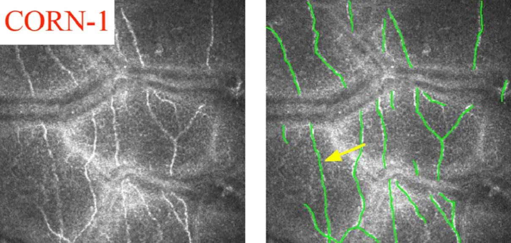

# CORN

<div align="center">
    <a href="https://github.com/openmedlab/"></a>
</div>
<p style="text-align:center;font-size:10px;"><em></em></p>

## Dataset Information

CORN (**COR**neal **N**erve Database) is a corneal nerve dataset comprising three subsets (CORN-1, CORN-2, and CORN-3), each designated for corneal nerve segmentation, image enhancement, and nerve tortuosity grading. This document first introduces the CORN-1 segmentation dataset. CORN-1 contains a total of 1,698 CCM (Corneal Confocal Microscopy) images of corneal basal epithelial cells captured using the Heidelberg Retina Tomograph equipped with the Rostock Cornea Module (HRT-III) microscope. These images were collected by Peking University Third Hospital in China and the University of Padua in Italy. Each image has a resolution of 384 × 384 pixels, covering a field of view (FOV) of 400 × 400 square micrometers. Manual annotations of the nerve fibers (central lines) in both datasets were completed by an ophthalmologist using the open-source software ImageJ.

CCM (Corneal Confocal Microscopy) is an advanced microscopy technique used to clearly display corneal cells, nerves, and microstructures. Changes in corneal nerves often indicate early signs of various diseases, such as diabetic neuropathy, dry eye syndrome, corneal infections, and other neurodegenerative diseases. Accurate segmentation of corneal nerves in CCM images is not only crucial for diagnosis but also essential for evaluating treatment outcomes. This technique allows doctors to closely monitor changes in corneal nerves at different stages of disease, including before and after treatment.

## Dataset Meta Information

| Dimensions | Modality | Task Type    | Anatomical Structures | Anatomical Area | Number of Categories | Data Volume | File Format |
|------------|----------|--------------|-----------------------|-----------------|----------------------|-------------|-------------|
| 2D         | CCM      | Segmentation | Corneal Nerve         | Eye             | 1                    | 1698        | .tif        |


### Resolution Details

Images are all 384×384.

## Label Information Statistics

| Category            | Retinal Vessel |
|---------------------|----------------|
| Number of Images    | 1680           |
| Coverage Rate       | 98.9%          |
| Minimum Pixel Count | 6              |
| Medium Pixel Count  | 2064          |
| Maximum Pixel Count | 4874          |

## Visualization

<div align="center">
    <a href="https://github.com/openmedlab/"></a>
</div>
<p style="text-align:center;font-size:10px;"><em> Paper Visualization. Image and Annotation.</em></p>

<div align="center">
    <a href="https://github.com/openmedlab/"></a>
</div>
<p style="text-align:center;font-size:10px;"><em> Local Visualization. Image and Annotation.</em></p>

## File Structure

The file structure of the CORN-1 dataset is as follows. The `Nerve_Segmentation` folder contains all the nerve segmentation data. Within the `Corneal nerve segmentation` subfolder, data is further divided into three parts: `test`, `training`, and `val`, which include collections of images for testing, training, and validation, as well as their respective annotations (mask). Additionally, the `Padova` folder contains datasets related to the University of Padua, which include both the original images and their annotated data.

``` 
CORN
├── Nerve_Segmentation
│   ├── Corneal nerve segmentation
│   │   ├── test
│   │   │   ├── test_images
│   │   │   └── test_mask
│   │   ├── training
│   │   │   ├── train_images
│   │   │   └── train_mask
│   │   └── val
│   │       ├── val_images
│   │       └── val_mask
│   └── Padova
│       ├── BioImLab corneal nerve images
│       ├── BioImLab corneal nerve images Ann
│       ├── BioImLab Corneal Nerve Tortuosity
│       └── BioImLab Corneal Nerve Tortuosity Ann
```

## Authors and Institutions

Yitian Zhao (Ningbo Industrial Research Institute Medical and Ophthalmic Imaging Team)


## Source Information

Official Website: https://imed.nimte.ac.cn/CORN.html

Download Link: https://imed.nimte.ac.cn/CORN.html

Article Address: https://www.sciencedirect.com/science/article/pii/S1361841520302383

Publication Date: 2019

## Citation

``` 
@inproceedings{mou2019cs,
title={CS-Net: channel and spatial attention network for curvilinear structure segmentation},
author={Mou, Lei and Zhao, Yitian and Chen, Li and Cheng, Jun and Gu, Zaiwang and Hao, Huaying and Qi, Hong and Zheng, Yalin and Frangi, Alejandro and Liu, Jiang},
booktitle={International Conference on Medical Image Computing and Computer-Assisted Intervention},
pages={721--730},
year={2019},
organization={Springer}
}
```

Original introduction article is [here](https://zhuanlan.zhihu.com/p/670025291).