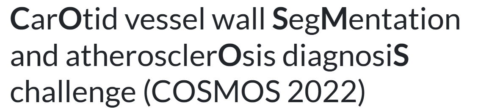
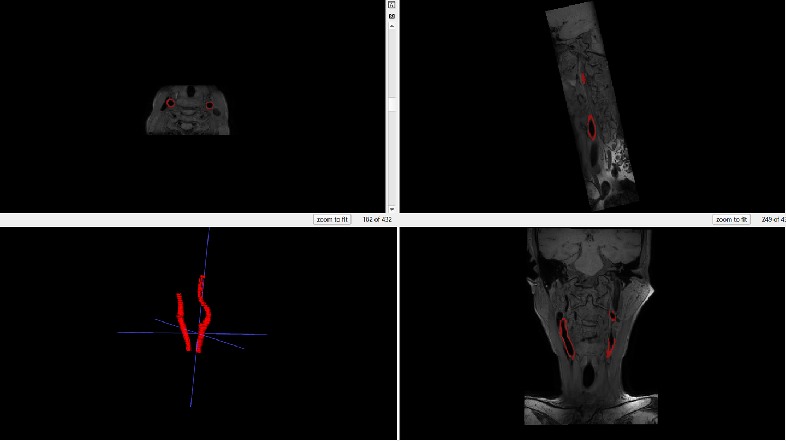

# COSMOS2022

<div align="center">
    <a href="https://github.com/openmedlab/"></a>
</div>
<p style="text-align:center;font-size:10px;"><em></em></p>

## Dataset Information

**COSMOS** (CarOtid vessel wall SegMentation and atherosclerOsis diagnosiS challenge) is a dataset designed to segment vessel walls from 3D-VISTA imaging and accurately diagnose atherosclerotic lesions. Based on the segmented vessel walls, relevant parameters (e.g., wall thickness, lumen area, or stenosis percentage) can be calculated, which are critical for diagnosing atherosclerotic lesions. The dataset was collected at **Renji Hospital affiliated with Shanghai Jiao Tong University School of Medicine** using a **3T Philips MRI scanner** with 3D VISTA sequences. Each scan includes bilateral carotid arteries. The dataset provides **50 cases** for model training and validation and **25 cases** for testing, with the test set distribution similar to the training set. The vessel walls were annotated by experts using specialized vessel wall annotation software.

This dataset offers valuable clinical data resources for research on carotid vessel wall segmentation and automated diagnosis of atherosclerotic lesions. It includes high-resolution 3D-VISTA MRI images that cover both normal arteries and those with plaques or stenosis lesions. Since atherosclerosis is a leading cause of death worldwide, early detection and accurate diagnosis are critical. The manual annotations and image data in this dataset provide a foundation for developing automated segmentation algorithms, significantly reducing the labor intensity of manual segmentation. This enables fast and precise diagnosis of carotid lesions, advancing the prevention and treatment of cardiovascular diseases.

## Dataset Meta Information

| Dimensions | Modality | Task Type     | Anatomical Structures | Anatomical Area | Number of Categories | Data Volume | File Format |
|------------|----------|---------------|-----------------------|-----------------|----------------------|-------------|-------------|
| 3D         | MR       | Segmentation  | Blood vessel wall     | Carotid artery  | 1                    | 75          | DICOM       |


### Resolution Details

| Dataset Statistics | spacing (mm)        | size         |
|--------------------|---------------------|--------------|
| min                | 0.5303*0.5303*0.60  | 432*432*432  |
| median             | 0.5787*0.5787*0.60  | 432*432*432  |
| max                | 0.5787*0.5787*0.60  | 528*528*432  |

Number of 2D slices in the dataset: 21600.

## Label Information Statistics

| Metric               | Carotid vessel wall |
|----------------------|---------------------|
| Case Count           | 50                  |
| Coverage             | 100%                |
| Min Volume (cm³)     | 1.95                |
| Median Volume (cm³)  | 4.12                |
| Max Volume (cm³)     | 7.62                |

## Visualization

Schematic diagram of the carotid artery wall annotation and 3D model in three sections of MR images

<div align="center">
    <a href="https://github.com/openmedlab/"></a>
</div>
<p style="text-align:center;font-size:10px;"><em></em></p>

## File Structure

``` 
COSMOS2022
│
├── Testing_dataset
│   ├── 16
│   ├── 55
│   ├── 56
│   └── 57
│       ...
│
├── Training_dataset
│   ├── 3
│   │   ├── 1.1310.12.146843.3636.42584.24983.1687.dcm
│   │   ├── 1.1310.12.146843.3637.42584.24983.1687.dcm
│   │   └── 1.1310.12.146843.3638.42584.24983.1687.dcm
│   │        ...
│   ├── 4
│   ├── 5
│   └── 6
│       ...
│
├── Validation_dataset
│   ├── 1
│   └── 2
│       ...
```

## Authors and Institutions

- Huijun Chen (Tsinghua University)  

- Xihai Zhao (Tsinghua University)  

- Jiaqi Dou (Tsinghua University)  

- Chenlin Du (Tsinghua University)  

- Runyu Yang (Tsinghua University)  

- Haozhong Sun (Tsinghua University)  

- Shuwan Yu (Tsinghua University)  

- Huilin Zhao (Renji Hospital, Shanghai Jiao Tong University School of Medicine)  

- Chun Yuan (University of Washington)  

- Niranjan Balu (University of Washington)  

## Source Information

Official Website: https://vessel-wall-segmentation-2022.grand-challenge.org/

Download Link: https://vessel-wall-segmentation-2022.grand-challenge.org/

Article Address: TBD

Publication Date: 2022-04

## Citation

``` 
TBD
```

Original introduction article is [here](https://zhuanlan.zhihu.com/p/2638128980).