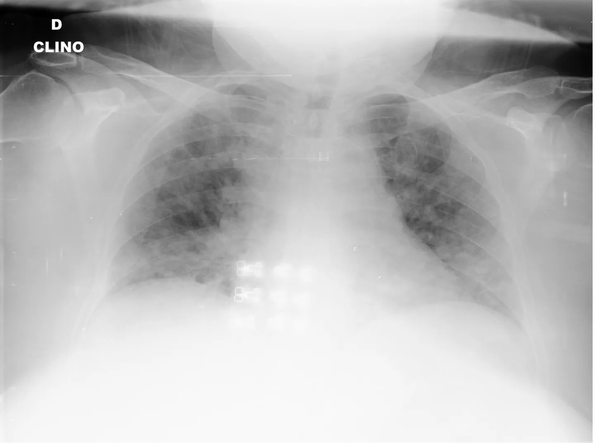

# COVID-19-CT SCAN IMAGES

<div align="center">
    <a href="https://github.com/openmedlab/"></a>
</div>
<p style="text-align:center;font-size:10px;"><em></em></p>

## Dataset Information

The COVID-19-CT SCAN IMAGES dataset contains 1400 CT lung scan images. There are two categories in the dataset: 58 CT scan images from COVID-19 positive patients and 1342 CT scan images from individuals not infected with COVID-19. Lung CT scan images are crucial in determining whether an individual is infected with COVID-19 and the degree of infection. Accurate and rapid screening of COVID-19 positive patients is beneficial not only for the patients to recover healthily but also for quickly controlling this highly transmissible disease and reducing further infections. Consequently, many researchers are actively applying deep learning technology to achieve rapid identification of COVID-19 infections based on CT lung scan images. The authors have collected and made public this dataset, which includes lung CT images of COVID-19 positive patients, in hopes of promoting research and development of COVID-19 detection algorithms and related applications based on deep learning technology. Additionally, it is noticeable that the number of COVID-19 negative images in the dataset significantly outnumbers the positive ones. The severe imbalance of categories will be a major challenge in developing corresponding algorithms and programs.

## Dataset Meta Information

| Dimensions | Modality | Task Type      | Anatomical Structures | Anatomical Area | Number of Categories | Data Volume | File Format        |
|------------|----------|----------------|-----------------------|-----------------|----------------------|-------------|--------------------|
| 2D         | CT       | Classification | Lung                  | Chest           | 2                    | 1400        | .png, .jpg, .jpeg  |


### Resolution Details

| Dataset Statistics | size          |
|--------------------|---------------|
| min                | [256,247]     |
| median             | [1636,1321]   |
| max                | [4248,3480]   |

## Label Information Statistics

| Categories         | Number |
|--------------------|--------|
| COVID-19 positive  | 58     |
| COVID-19 negative  | 1342   |

## Visualization


<div align="center">
    <a href="https://github.com/openmedlab/"></a>
</div>
<p style="text-align:center;font-size:10px;"><em> COVID-19 positive example image.</em></p>

<div align="center">
    <a href="https://github.com/openmedlab/"></a>
</div>
<p style="text-align:center;font-size:10px;"><em> COVID-19 negative example image.</em></p>

## File Structure

The file structure of the data set is as follows, including an .xls file that records the names of all images, and 2 folders that store images of corresponding categories.

``` 
COVID-19-CT SCAN IMAGES_COVID_datasets
├── COVID-19-CT SCAN IMAGES_Neg_Samples_datasets
│   ├── F051E018-DAD1-4506-AD43-BE4CA29E960B.jpeg
│   ├── IM-0115-0001.jpeg
│   │    ...
├── COVID-19-CT SCAN IMAGES_Pos_Samples_datasets
│   ├── 01E392EE-69F9-4E33-BFCE-E5C968654078.jpeg
│   ├── 1B734A89-A1BF-49A8-A1D3-66FAFA4FAC5D.jpeg
│   │    ...
├── Train.xls
```

## Authors and Institutions

`wj小窗w`（Aliyun user）


## Source Information

Official Website: https://tianchi.aliyun.com/dataset/93666

Download Link: https://tianchi.aliyun.com/dataset/93666

Article Address: -

Publication Date: 2021-03-10

## Citation

``` 
@misc{ COVID-19-CT,
title= { COVID-19-CT SCAN IMAGES},
author= { wj小窗w },
url= { https://tianchi.aliyun.com/dataset/93666 },
year = { 2019 },
}
```

Original introduction article is [here](https://zhuanlan.zhihu.com/p/680614780).