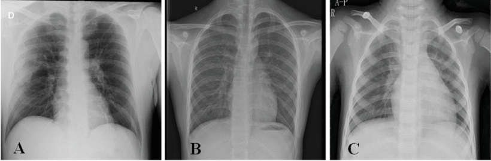
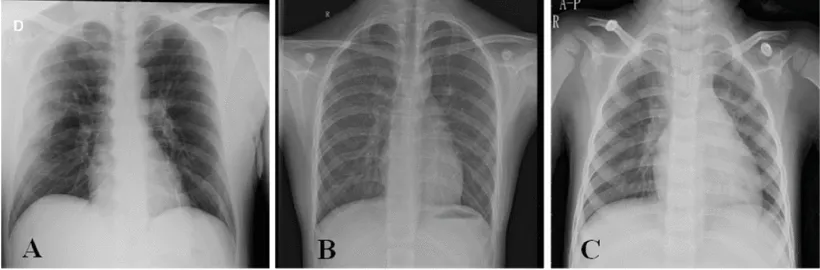

# Dataset Name

<div align="center">
    <a href="https://github.com/openmedlab/"></a>
</div>
<p style="text-align:center;font-size:10px;"><em></em></p>

## Dataset Information

This part is introduction and summarization of the dataset.

## Dataset Meta Information

| Dimensions | Modality | Task Type      | Anatomical Structures | Anatomical Area | Number of Categories | Data Volume | File Format |
|------------|----------|----------------|-----------------------|----------------|----------------------|-------------|------------|
| 2D         | X Ray    | Classification | Lung                  | Chest          | 3                    | 3886        | PNG        |


### Resolution Details

| Label           | size         |
|-----------------|--------------|
| COVID	          | 256*256   |
| NORMAL          | 1024*1024   |
| Viral Pneumonia | 1024*1024   |

## Label Information Statistics

| Label           | num  |
|-----------------|------|
| COVID	          | 1200 |
| NORMAL          | 1341 |
| Viral Pneumonia | 1345 |

## Visualization

<div align="center">
    <a href="https://github.com/openmedlab/"></a>
</div>
<p style="text-align:center;font-size:10px;"><em> Paper Visualization. A: COVID-19 B: Normal C: Viral pneumonia. </em></p>

## File Structure

``` 
COVID-19 Radiography Database
├── COVID
│   ├── COVID (1).png
│   ├── COVID (2).png
│   │    ...
├── NORMAL
│   ├── NORMAL (1).png
│   ├── NORMAL (2).png
│   ├── ...
├── Viral Pneumonia
│   ├── Viral Pneumonia (1).png
│   ├── Viral Pneumonia (2).png
│   ├── ...
├── COVID.metadata.xlsx
├── NORMAL.metadata.xlsx
├── Viral Pneumonia.metadata.xlsx
├── README.md.txt
```

## Authors and Institutions

Muhammad E. H. Chowdhury (Qatar University, Qatar)

Tawsifur Rahman (University of Dhaka, Bangladesh)

Amith Khandakar (Qatar University, Qatar)

Rashid Mazhar (Hamad General Hospital, Qatar)

Muhammad Abdul Kadir (University of Dhaka, Bangladesh)

Zaid Bin Mahbub (North South University, Bangladesh)

Khandakar Reajul Islam (Bangabandhu Sheikh Mujib Medical University, Bangladesh)

Muhammad Salman Khan (University of Engineering and Technology, Pakistan)

Atif Iqbal (Qatar University, Qatar)

Nasser Al Emadi (University of Engineering and Technology, Pakistan)

Mamun Bin Ibne Reaz (National University of Malaysia, Malaysia)

Mohammad Tariqul Islam (National University of Malaysia, Malaysia)


## Source Information

Official Website: https://www.heywhale.com/mw/dataset/6027caee891f960015c863d7/content

Download Link: https://drive.google.com/file/d/1xt7g5LkZuX09e1a8rK9sRXIrGFN6rjzl/view?usp=sharing

Article Address: https://ieeexplore.ieee.org/abstract/document/9144185

Publication Date: 2021-01-06

## Citation

``` 
@ARTICLE{9144185,
  author={Chowdhury, Muhammad E. H. and Rahman, Tawsifur and Khandakar, Amith and Mazhar, Rashid and Kadir, Muhammad Abdul and Mahbub, Zaid Bin and Islam, Khandakar Reajul and Khan, Muhammad Salman and Iqbal, Atif and Emadi, Nasser Al and Reaz, Mamun Bin Ibne and Islam, Mohammad Tariqul},
  journal={IEEE Access}, 
  title={Can AI Help in Screening Viral and COVID-19 Pneumonia?}, 
  year={2020},
  volume={8},
  number={},
  pages={132665-132676},
  doi={10.1109/ACCESS.2020.3010287}}
```

Original introduction article is [here](https://zhuanlan.zhihu.com/p/658834250).