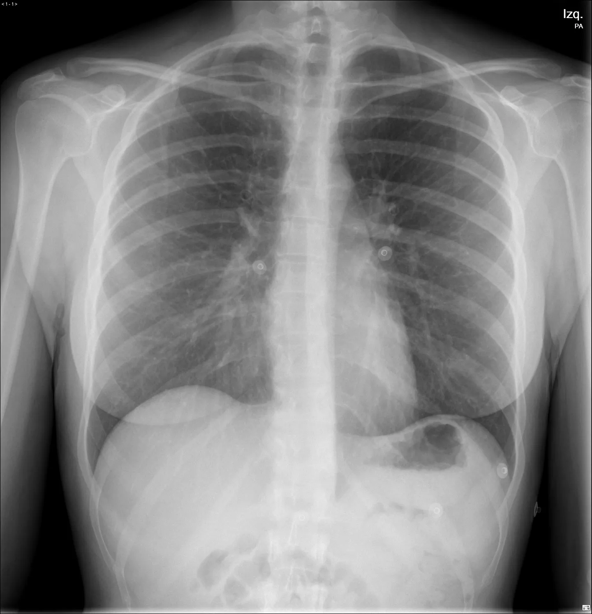
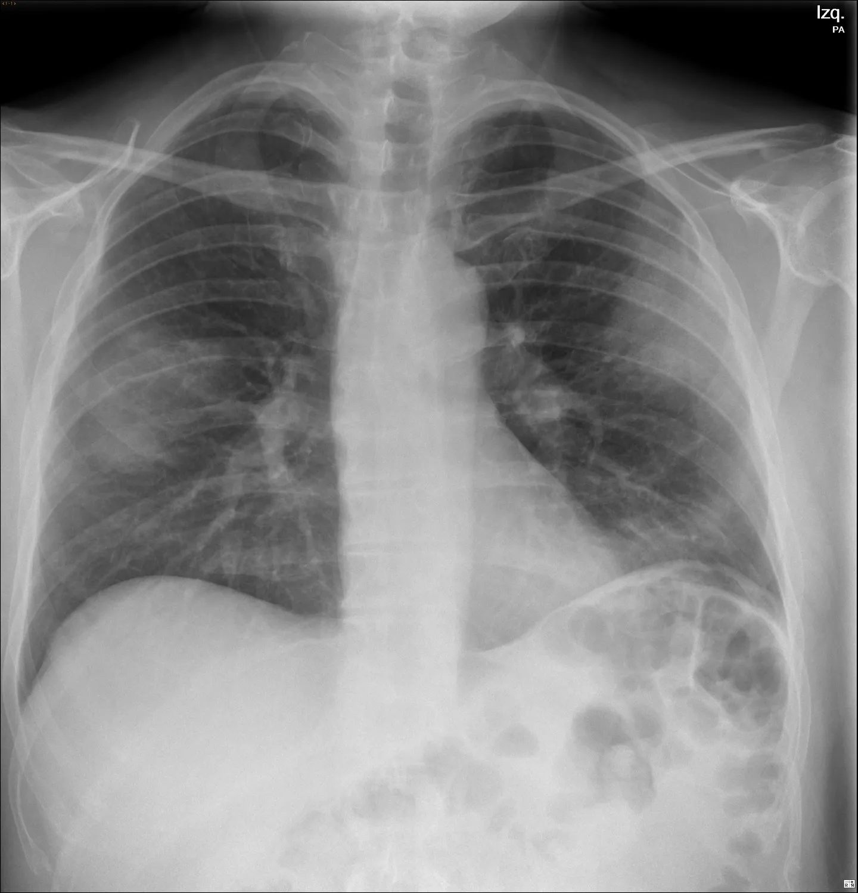

# COVIDGR

<div align="center">
    <a href="https://github.com/openmedlab/"></a>
</div>
<p style="text-align:center;font-size:10px;"><em></em></p>

## Dataset Information

This part is introduction and summarization of the dataset.

## Dataset Meta Information

| Dimensions | Modality | Task Type      | Anatomical Structures | Anatomical Area | Number of Categories | Data Volume | File Format |
|------------|----------|----------------|-----------------------|-----------------|----------------------|-------------|-------------|
| 2D         | X Ray    | Classification | Lung                  | Chest           | 2                    | 852         | JPG         |


### Resolution Details

| Dataset Statistics | size         |
|--------------------|--------------|
| min                | [534,224]   |
| median             | [2728,2563]   |
| max                | [3000,3000]   |

## Label Information Statistics

| Class | Number |
|-------------------|--------|
| Positive          | 426    |
| Negative          | 426    |

## Visualization

<div align="center">
    <a href="https://github.com/openmedlab/"></a>
</div>
<p style="text-align:center;font-size:10px;"><em> Example images of negative cases.</em></p>

<div align="center">
    <a href="https://github.com/openmedlab/"></a>
</div>
<p style="text-align:center;font-size:10px;"><em> Example images of positive cases.</em></p>

## File Structure

The dataset file structure is as follows, including one README.md file, one metafile.yaml file containing more basic information about the dataset, and folders that separately store images of two categories.

``` 
COVIDGR
├── raw
│   ├──N
│   │   ├── 0b54ce0c4f7f6ea5862f75c1d1d33311.jpg
│   │   ├── 0c059d97a821616bef37761cce4138e5.jpg
│   │   ├── ...
│   ├──P
│   │   ├── 00b05aa3cb325265b9ded3f1a9f704c8.jpg
│   │   ├── 00f9707e0de334db70a7924a9de98368.jpg
│   │   ├── ...
├── README.md
├── metafile.yaml
```

## Authors and Institutions

S. Tabik (Spain, University of Granada)

A. Gómez-Ríos (Spain, University of Granada)

J.L. Martín-Rodríguez（Spain, Hospital Universitario Clínico）

I. Sevillano-García (Spain, University of Granada)

M. Rey-Area (Spain, University of Vigo）

D. Charte (Spain, University of Granada)

E. Guirado (Spain, University of Alicante)

J.L. Suárez (Spain, University of Granada)

J. Luengo (Spain, University of Granada)

M.A. Valero-González（Spain, Hospital Universitario Clínico）

P. García-Villanova（Spain, Hospital Universitario Clínico）

E. Olmedo-Sánchez（Spain, Hospital Universitario Clínico）

F. Herrera (Spain, University of Granada)


## Source Information

Official Website: https://github.com/ari-dasci/covidgr

Download Link: https://github.com/ari-dasci/covidgr, https://opendatalab.com/OpenDataLab/COVIDGR

Article Address: https://ieeexplore.ieee.org/stamp/stamp.jsp?tp=&arnumber=9254002

Publication Date: 2020-12-04

## Citation

``` 
@article{tabik2020covidgr,
 title={COVIDGR dataset and COVID-SDNet methodology for predicting COVID-19 based on chest X-ray images},
 author={Tabik, Siham and G{\'o}mez-R{\'\i}os, Anabel and Mart{\'\i}n-Rodr{\'\i}guez, Jos{\'e} Luis and Sevillano-Garc{\'\i}a, Iv{\'a}n and Rey-Area, Manuel and Charte, David and Guirado, Emilio and Su{\'a}rez, Juan-Luis and Luengo, Juli{\'a}n and Valero-Gonz{\'a}lez, MA and others},
 journal={IEEE journal of biomedical and health informatics},
 volume={24},
 number={12},
 pages={3595--3605},
 year={2020},
 publisher={IEEE}
 }
```

Original introduction article is [here](https://zhuanlan.zhihu.com/p/664976090).