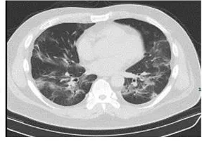
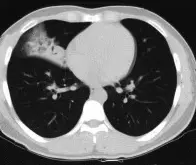

# COVID_CT_COVID-CT

<div align="center">
    <a href="https://github.com/openmedlab/"></a>
</div>
<p style="text-align:center;font-size:10px;"><em></em></p>

## Dataset Information

The COVID_CT_COVID-CT dataset contains a total of 746 lung CT images, of which 349 are of coronavirus infections and 397 are of non-coronavirus infections, with a default division provided for train, val, and test data. In addition, for each coronavirus-infected CT image, this dataset provides a basic information description of the corresponding patient (including location, age, condition description, medical history summary, onset time, and other symptoms). It should be noted that the original CTs in the dataset are 3D, but only slices considered by doctors to have key features were selected from each 3D CT data. According to radiologists, this does not significantly affect the accuracy of diagnostic decisions, especially under conditions like this dataset that includes sufficient clinical information. This dataset aims to promote research on algorithms for the identification of COVID infections in lung CT (2D).

## Dataset Meta Information

| Dimensions | Modality | Task Type      | Anatomical Structures | Anatomical Area | Number of Categories | Data Volume | File Format |
|------------|----------|----------------|-----------------------|-----------------|----------------------|-------------|-------------|
| 2D         | CT       | Classification | Lung                  | Chest           | 2                    | 746         | JPG, PNG    |


### Resolution Details

| Dataset Statistics | size         |
|--------------------|--------------|
| min                | [148,61]   |
| median             | [404,299]   |
| max                | [1637,1225]   |

## Label Information Statistics

| Category | train | val | test |
|----------|-------|-----|------|
| COVID    | 191   | 60  | 98   |
| NonCOVID | 234   | 58  | 105  |

## Visualization

<div align="center">
    <a href="https://github.com/openmedlab/"></a>
</div>
<p style="text-align:center;font-size:10px;"><em> COVID-New Coronavirus Infection Example Picture. </em></p>

<div align="center">
    <a href="https://github.com/openmedlab/"></a>
</div>
<p style="text-align:center;font-size:10px;"><em> NonCOVID-non-coronavirus infection example images. </em></p>

## File Structure

The file structure of the dataset is as follows: it contains one .xlsx file describing the basic information of all COVID (coronavirus infection) images, one .csv file describing the basic information of all NonCOVID (non-coronavirus infection) images, one folder that contains the images of both categories, one folder for text documents that divide the data into train, val, test categories, and one README file.

``` 
COVID_CT_COVID-CT
├── Data-split
│   ├── COVID
│   │   ├── testCT_COVID.txt
│   │   ├── trainCT_COVID.txt
│   │   ├── valCT_COVID.txt
│   ├── NonCOVID
│   │   ├── CT_NonCOVID_test_id.csv
│   │   ├── CT_NonCOVID_train_id.csv
│   │   ├── CT_NonCOVID_val_id.csv
│   │   ├── testCT_NonCOVID.txt
│   │   ├── trainCT_NonCOVID.txt
│   │   ├── valCT_NonCOVID.txt
├── Images-processed
│   ├── CT_COVID
│   │   ├── 2019-novel-Coronavirus-severe-adult-respiratory-dist_2020_International-Jour-p3-89%0.txt
│   │   ├── ...
│   ├── CT_NonCOVID
│   │   ├── 0.jpg
│   │   ├── ...
├── COVID-CT-MetaInfo.xlsx
├── NonCOVID-CT-MetaInfo.csv
├── README.md
```

## Authors and Institutions

Xingyi Yang(University of California, San Diego, United States)

Xuehai He(University of California, San Diego, United States)

Jinyu Zhao(University of California, San Diego, United States)

Yichen Zhang(University of California, San Diego, United States)

Shanghang Zhang(University of California, San Diego, United States)

Pengtao Xie(University of California, San Diego, United States)


## Source Information

Official Website: https://tianchi.aliyun.com/dataset/106604

Download Link: https://tianchi.aliyun.com/dataset/106604

Article Address: https://arxiv.org/pdf/2003.13865.pdf

Publication Date: 2020-06-17

## Citation

``` 
@article{zhao2020COVID-CT-Dataset,
  title={COVID-CT-Dataset: a CT scan dataset about COVID-19},
  author={Zhao, Jinyu and Zhang, Yichen and He, Xuehai and Xie, Pengtao},
  journal={arXiv preprint arXiv:2003.13865}, 
  year={2020}
}
```

Original introduction article is [here](https://zhuanlan.zhihu.com/p/666237686).