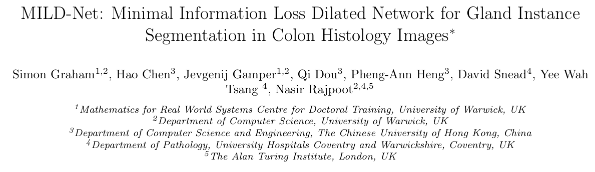
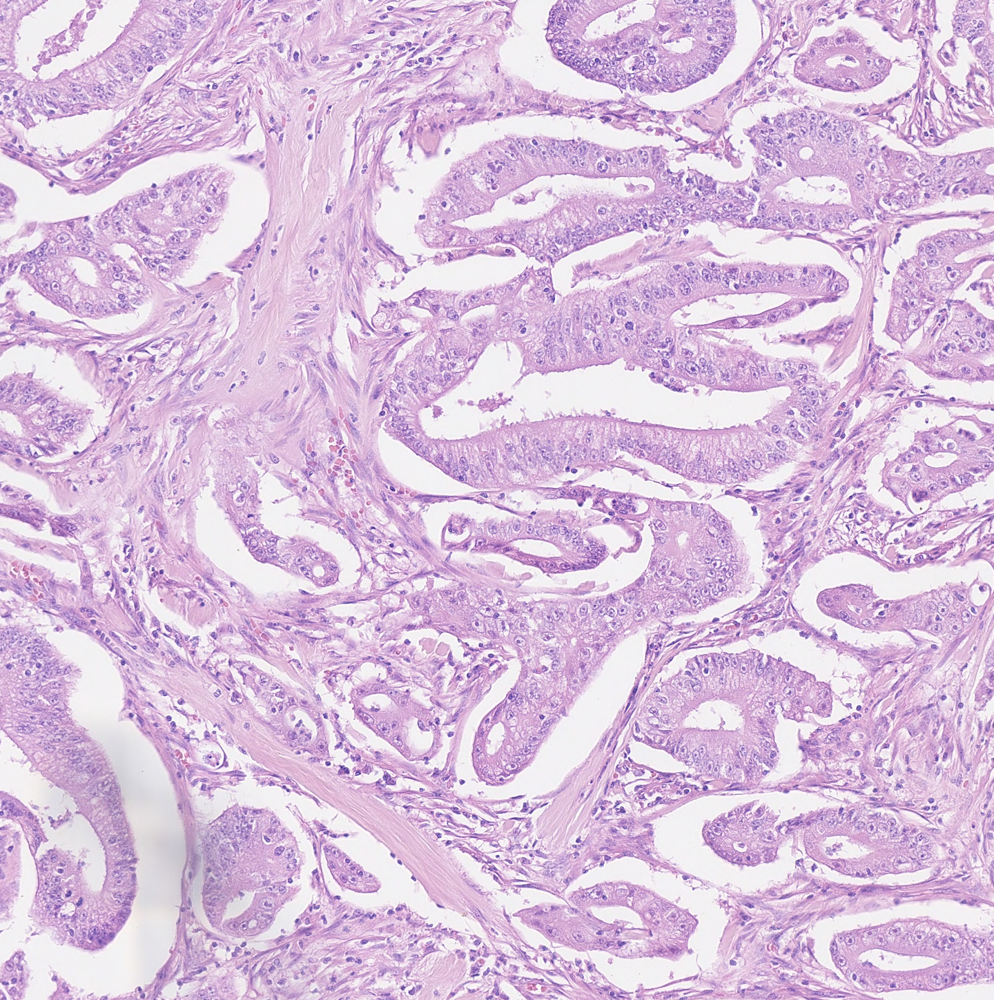

# CRAG

<div align="center">
    <a href="https://github.com/openmedlab/"></a>
</div>
<p style="text-align:center;font-size:10px;"><em></em></p>

## Dataset Information

This dataset contains **213 H&E-stained colorectal adenocarcinoma image slices**, magnified at **20x**, with full instance-level annotations. These images were used in the **MILD-Net** paper to address the challenge of automated gland instance segmentation. MILD-Net significantly improves segmentation accuracy for colorectal adenocarcinoma tissue by introducing a minimal information loss network architecture. The dataset is divided into a **training set** with **173 images** and a **test set** with **40 images**. It provides a reliable foundation for developing and evaluating automated segmentation methods, helping to reduce the manual annotation workload of pathologists and improving the objectivity and consistency of diagnoses.

The significance of this dataset lies in its ability to support pathologists in extracting key morphological features from large-scale tissue slides through automated gland segmentation. This approach not only enhances the efficiency of pathological analysis but also provides more precise diagnostic information through methods such as uncertainty quantification. As a result, it has the potential for widespread clinical application.

## Dataset Meta Information

| Dimensions | Modality   | Task Type      | Anatomical Structures        | Number of Categories | Data Volume | File Format |
|------------|------------|----------------|------------------------------|----------------------|-------------|-------------|
| 2D         | pathology  | Segmentation   | Colorectal adenocarcinoma    | 1                    | 213         | PNG         |


### Resolution Details

| Dataset Statistics | size       |
|--------------------|------------|
| min                | 1516*1319  |
| median             | 1516*1511  |
| max                | 1516*1514  |

## Label Information Statistics

| Metric        | Colorectal adenocarcinoma |
|---------------|---------------------------|
| Case Count    | 213                       |
| Coverage      | 100%                      |

## Visualization

The following figure shows the annotated image of colorectal adenocarcinoma and the corresponding original image:

<div align="center">
    <a href="https://github.com/openmedlab/"></a>
</div>
<p style="text-align:center;font-size:10px;"><em></em></p>

<div align="center">
    <a href="https://github.com/openmedlab/"></a>
</div>
<p style="text-align:center;font-size:10px;"><em></em></p>

## File Structure

``` 
CRAG
├── train
│   ├── Annotation
│   │   ├── train_1.png
│   │   ├── train_2.png
│   │   ├── train_3.png
│   │   └── ...
│   ├── Images
│   │   ├── train_1.png
│   │   ├── train_2.png
│   │   ├── train_3.png
│   │   └── ...
│   ├── Overlay
│   │   ├── train_1.png
│   │   ├── train_2.png
│   │   ├── train_3.png
│   │   ├── train_4.png
│   │   ├── train_5.png
│   │   └── ...
├── valid
│   ├── Annotation
│   │   ├── test_1.png
│   │   ├── test_2.png
│   │   ├── test_3.png
│   │   └── ...
│   ├── Images
│   │   ├── test_1.png
│   │   ├── test_2.png
│   │   ├── test_3.png
│   │   └── ...
│   ├── Overlay
│   │   ├── test_1.png
│   │   ├── test_2.png
│   │   ├── test_3.png
│   │   └── ...
```

## Authors and Institutions

Simon Graham (University of Warwick)

Hao Chen (The Chinese University of Hong Kong)

Jevgenij Gamper (University of Warwick)

Qi Dou (The Chinese University of Hong Kong)

Pheng-Ann Heng (The Chinese University of Hong Kong)

David Snead (University Hospitals Coventry and Warwickshire)

Yee Wah Tsang (University Hospitals Coventry and Warwickshire)

Nasir Rajpoot (University of Warwick)

Nasir Rajpoot (The Alan Turing Institute, London)

## Source Information

Official Website: https://github.com/XiaoyuZHK/CRAG-Dataset_Aug_ToCOCO

Download Link: https://github.com/XiaoyuZHK/CRAG-Dataset_Aug_ToCOCO

Article Address: https://arxiv.org/pdf/1806.01963

Publication Date: 2019

## Citation

``` 
@article{graham2019mild,
  title={MILD-Net: Minimal information loss dilated network for gland instance segmentation in colon histology images},
  author={Graham, Simon and Chen, Hao and Gamper, Jevgenij and Dou, Qi and Heng, Pheng-Ann and Snead, David and Tsang, Yee Wah and Rajpoot, Nasir},
  journal={Medical image analysis},
  volume={52},
  pages={199--211},
  year={2019},
  publisher={Elsevier}
}
```

Original introduction article is [here](https://zhuanlan.zhihu.com/p/856682365).