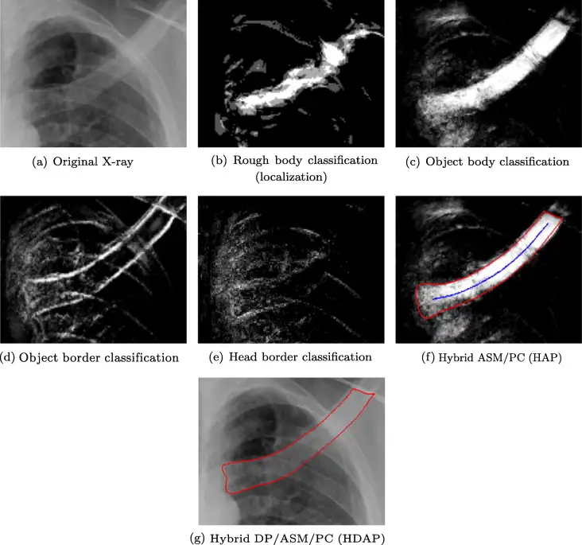

# CRASS12

<div align="center">
    <a href="https://github.com/openmedlab/"></a>
</div>
<p style="text-align:center;font-size:10px;"><em></em></p>

## Dataset Information

The CRASS12 dataset consists of 284 chest X-ray images specifically designed for the segmentation of the clavicles. These images come from databases in two tuberculosis-endemic regions of sub-Saharan Africa, with all subjects being at least 15 years old. The images were captured using digital chest radiography equipment from Delft Imaging Systems in the Netherlands, offering various resolutions with an average resolution of 1768×1812 pixels and a pixel size of 250μm isotropic.

This dataset aims to provide high-quality imaging data support for the diagnosis and research of tuberculosis. Segmentation of the clavicles is of significant importance in diagnosing tuberculosis because the disease often affects the lung regions, including the subclavian area. By accurately segmenting and analyzing the clavicles, the CRASS12 dataset helps researchers better identify and diagnose tuberculosis. With images of varying resolutions, the CRASS12 dataset meets diverse research needs, allowing scholars to conduct analyses and studies at different levels of detail. These images not only aid in the development and validation of new diagnostic algorithms but also provide valuable resources for advancing medical image processing technologies.

## Dataset Meta Information

| Dimensions | Modality | Task Type    | Anatomical Structures | Anatomical Area | Number of Categories | Data Volume | File Format |
|------------|----------|--------------|-----------------------|-----------------|----------------------|-------------|-------------|
| 2D         | X-ray    | Segmentation | Neck                  | Clavicle        | 1                    | 284         | PNG         |


### Resolution Details

| Dataset Statistics | size          |
|--------------------|---------------|
| min                | (1560, 1520)  |
| medium             | (1768, 1812)  |
| max                | (1768, 1812)  |

## Label Information Statistics

| Segmented Structure | Clavicle |
|---------------------|----------|
| Occurrences         | 284      |
| Proportion          | 100%     |
| Minimum Pixels      | 9768     |
| Median Pixels       | 48715    |
| Maximum Pixels      | 48715    |

## Visualization

<div align="center">
    <a href="https://github.com/openmedlab/"></a>
</div>
<p style="text-align:center;font-size:10px;"><em> Paper Visualization.</em></p>

## File Structure

The specific file structure of the CRASS12 dataset is as follows:

``` 
CRASS12/
│   │── image
│   │   ├── xxx.PNG
│   │   ├── xxx.PNG
│   │   └── ...
│   └── mask
│       ├── xxx.PNG
│       ├── xxx.PNG
│       └── ...
│   
└── train.txt
└── val.txt
```

## Authors and Institutions

LaurensHogeweg (Radboud University Nijmegen Medical Centre)

Clara I.Sánchez (Radboud University Nijmegen Medical Centre)

Pim A.de Jong (University Medical Center Utrech)

PragnyaMaduskar (Radboud University Nijmegen Medical Centre)

Bramvan Ginneken (Radboud University Nijmegen Medical Centre)

## Source Information

Official Website: https://crass.grand-challenge.org/Details/

Download Link: https://crass.grand-challenge.org/Download/

Article Address: https://doi.org/10.1016/j.media.2012.06.009

Publication Date: 2012.12

## Citation

``` 
@article{hogeweg2012clavicle,
  title={Clavicle segmentation in chest radiographs},
  author={Hogeweg, Laurens and S{\'a}nchez, Clara I and de Jong, Pim A and Maduskar, Pragnya and van Ginneken, Bram},
  journal={Medical image analysis},
  volume={16},
  number={8},
  pages={1490--1502},
  year={2012},
  publisher={Elsevier}
}
```

Original introduction article is [here](https://zhuanlan.zhihu.com/p/699094021).