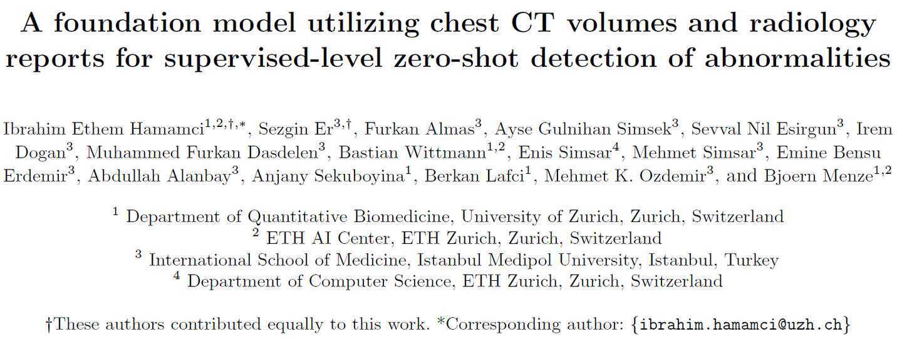
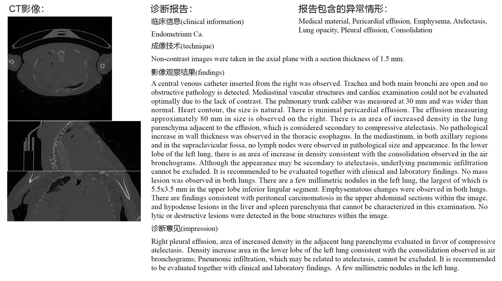

# CT-RATE

<div align="center">
    <a href="https://github.com/openmedlab/"></a>
</div>
<p style="text-align:center;font-size:10px;"><em></em></p>

## Dataset Information

CT-RATE is a large dataset containing paired chest CT images and corresponding radiological diagnostic reports, along with annotated results for 18 possible abnormal conditions mentioned in the reports. The dataset comprises a total of 50,188 cases, with 47,149 in the training set and 3,039 in the validation set. CT-RATE covers plain scan CT images of 21,304 different patients collected from May 2015 to January 2023. The corresponding radiological reports consist of four parts: clinical information, imaging technique, imaging findings, and impression. Clinical information includes the patient's symptoms and treatment history; imaging technique encompasses imaging protocols, imaging perspectives, and the use of contrast agents; imaging findings include observations anatomically and pathologically, and the impression is given by doctors based on these observations.

CT-RATE is the first open-source dataset to date that includes chest CT images, radiological diagnostic reports, and abnormality labels on a large scale. This dataset can not only help researchers to further train more precise models for generating diagnostic reports for chest CT images, thereby alleviating the workload of doctors; moreover, it is expected to promote the development of large multimodal models in the field of radiology and even general-purpose medical multimodal mega-models.

## Dataset Meta Information

| Task Type | Language | Train | Val   | Test | File Format | Size |
|-----------|----------|-------|-------|------|-------|------|
| Caption   | English  | 47149   | 3039  | -    | .nii.gz, .csv   | -    |


## Dataset Information Statistics

The CT-RATE data set collects CT image data from three types of CT equipment, including CT equipment produced by Philips, Siemens and Neusoft Philips. The statistical information is as follows:

| Manufacturer | Count in train set | Count in internal validation set | Train set ratio | Internal validation set ratio |
|--------------|--------------------|---------------------------------|-----------------|------------------------------|
| Philips      | 28966              | 1928                            | 0.614           | 0.634                        |
| Siemens      | 15946              | 971                             | 0.338           | 0.320                        |
| PNMS         | 2237               | 140                             | 0.048           | 0.046                        |

In the CT-RATE data set, the gender distribution corresponding to different CT images is as follows:

| Sex    | Count in train set | Count in internal validation set | Train set ratio | Internal validation set ratio |
|--------|--------------------|---------------------------------|-----------------|------------------------------|
| Male   | 27462              | 1776                            | 0.583           | 0.584                        |
| Female | 19681              | 1263                            | 0.417           | 0.416                        |

In addition, the CT-RATE data set counts 18 abnormalities in diagnostic reports, covering common abnormalities in the chest area. The distribution of these 18 abnormalities in the data set is as shown below, including pulmonary nodules, coronary artery walls Calcification, lung opacity and other common abnormalities.

| Abnormality                   | Count in train set | Count in internal validation set | Train set ratio | Internal validation set ratio |
|-------------------------------|--------------------|---------------------------------|-----------------|------------------------------|
| Medical material              | 2387               | 130                             | 0.102           | 0.083                        |
| Arterial wall calcification   | 7136               | 459                             | 0.303           | 0.296                        |
| Cardiomegaly                  | 2604               | 161                             | 0.114           | 0.102                        |
| Pericardial effusion          | 718                | 41                              | 0.030           | 0.027                        |
| Coronary artery wall calcification | 6050          | 388                             | 0.258           | 0.250                        |
| Hiatal hernia                 | 3418               | 220                             | 0.143           | 0.139                        |
| Lymphadenopathy               | 5769               | 385                             | 0.245           | 0.250                        |
| Emphysema                     | 4651               | 304                             | 0.192           | 0.197                        |
| Atelectasis                   | 6027               | 363                             | 0.254           | 0.234                        |
| Lung nodule                   | 10892              | 706                             | 0.450           | 0.450                        |
| Lung opacity                  | 8976               | 622                             | 0.375           | 0.398                        |
| Pulmonary fibrotic sequela    | 5809               | 380                             | 0.240           | 0.240                        |
| Pleural effusion              | 2967               | 197                             | 0.126           | 0.128                        |
| Mosaic attenuation pattern    | 1253               | 88                              | 0.054           | 0.057                        |
| Peribronchial thickening      | 1622               | 109                             | 0.068           | 0.072                        |
| Consolidation                 | 3274               | 230                             | 0.136           | 0.145                        |
| Bronchiectasis                | 2028               | 147                             | 0.084           | 0.093                        |
| Interlobular septal thickening| 1674               | 110                             | 0.070           | 0.071                        |

## Dataset Example

<div align="center">
    <a href="https://github.com/openmedlab/"></a>
</div>
<p style="text-align:center;font-size:10px;"><em></em></p>

## File Structure

The data set file structure is as follows. The file structure of the dataset includes metadata, various anomaly labels, radiology text reports, and CT image files divided into training and validation sets.

``` 
Dataset
│
├──── metadata/
│       ├── Metadata_Attributes.xlsx
│       ├── train_metadata.csv
│       └── validation_metadata.csv
├──── multi_abnormality_labels/
│       ├── train_predicted_labels.csv
│       └── valid_predicted_labels.csv
├──── radiology_text_reports/
│       ├── train_reports.csv
│       └── validation_reports.csv
├──── train/
│       ├── train_1/
│       │   ├── train_1_a/
│       │        ├── train_1_a_1.nii.gz
│       │        └── train_1_a_2.nii.gz
│       ├── ...
├──── valid/
│       ├── valid_1/
│       │   ├── valid_1_a/
│       │        ├── valid_1_a_1.nii.gz
│       │        └── valid_1_a_2.nii.gz
│       ├── ...
```

## Authors and Institutions

Ibrahim Ethem Hamamci (University of Zurich, Switzerland)

Sezgin Er (Istanbul Medipol University, Turkey)

Furkan Almas (Istanbul Medipol University, Turkey)

Ayse Gulnihal Simsek (Istanbul Medipol University, Turkey)

Sevval Nil Esirgun (Istanbul Medipol University, Turkey)

Irem Dogan (Istanbul Medipol University, Turkey)

Muhammed Furkan Dasdelen (Istanbul Medipol University, Turkey)

Bastian Wittmann (University of Zurich, Switzerland)

Enis Simsar (ETH Zurich, Switzerland)

Mehmet Simsar (Istanbul Medipol University, Turkey)

Emine Bensu Erdemir (Istanbul Medipol University, Turkey)

Abdullah Alanbay (Istanbul Medipol University, Turkey)

Anjany Sekuboyina (University of Zurich, Switzerland)

Berkan Lafci (University of Zurich, Switzerland)

Mehmet K. Ozdemir (Istanbul Medipol University, Turkey)

Bjoern Menze (University of Zurich, Switzerland)


## Source Information

Official Website: https://huggingface.co/datasets/ibrahimhamamci/CT-RATE

Download Link: https://huggingface.co/datasets/ibrahimhamamci/CT-RATE

Article Address: https://arxiv.org/abs/2403.17834

Publication Date: 2024.3

## Citation

``` 
@ARTICLE{2024arXiv240317834E,
       author = {{Ethem Hamamci}, Ibrahim and {Er}, Sezgin and {Almas}, Furkan and {Gulnihan Simsek}, Ayse and {Nil Esirgun}, Sevval and {Dogan}, Irem and {Furkan Dasdelen}, Muhammed and {Wittmann}, Bastian and {Simsar}, Enis and {Simsar}, Mehmet and {Bensu Erdemir}, Emine and {Alanbay}, Abdullah and {Sekuboyina}, Anjany and {Lafci}, Berkan and {Ozdemir}, Mehmet K. and {Menze}, Bjoern},
        title = {A foundation model utilizing chest CT volumes and radiology reports for supervised-level zero-shot detection of abnormalities},
      journal = {arXiv preprint arxiv:2403.17834},
         year = 2024,
}
```

Original introduction article is [here](https://zhuanlan.zhihu.com/p/689555581).