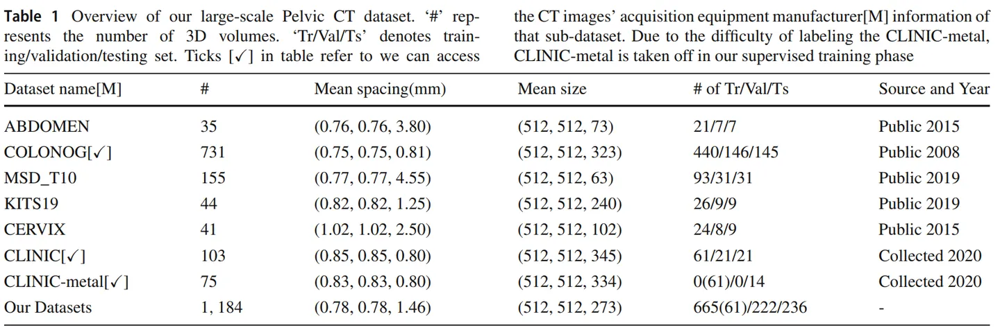
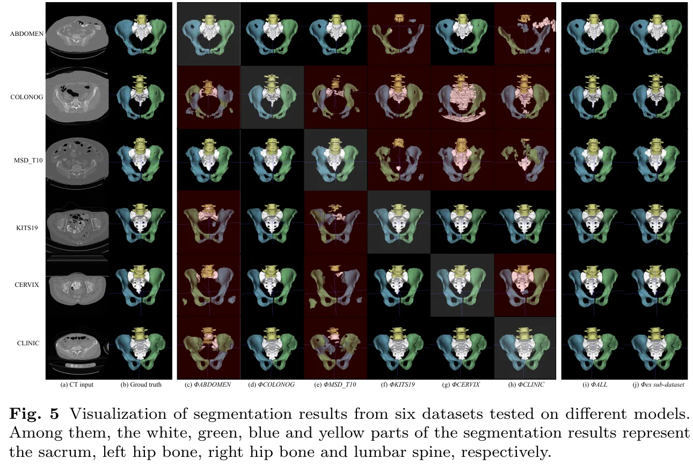
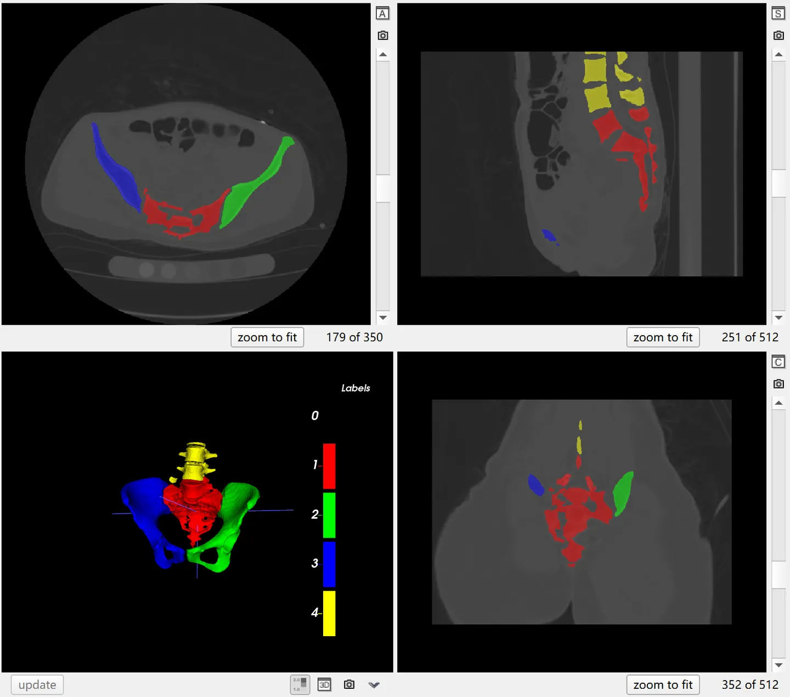

# CTPelvic1K

<div align="center">
    <a href="https://github.com/openmedlab/"></a>
</div>
<p style="text-align:center;font-size:10px;"><em></em></p>

## Dataset Information

`CTPelvic1K` is a large-scale CT dataset specifically designed for pelvic segmentation. This dataset aggregates a total of 1184 CT cases from 7 different data sources, including 75 cases with metal artifacts. Among these, 5 are public datasets, and the remaining 2 have been newly collected. The data has been annotated for segmentation of 4 types of pelvic parts: `lumbar spine`, `sacrum`, `left hip`, and `right hip`. The 5 referenced public datasets are: BTCV Abdomen, COLONOG, MSD Colon, KiTS19, and BTCV CERVIX. To ensure data quality, only a portion of the data from these 5 public datasets was selected, with the specific data composition as follows in the table:

<div align="center">
    <a href="https://github.com/openmedlab/"></a>
</div>
<p style="text-align:center;font-size:10px;"><em> CTPelvic1K data composition and division. </em></p>

It should be noted that the CLINIC-metal sub-dataset, which is affected by metal artifacts, actually has only 14 annotated cases, and these are allocated to the test set, with 61 cases placed in the training set without annotations. Additionally, we discovered through the CTPelvic official download link that the COLONOG sub-dataset provides only 714 annotations, which does not match the official description of 731 cases.

In summary, the CTPelvic1K dataset actually provides annotations for 1106 cases.

## Dataset Meta Information

| Dimensions | Modality | Task Type | Anatomical Structures          | Anatomical Area | Number of Categories | Data Volume | File Format |
|------------|----------|-----------|--------------------------------|-----------------|----------------------|-------------|-------------|
| 3D         | CT       | Segmentation | Pelvis | Pelvic cavity       | 4                    | 1184        | .nii.gz     |

Number of slices with annotated data: 488,335 (statistics of 1106 actual downloaded images, the official paper describes it as >320K)

### Resolution Details


| Dataset Statistics | spacing (mm)     | size              |
|--------------------|------------------|-------------------|
| min                | (0.5, 0.527, 0.625)              | 	(129, 512, 55)   |
| median             | (0.78, 0.78, 0.8)           | (512, 512, 515)   |
| max                | (3.75, 1.27, 7.5)              | (1059, 512, 739)  |

## Label Information Statistics

| Dataset Statistics  | Sacrum | Left Hip  | Right Hip   | Lumbar Spine   |
|---------------------|------------|-----------------|-------------|----------------|
| Detection Count     | 1106       | 1106            | 1106        | 1104           |
| Detection Rate      | 100%       | 100%            | 100%        | 99.82%         |
| Min Volume (cm³)    | 107        | 108             | 120         | 2              |
| Median Volume (cm³) | 200        | 304             | 304         | 145            |
| Max Volume (cm³)    | 373        | 573             | 562         | 338            |


## Visualization

<div align="center">
    <a href="https://github.com/openmedlab/"></a>
</div>
<p style="text-align:center;font-size:10px;"><em> Official website visualization.</em></p>

<div align="center">
    <a href="https://github.com/openmedlab/"></a>
</div>
<p style="text-align:center;font-size:10px;"><em> ITK-SNAP Visualization. Red: sacrum; yellow: lumbar spine; green: left hip; blue: right hip.</em></p>


## File Structure

The official dataset organizational structure includes 14 folders, which contain CT images and corresponding annotations for 7 sub-datasets. It is noteworthy that the original images from 5 of the public datasets are not included and need to be downloaded from their respective official websites. Taking the "CLINIC" sub-dataset as an example, the data structure of the CT images and their labels is as follows:

``` 
CTPelvic1K_dataset6_data
│
├── dataset6_CLINIC_0001_data.nii.gz
├── ...
├── dataset6_CLINIC_0103_data.nii.gz

ipcai2021_dataset6_Anonymized
│
├── dataset6_CLINIC_0001_mask_4label.nii.gz
├── ...
├── dataset6_CLINIC_0103_mask_4label.nii.gz
```

## Authors and Institutions

Pengbo Liu (Institute of Computing Technology, Chinese Academy of Sciences)

Hu Han (Institute of Computing Technology, Chinese Academy of Sciences)

Yuanqi Du (George Mason University, Virginia, USA)

Heqin Zhu (Institute of Computing Technology, Chinese Academy of Sciences)

Yinhao Li (Institute of Computing Technology, Chinese Academy of Sciences)

Feng Gu (Institute of Computing Technology, Chinese Academy of Sciences; Beijing Institute of Electronic Technology)

Honghu Xiao (Beijing Jishuitan Hospital)

Jun Li (Institute of Computing Technology, Chinese Academy of Sciences)

Chunpeng Zhao (Beijing Jishuitan Hospital)

Li Xiao (Institute of Computing Technology, Chinese Academy of Sciences)

Xinbao Wu (Beijing Jishuitan Hospital)

S. Kevin Zhou (School of Biomedical Engineering, University of Science and Technology of China and the Advanced Research Institute of Multidisciplinary Science MIRACLE Lab; Institute of Computing Technology, Chinese Academy of Sciences)


## Source Information

Official Website: https://github.com/MIRACLE-Center/CTPelvic1K

Download Link: https://zenodo.org/record/4588403#.YEyLq_0zaCo

Article Address: https://link.springer.com/article/10.1007/s11548-021-02363-8

Publication Date: 2020-12

## Citation

``` 
@article{deep_learning_to_segment_pelvic_bones:_large-scale_ct_datasets_and_baseline_models,
  title = {Deep learning to segment pelvic bones: large-scale CT datasets and baseline models},
  author = {Liu, Pengbo and Han, Hu and Du, Yuanqi and Zhu, Heqin and Li, Yinhao and Gu, Feng and Xiao, Honghu and Li, Jun and Zhao, Chunpeng and Xiao, Li and Wu, Xinbao and Zhou, S. Kevin},
  journal = {International Journal of Computer Assisted Radiology and Surgery},
  volume = {16},
  number = {5},
  year = {2021},
  pages = {749},
  doi = {10.1007/s11548-021-02363-8},
  abstract = {Pelvic bone segmentation in CT has always been an essential step in clinical diagnosis and surgery planning of pelvic bone diseases. Existing methods for pelvic bone segmentation are either hand-crafted or semi-automatic and achieve limited accuracy when dealing with image appearance variations due to the multi-site domain shift, the presence of contrasted vessels, coprolith and chyme, bone fractures, low dose, metal artifacts, etc. Due to the lack of a large-scale pelvic CT dataset with annotations, deep learning methods are not fully explored.},
  url = {https://doi.org/10.1007/s11548-021-02363-8},
}
```

Original introduction article is [here](https://zhuanlan.zhihu.com/p/657953493).