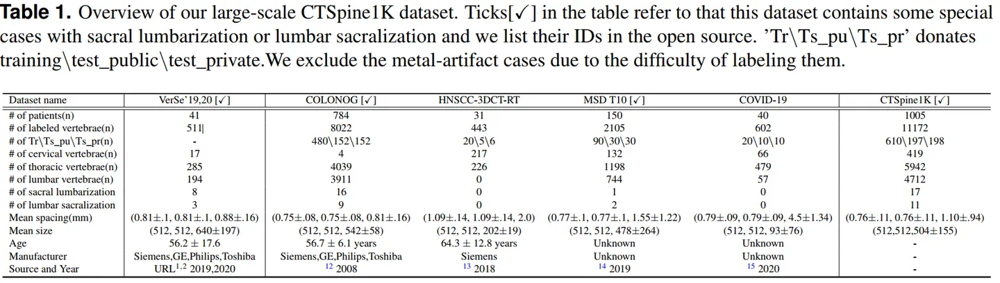
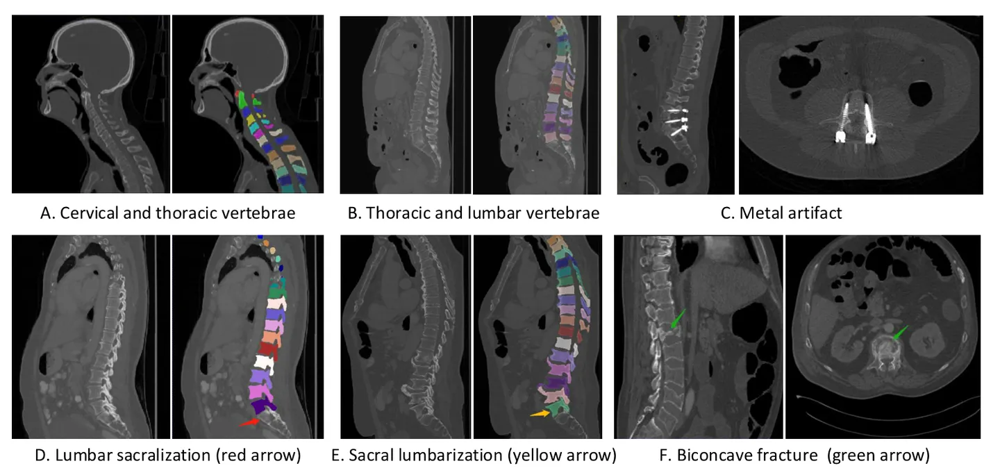

# CTSpine1K

<div align="center">
    <a href="https://github.com/openmedlab/"></a>
</div>
<p style="text-align:center;font-size:10px;"><em></em></p>

## Dataset Information

The translation of the text is as follows:

`CTSpine1K` is a large-scale CT dataset specifically designed for spinal segmentation. This dataset comprises a total of 1005 CT cases from four public datasets, with annotations for 25 types of vertebrae, including C1-C7, T1-T12, and L1-L6. It should be noted that most patients do not have an L6 vertebra, hence this category of data is relatively rare. The four public datasets are: COLONOG, HNSCC-3DCT-RT, MSD Liver, and COVID-19. `CTSpine1K` did not adopt all the data from these datasets; instead, it selected and excluded parts with poor quality. To achieve a reasonable data partition, `CTSpine1K` ensures that the proportion of data from the four datasets is the same in the training, validation, and test sets. Specifically, the division is 610 cases for the training set, 197 cases for the validation set, and 198 cases for the test set. The specific data composition is as follows:

<div align="center">
    <a href="https://github.com/openmedlab/"></a>
</div>
<p style="text-align:center;font-size:10px;"><em> CTSpine1K consists of four public data sets in the middle.</em></p>

## Dataset Meta Information

| Dimensions | Modality | Task Type | Anatomical Structures          | Anatomical Area | Number of Categories | Data Volume                                         | File Format |
|------------|----------|-----------|--------------------------------|-----------------|----------------------|-----------------------------------------------------|-------------|
| 3D         | CT       | Segmentation | cervical vertebra, thoracic, lumbar spine | Vertebrae       | 25                   | 610 for training, 197 for validation, 198 for test. | .nii.gz     |

Number of slices of all data: 506,634

### Resolution Details

| Dataset Statistics | spacing (mm)        | size              |
|--------------------|---------------------|-------------------|
| min                | (0.45, 0.45, 0.45)  | (512, 512, 42)    |
| median             | (0.76, 0.76, 0.80)  | (512, 512, 535)   |
| max                | (1.27, 1.27, 5.0 )     | (512, 512, 1026)  |

## Label Information Statistics

| Label | Anatomy Structure       | Detection Count | Detection Rate | Min Volume (cm³) | Median Volume (cm³) |
|-------|-------------------------|-----------------|----------------|------------------|---------------------|
| 1     | C1 (Primary Vertebra)   | 33              | 3.28%          | 19.15            | 13.94               |
| 2     | C2 (Secondary Vertebra) | 31              | 3.08%          | 26.5             | 17.48               |
| 3     | C3 (Tertiary Vertebra)  | 31              | 3.08%          | 19.44            | 12.42               |
| 4     | C4 (Intervertebral)     | 35              | 3.48%          | 19.48            | 12.08               |
| 5     | C5 (Arch Root)          | 50              | 4.98%          | 21.92            | 10.66               |
| 6     | C6 (Small Joint)        | 105             | 10.45%         | 22.95            | 5.38                |
| 7     | C7 (Upper Joint)        | 134             | 13.33%         | 25.42            | 14.18               |
| 8     | T1 (First Lumbar)       | 136             | 13.53%         | 31.88            | 20.66               |
| 9     | T2 (Second Lumbar)      | 136             | 13.53%         | 33.91            | 23.06               |
| 10    | T3 (Third Lumbar)       | 137             | 13.63%         | 33.47            | 22.1                |
| 11    | T4 (Fourth Lumbar)       | 146             | 14.53%         | 33.59            | 21.4                |
| 12    | T5 (Fifth Lumbar)        | 167             | 16.62%         | 36.57            | 21.73               |
| 13    | T6 (Sixth Lumbar)        | 291             | 28.96%         | 40.33            | 17.85               |
| 14    | T7 (Seventh Lumbar)      | 489             | 48.66%         | 44                | 3.7                 |
| 15    | T8 (Eighth Lumbar)       | 701             | 69.75%         | 53.38            | 13.23               |
| 16    | T9 (Ninth Lumbar)        | 859             | 85.47%         | 55.72            | 26.45               |
| 17    | T10 (Tenth Lumbar)       | 938             | 93.33%         | 67.62            | 34.48               |
| 18    | T11 (Eleventh Lumbar)    | 970             | 96.52%         | 69.98            | 39.53               |
| 19    | T12 (Twelfth Lumbar)     | 972             | 96.72%         | 88.12            | 44.68               |
| 20    | L1 (First Sacral)        | 967             | 96.22%         | 95.22            | 50.51               |
| 21    | L2 (Second Sacral)       | 953             | 94.83%         | 105.88           | 55.55               |
| 22    | L3 (Third Sacral)        | 939             | 93.43%         | 120.27           | 61.62               |
| 23    | L4 (Fourth Sacral)       | 932             | 92.74%         | 122.35           | 62.14               |
| 24    | L5 (Fifth Sacral)        | 921             | 91.64%         | 129.28           | 62.3                |
| 25    | L6 (Sixth Sacral)        | 18              | 1.79%          | 92.45            | 62.72               |


## Visualization

<div align="center">
    <a href="https://github.com/openmedlab/"></a>
</div>
<p style="text-align:center;font-size:10px;"><em> Official website visualization.</em></p>

## File Structure

The official file structure is as follows: the `data` directory contains CT images from four public datasets. At the same time, the `label` directory stores the corresponding annotation information and additionally provides complete annotations for the VerSe dataset, which is not part of this dataset. The officials also include the `data_split.txt` data partition file and the pretrained nnU-Net model `model_final_checkpoint`.

``` 
CTSpine1K
|-- Path.csv
|-- data_split.txt
|-- model_final_checkpoint.model
|-- model_final_checkpoint.model.pkl
|-- plans.pkl
|-- readme.txt
|-- data
|   |-- COVID-19
|   |   |-- volume-covid19-A-0003_ct.nii.gz
|   |   |-- ...
|   |-- HNSCC-3DCT-RT_neck
|   |   |-- HN_P001.nii.gz
|   |   |-- ...
|   |-- colon
|   |   |-- 1.3.6.1.4.1.9328.50.4.0001.nii.gz
|   |   |-- ...
|   |-- liver
|   |   |-- liver_0.nii.gz
|   |   |-- ...
|   |-- metadata_colonog.xlsx
|   |-- metadata_neck.xlsx
|-- label
|   |-- COVID-19
|   |-- HNSCC-3DCT-RT_neck
|   |-- Liver
|   |-- Verse
|   |-- completed_annotation_verse
|   |-- conlon
```

## Authors and Institutions

Yang Deng (Institute of Computing Technology, Chinese Academy of Sciences; Suzhou Institute for Advanced Study, University of Science and Technology of China)

Ce Wang (Institute of Computing Technology, Chinese Academy of Sciences; Suzhou Institute for Advanced Study, University of Science and Technology of China)

Yuan Hui (Institute of Computing Technology, Chinese Academy of Sciences; Suzhou Institute for Advanced Study, University of Science and Technology of China)

Qian Li (Institute of Computing Technology, Chinese Academy of Sciences; Suzhou Institute for Advanced Study, University of Science and Technology of China)

Jun Li (Institute of Computing Technology, Chinese Academy of Sciences)

Shiwei Luo (Department of Radiology, Guangzhou First People's Hospital; School of Medicine, Southern University of Science and Technology)

Mengke Sun (Institute of Computing Technology, Chinese Academy of Sciences)

Quan Quan (Institute of Computing Technology, Chinese Academy of Sciences)

Shuxin Yang (Institute of Computing Technology, Chinese Academy of Sciences)

You Hao (Institute of Computing Technology, Chinese Academy of Sciences; Suzhou Institute for Advanced Study, University of Science and Technology of China)

Pengbo Liu (Institute of Computing Technology, Chinese Academy of Sciences)

Honghu Xiao (Beijing Jishuitan Hospital)

Chunpeng Zhao (Beijing Jishuitan Hospital)

Xinbao Wu (Beijing Jishuitan Hospital)

S. Kevin Zhou (School of Biomedical Engineering and Suzhou Institute for Advanced Research MIRACLE Lab, University of Science and Technology of China; Institute of Computing Technology, Chinese Academy of Sciences)


## Source Information

Official Website: https://github.com/MIRACLE-Center/CTSpine1K

Download Link: https://github.com/MIRACLE-Center/CTSpine1K

Article Address: https://arxiv.org/abs/2105.14711

Publication Date: 2021-05

## Citation

``` 
@misc{deng2021ctspine1k,
      title={CTSpine1K: A Large-Scale Dataset for Spinal Vertebrae Segmentation in Computed Tomography}, 
      author={Yang Deng and Ce Wang and Yuan Hui and Qian Li and Jun Li and Shiwei Luo and Mengke Sun and Quan Quan and Shuxin Yang and You Hao and Pengbo Liu and Honghu Xiao and Chunpeng Zhao and Xinbao Wu and S. Kevin Zhou},
      year={2021},
      eprint={2105.14711},
      archivePrefix={arXiv},
      primaryClass={eess.IV}
}
```

Original introduction article is [here](https://zhuanlan.zhihu.com/p/657744499).