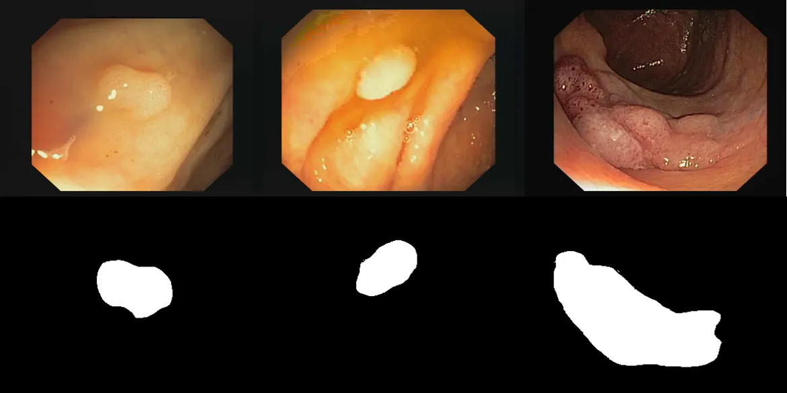

# CVC-ClinicDB

<div align="center">
    <a href="https://github.com/openmedlab/"></a>
</div>
<p style="text-align:center;font-size:10px;"><em></em></p>

## Dataset Information

CVC-ClinicDB is the official dataset for the training phase of the MICCAI 2015 Endoscopic Video Automatic Polyp Detection sub-challenge. The database consists of 612 static images extracted from colonoscopy examination videos, originating from 29 different sequences. Each frame image is accompanied by a ground truth mask, which is used to identify the area covered by polyps in the image. Polyp segmentation is of significant importance when it comes to colonoscopy examinations and gastrointestinal tumor screening. By separating polyps from the surrounding normal tissues in medical imaging, a clearer visual reference is provided, helping doctors to accurately determine the location, shape, and size of the polyps. This is crucial for preliminary assessment of the nature of the polyps (benign or malignant) and for formulating corresponding treatment plans.

## Dataset Meta Information

| Dimensions | Modality  | Task Type | Anatomical Structures | Anatomical Area | Number of Categories | Data Volume | File Format |
|------------|-----------|-----------|-----------------------|-----------------|----------------------|-------------|-------------|
| 2D         | Endoscopy | Segmentation | Colorectal                 | abdomen           | 1                    | 612         | .tif        |


### Resolution Details

| Dataset Statistics | size       |
|--------------------|------------|
| min                | [288,384]  |
| median             | [288,384]  |
| max                | [288,384]  |

## Label Information Statistics

| Category         | polyp   |
|------------------|---------|
| Detection Count  | 612     |
| Detection Rate   | 100%    |
| Min Area Size    | 373     |
| Median Area Size | 7557    |
| Max Area Size    | 54148   |


## Visualization

<div align="center">
    <a href="https://github.com/openmedlab/"></a>
</div>
<p style="text-align:center;font-size:10px;"><em></em></p>

## File Structure

The file structure of the dataset is as shown below, containing two different folders: Original and Ground Truth, corresponding to the images and the annotations of the polyps, respectively.

``` 
dataset
├── Original
│   ├── 1.tif
│   ├── 2.tif
│   │    ...
├── Ground Truth
│   ├── 1.tif
│   ├── 2.tif
│   ├── ...
```

## Authors and Institutions

Jorge Bernal (Department of Computer Science and Computer Vision Center, Autonomous University of Barcelona, Spain)

F. Javier Sánchez (Department of Computer Science and Computer Vision Center, Autonomous University of Barcelona, Spain)

Gloria Fernández-Esparrach (Gastroenterology Department, Hospital Clínic de Barcelona, Spain)

Debora Gil (Department of Computer Science and Computer Vision Center, Autonomous University of Barcelona, Spain)

Cristina Rodríguez (Gastroenterology Department, Hospital Clínic de Barcelona, Spain)

Fernando Vilariño (Department of Computer Science and Computer Vision Center, Autonomous University of Barcelona, Spain)


## Source Information

Official Website: https://polyp.grand-challenge.org/CVCClinicDB/

Download Link: https://polyp.grand-challenge.org/CVCClinicDB/

Article Address: https://www.sciencedirect.com/science/article/abs/pii/S0895611115000567

Publication Date: 2015-2-20

## Citation

``` 
@article{bernal2015wm,
  title={WM-DOVA maps for accurate polyp highlighting in colonoscopy: Validation vs. saliency maps from physicians},
  author={Bernal, Jorge and S{\'a}nchez, F Javier and Fern{\'a}ndez-Esparrach, Gloria and Gil, Debora and Rodr{\'\i}guez, Cristina and Vilari{\~n}o, Fernando},
  journal={Computerized medical imaging and graphics},
  volume={43},
  pages={99--111},
  year={2015},
  publisher={Elsevier}
}
```

Original introduction article is [here](https://zhuanlan.zhihu.com/p/661471445).