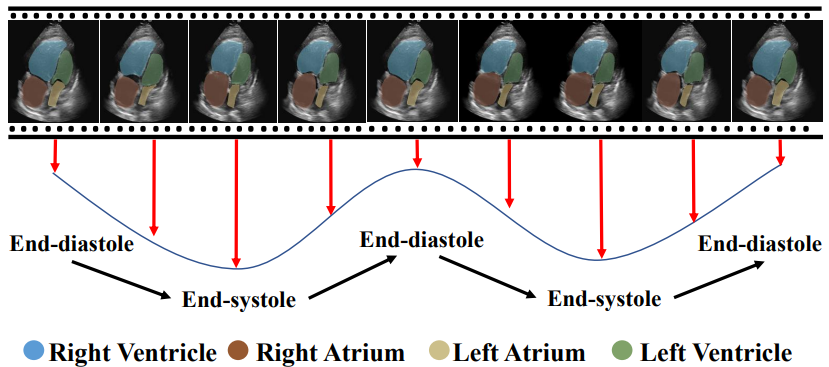
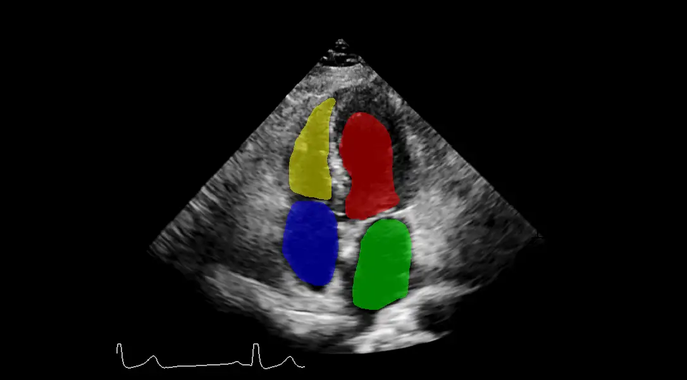
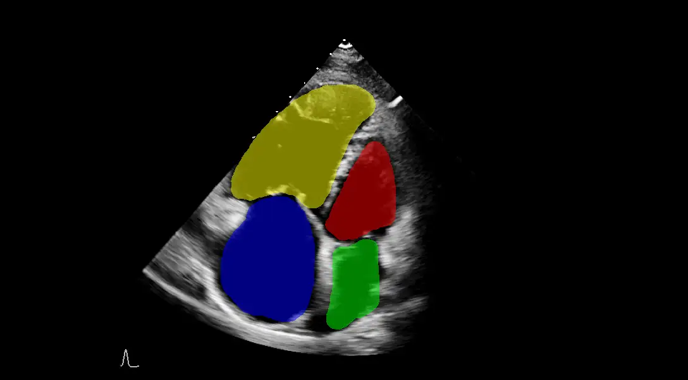

# CardiacUDA

<div align="center">
    <a href="https://github.com/openmedlab/"></a>
</div>
<p style="text-align:center;font-size:10px;"><em></em></p>

## Dataset Information

The CardiacUDA dataset is a cardiac ultrasound video dataset that includes a total of 992 cardiac ultrasound videos collected from G Hospital and R Hospital. Among these, 516 videos are from G Hospital and 476 videos are from R Hospital, collected from approximately 100 different patients from both hospitals. Each video contains over 100 frames and at least one cardiac cycle. The CardiacUDA dataset provides annotations for the **left ventricle (LV)** and **right ventricle (RV)** from the left ventricular long axis view (LVLA) and left ventricular short axis view (LVSA); annotations for the pulmonary artery (PA) from the pulmonary artery long axis view (PALA); and annotations for the **left ventricle (LV)**, **right ventricle (RV)**, **left atrium (LA)**, and **right atrium (RA)** from the apical four-chamber view (A4C). The dataset is divided into training, validation, and test sets in an 8:1:1 ratio by the authors. In the training set, annotations are provided only for 5 frames per video; in the validation and test sets, annotations are provided for every frame of each video.

Cardiac ultrasound is a non-invasive diagnostic tool that can observe all structures of the heart and capture dynamic information about heart motion and function. It is a safe and cost-effective method for analyzing cardiac morphological and functional changes. Accurate segmentation of cardiac structures, such as the left ventricle (LV) and right ventricle (RV), is crucial for determining fundamental cardiac function parameters such as ejection fraction and myocardial strain. These parameters can assist doctors in diagnosing heart diseases, planning treatment, and monitoring treatment effectiveness. The CardiacUDA dataset provides annotated results of different cardiac structures from various ultrasound views, enabling researchers and algorithm developers to train and validate machine learning models to improve the accuracy and efficiency of automatic cardiac structure segmentation.

## Dataset Meta Information

| Dimensions | Modality    | Task Type | Anatomical Structures | Anatomical Area | Number of Categories | Data Volume | File Format |
|------------|-------------|-----------|-----------------------|-----------------|----------------------|-------------|-------------|
| 2D         | Ultrasound  | Segmentation | Heart                 | Heart       | 5                    | 992         | .nii.gz     |


### Resolution Details

| Dataset Statistics | size        |
|--------------------|-------------|
| min                | [640,480]   |
| median             | [800,600]   |
| max                | [1024,768]  |

Number of two-dimensional slices in the data set: 29283.

## Label Information Statistics

When counting tags, the actual downloaded data shall prevail, and only videos containing annotation results will be counted. The data provided do not have annotations for the pulmonary arteries.

| Segmentation | Left Ventricle (LV) | Right Ventricle (RV) | Myocardium (MYO) | Atria (ATR) |
|--------------|---------------------|----------------------|------------------|-------------|
| Sample Count | 294                 | 293                  | 294              | 292         |
| Percentage   | 100%                | 99.66%               | 100%             | 99.32%      |


## Visualization

In the data provided by the authors, red, green, blue, and yellow correspond to the left ventricle (LV), left atrium (LA), right atrium (RA), and right ventricle (RV), respectively.

<div align="center">
    <a href="https://github.com/openmedlab/"></a>
</div>
<p style="text-align:center;font-size:10px;"><em> ITK-SNAP Visualization.</em></p>

<div align="center">
    <a href="https://github.com/openmedlab/"></a>
</div>
<p style="text-align:center;font-size:10px;"><em> ITK-SNAP Visualization.</em></p>

## File Structure

The structure of this dataset is as follows: it includes medical images and their labels from different sites, such as the Site_G_20 folder, as well as a folder labeled_all_frame that contains annotations for every frame of videos featuring both normal and pathological cases.

``` 
cardiacUDC_dataset
│
├── label_all_frame
│   ├── normal-23-4_image.nii
│   ├── normal-23-4_label.nii
│   ├── ...
│   ├── patient-5-4_image.nii
│   ├── patient-5-4_label.nii
│   ├── ...
├── Site_G_20
│   ├── patient-1-4_image.nii
│   ├── patient-1-4_label.nii
│   ├── ...
├── Site_G_29
│   ├── patient-1-4_image.nii
│   ├── patient-1-4_label.nii
│   ├── ...
├── Site_G_100
│   ├── patient-1-4_image.nii
│   ├── patient-1-4_label.nii
│   ├── ...
├── Site_R_52
│   ├── patient-1-4_image.nii
│   ├── patient-1-4_label.nii
│   ├── ...
├── Site_R_73
│   ├── patient-53-4_image.nii
│   ├── ...
├── Site_R_126
│   ├── patient-2-4_image.nii
│   ├── patient-2-4_label.nii
│   ├── ...
```

## Authors and Institutions

Jiewen Yang (Guangdong Provincial People's Hospital, China)

Xinpeng Ding (Hong Kong University of Science and Technology, Hong Kong, China)

Ziyang Zheng (Hong Kong University of Science and Technology, Hong Kong, China)

Xiaowei Xu (Guangdong Provincial People's Hospital, China)

Xiaomeng Li (Hong Kong University of Science and Technology, Hong Kong, China)

## Source Information

Official Website: https://github.com/xmed-lab/GraphEcho

Download Link: https://www.kaggle.com/datasets/xiaoweixumedicalai/cardiacudc-dataset

Article Address: https://arxiv.org/pdf/2309.11145.pdf

Publication Date: 2023-09

## Citation

``` 
@InProceedings{Yang_2023_ICCV,
    author    = {Yang, Jiewen and Ding, Xinpeng and Zheng, Ziyang and Xu, Xiaowei and Li, Xiaomeng},
    title     = {GraphEcho: Graph-Driven Unsupervised Domain Adaptation for Echocardiogram Video Segmentation},
    booktitle = {Proceedings of the IEEE/CVF International Conference on Computer Vision (ICCV)},
    month     = {October},
    year      = {2023},
    pages     = {11878-11887}
}
```

Original introduction article is [here](https://zhuanlan.zhihu.com/p/691337646).