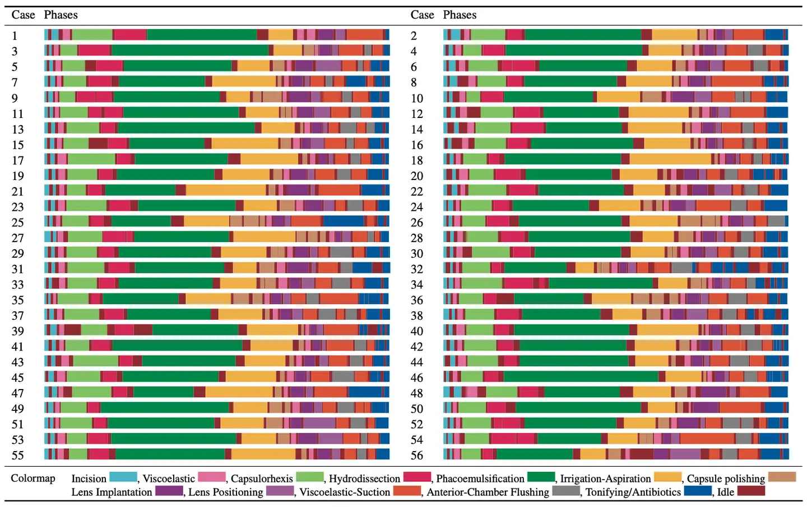
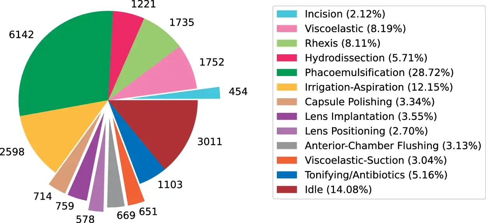
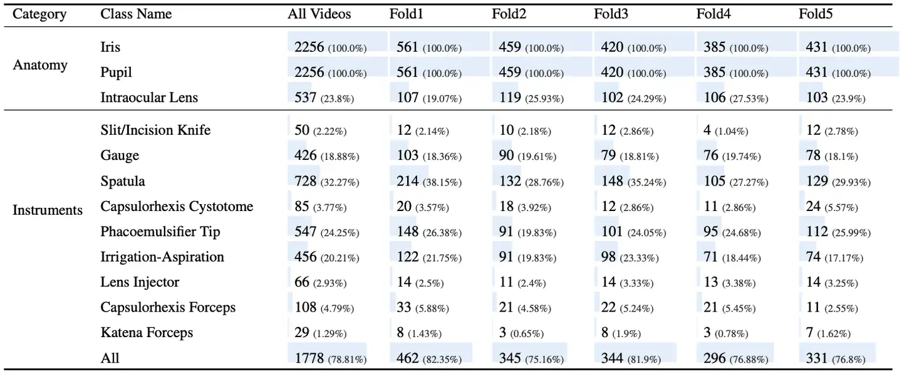
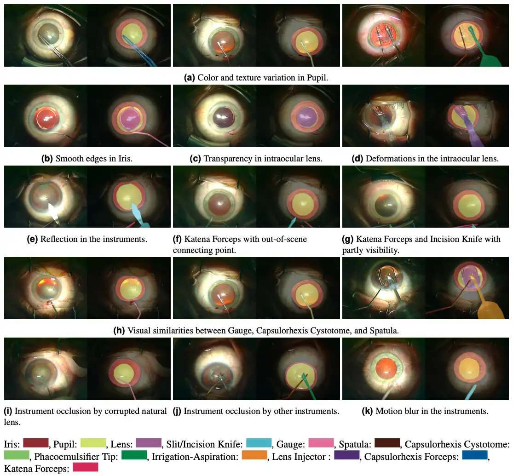
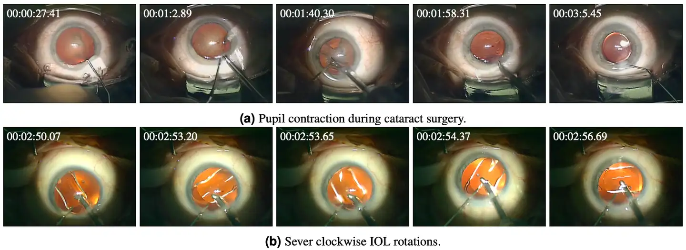

# Cataract-1K

<div align="center">
    <a href="https://github.com/openmedlab/"></a>
</div>
<p style="text-align:center;font-size:10px;"><em></em></p>

## Dataset Information

Cataract-1K consists of 1,000 cataract surgery videos conducted at the Ophthalmology Clinic of Klinikum Klagenfurt from 2021 to 2023. These videos were recorded using the Medilive Trio Eye device mounted on a Zeiss OPMI Vario microscope. Cataract-1K features surgeries performed by surgeons with experience ranging from 1,000 to over 40,000 surgeries. The average duration of these videos is 7.12 minutes, with a standard length of 200 seconds. Additionally, Cataract-1K includes surgical phase annotations for 56 standard videos and pixel-level annotations of relevant anatomy and instruments in 2,256 frames across 30 cataract surgery videos. It also contains a small subset of surgeries featuring two main complications: "pupil constriction" and "intraocular lens (IOL) rotation," to support further research in anomaly detection during cataract surgeries. Apart from the annotated videos and images, the remaining videos in Cataract-1K are encoded at a frame rate of 25 fps and a resolution of 512×324. Cataract-1K meets the diverse needs for building computerized surgical workflow analysis and detecting post-operative anomalies in cataract surgeries.

## Dataset Meta Information

| Dimensions | Modality               | Task Type                    | Anatomical Structures | Anatomical Area | Number of Categories                                                                  | Data Volume | File Format |
|------------|------------------------|------------------------------|-----------------------|-----------------|---------------------------------------------------------------------------------------|-------------|-------------|
| 2D         | Ophthalmic microscope  | Classification, Segmentation | Eye                   | Eye             | 13 types of Surgical Phases, 12 types of Segmentations, 2 types of Anomaly Detection. | 1000        | .mp4        |


## Label Information Statistics

(1) **Surgical Phase Identification**:

Conventional cataract surgeries can encompass twelve action phases including incision, viscoelastic substance injection, capsulotomy, hydrodissection, phacoemulsification, irrigation aspiration, capsular polishing, intraocular lens implantation, lens positioning, viscoelastic substance removal, anterior chamber flushing, and use of supplements/antibiotics. The idle phase refers to the spans when the surgeon mainly switches instruments and there is no visible instrument within the frame between one phase and another. Table 1 displays the phase annotations corresponding to 56 conventional cataract surgery videos, with a resolution of 1024x768, frame rate of 30 fps, average duration of 6.45 minutes, and a standard deviation of 2.04 minutes. The dataset includes patients with an average age of 75 years, ranging from 51 to 93 years, and a standard deviation of 8.69 years. The video for phase identification was recorded by surgeons who had performed an average of 8929 surgeries, with a standard deviation of 6350 surgeries. Frame-level annotations for phase identification are provided in a CSV file, determining the first and last frames of all action phases in each video. Additionally, Figure 1 shows the total annotated duration corresponding to each phase from the 56 videos.

<div align="center">
    <a href="https://github.com/openmedlab/"></a>
</div>
<p style="text-align:center;font-size:10px;"><em>Table 1. Visualization of phase annotations for 56 conventional cataract surgeries. The duration of the videos varies and has been standardized.</em></p>

<div align="center">
    <a href="https://github.com/openmedlab/"></a>
</div>
<p style="text-align:center;font-size:10px;"><em>Figure 1. Total duration of annotated phases in 56 annotated cataract surgery videos, measured in seconds.</em></p>

(2) **Semantic Segmentation**:

The semantic segmentation dataset includes frames extracted every 5 seconds from 30 conventional cataract surgery videos, with a resolution of 1024x768, average duration of 6.52 minutes, and a standard deviation of 2 minutes. Frames with severe motion blur or scenes outside the iris were excluded from the dataset. Pixel-level annotations are provided for three related anatomical structures, including the iris, pupil, and intraocular lens, as well as for nine instruments used in conventional cataract surgeries: slit/incision knife, gauge, spatula, capsulorhexis cystotome, phacoemulsification tip, irrigation aspiration handpiece, lens injector, capsulorhexis forceps, and Sinskey hook. All annotations were made using polygons on the Supervisely platform and exported as JSON files. In this dataset, the average age of individuals is 74.5 years, ranging from 51 to 90 years, with a standard deviation of 8.43 years. The collective experience of the surgeons performing the videos in the semantic segmentation dataset averages 8033 surgeries, with a standard deviation of 3894 surgeries. The provided dataset reliably studies the segmentation performance of relevant anatomical structures, binary instruments, and multi-class instruments. Pixel-level annotations are provided in two formats: (1) Supervisely format, for which we provide Python code to create masks from JSON files, and (2) COCO format, which also provides bounding box annotations for all objects in the pixel-level annotations. The latter can be used for object localization problems. Preprocessing code to create training masks for "Anatomical Structure and Instrument Segmentation," "Binary Instrument Segmentation," and "Multi-class Instrument Segmentation" is available in the repository on GitHub. We have created five folds for separation, by patients, meaning each fold includes frames corresponding to six different videos. Table 2 compares the number of instances and their percentage occurrences in frames. Additionally, Table 3 lists the average number of pixels per label per frame.

<div align="center">
    <a href="https://github.com/openmedlab/"></a>
</div>
<p style="text-align:center;font-size:10px;"><em>Table 2. Number of instances per frame (percentage of total frames in each fold)</em></p>

| Category  | Class Name                 | All Videos | Fold1 | Fold2 | Fold3 | Fold4 | Fold5 |
|-----------|----------------------------|------------|-------|-------|-------|-------|-------|
| Anatomy   | Iris                       | 45939      | 41874 | 47792 | 44867 | 47963 | 48494 |
|           | Pupil                      | 36013      | 38594 | 33578 | 35900 | 35291 | 35999 |
|           | Intraocular Lens           | 9135       | 7056  | 10017 | 9153  | 10405 | 9748  |
| Instruments| Slit/Incision Knife       | 1140       | 1088  | 1179  | 1163  | 1206  | 1086  |
|           | Gauge                      | 299        | 222   | 337   | 454   | 168   | 326   |
|           | Spatula                    | 2613       | 3163  | 2078  | 2893  | 2309  | 2466  |
|           | Capsulorhexis Cystotome    | 5523       | 4760  | 4773  | 6551  | 6345  | 5580  |
|           | Phacoemulsifier Tip        | 5230       | 4388  | 5526  | 7646  | 4451  | 4354  |
|           | Irrigation-Aspiration      | 1083       | 790   | 1138  | 1311  | 1153  | 1123  |
|           | Lens Injector              | 512        | 465   | 543   | 673   | 318   | 556   |
|           | Capsulorhexis Forceps      | 172        | 288   | 104   | 225   | 23    | 176   |
|           | Katena Forceps             | 823        | 906   | 678   | 1065  | 1133  | 357   |
|           | All                        | 17397      | 16069 | 16357 | 21981 | 17105 | 16025 |
<center> Table 3. Average pixels per frame for different labels </center>


(3) **Irregularity Detection**:

This dataset includes two small subsets involving major intraoperative irregular phenomena in cataract surgery, including pupil reactions and intraocular lens rotation.

Pupil Constriction: During the phacoemulsification phase, when the obstructed natural lens is disrupted and suctioned away, the amount of light reaching the photoreceptors may suddenly increase. This increase in light reception can affect the size of the pupil, typically causing the pupil to slowly (gradually) constrict. However, in some cases, the pupil's reaction to changes in lighting is unexpectedly quick, causing rapid constriction. These sudden responses in pupil size can have severe intraoperative impacts. Especially during the phacoemulsification phase, when instruments are deep inside the eye, sudden changes in pupil size can cause damage to delicate eye tissues. Moreover, achieving precise IOL alignment or centering becomes challenging under conditions of intraoperative pupil constriction (miosis). Particularly with multifocal IOLs, even minor misalignments or tilts, which might be trivial for traditional monofocal IOLs, can significantly impact visual performance. In the case of toric IOLs, precise alignment of the torus is crucial, as any deviation reduces the effectiveness of the IOL. Detecting unusual pupil reactions and severe miosis during surgery can greatly aid the overall outcome of cataract surgery and provide important insights for further postoperative investigations. The top of Figure 4 showcases an instance of severe pupil constriction during cataract surgery.

IOL Rotation: While aligned and centered at the end of surgery, the IOL may rotate or shift postoperatively. Even slight deviations, such as minor misalignments of the torus in toric IOLs or slight movements and tilts in multifocal IOLs, can cause significant visual distortions, leading to patient dissatisfaction. The only way to address this postoperative complication is through follow-up surgery, which involves additional costs, increased surgical risks, and patient discomfort. Identifying intraoperative indicators to predict and prevent postoperative IOL shifts is an unmet clinical need. It is argued that intraoperative rotations of the IOL during cataract surgery are primary causes of postoperative displacements. Thus, automatically detecting and measuring intraoperative lens rotations can effectively help prevent postoperative IOL shifts. The bottom of Figure 4 represents a situation where the IOL rapidly rotates clockwise during deployment, occurring in less than seven seconds.


## Visualization

<div align="center">
    <a href="https://github.com/openmedlab/"></a>
</div>
<p style="text-align:center;font-size:10px;"><em>Figure 2. Visualization of pixel-level annotations corresponding to relevant anatomical structures and instruments in cataract surgery.</em></p>

<div align="center">
    <a href="https://github.com/openmedlab/"></a>
</div>
<p style="text-align:center;font-size:10px;"><em>Figure 3. Intraoperative anomalies during cataract surgery.</em></p>

## File Structure

Officially, the video files, annotation files, and data preprocessing code are provided according to the type of task.

``` 
Dataset
│
├── Catatact-1k
│   ├── case_2000.mp4
│   ├── case_2000.mp4
│   ├── case_2002.mp4
│   └── ...
├── Phase Recognition Set
│   ├── annotations
│   │   ├── case_2000
│   │   ├── case_2001
│   │   ├── ...
│   ├── videos
│   │   ├── case_2000
│   │   ├── case_2001
│   │   ├── ...
├── Semantic Segmentation Set
│   ├── annotations
│   │   ├── Coco-Annotations
│   │   │    ├── case_2000
│   │   │    ├── case_2001
│   │   │    ├── ...
│   │   ├── Images-and-Supervisely-Annotations
│   │   │    ├── case_2000
│   │   │    ├── case_2001
│   │   │    ├── ...
│   ├── videos
│   │   ├── case_2000
│   │   ├── case_2001
│   │   ├── ...
├── Lens Irregularity Set
│   ├── case_2595.mp4
│   ├── case_3459.mp4
│   ├── ...
├── Pupil Reaction Set
│   ├── case_3201.mp4
│   ├── case_709.mp4
│   ├── ...
├── Dataset Preparation Codes
```

## Authors and Institutions

Negin Ghamsarian (Center for Artificial Intelligence in Medicine (CAIM), University of Bern, Switzerland)

Yosuf El-Shabrawi (Department of Ophthalmology, Klinikum Klagenfurt, Klagenfurt, Austria)

Sahar Nasirihaghighi (Department of Informatics, University of Klagenfurt, Klagenfurt, Austria)

Doris Putzgruber-Adamitsch (Department of Ophthalmology, Klinikum Klagenfurt, Klagenfurt, Austria)

Martin Zinkernagel (Department of Ophthalmology, Inselspital, Bern, Switzerland)

Sebastian Wolf (Department of Ophthalmology, Inselspital, Bern, Switzerland)

Klaus Schoefmann (Department of Informatics, University of Klagenfurt, Klagenfurt, Austria)

Raphael Sznitman (Center for Artificial Intelligence in Medicine (CAIM), University of Bern, Switzerland)

## Source Information

Official Website: https://github.com/Negin-Ghamsarian/Cataract-1K

Download Link: https://www.synapse.org/#!Synapse:syn53404507

Article Address: https://www.nature.com/articles/s41597-024-03193-4

Publication Date: 2024-04-12

## Citation

``` 
@inproceedings{Cataract-1K,
    author    = {Negin Ghamsarian and
                Yosuf El-Shabrawi and
                Sahar Nasirihaghighi and
                Doris Putzgruber-Adamitsch and
                Martin Zinkernagel and
                Sebastian Wolf and
                Klaus Schoeffmann and
                Raphael Sznitman},
    title     = {Cataract-1K: Cataract Surgery Dataset for Scene Segmentation, Phase Recognition, and Irregularity Detection (to appear)},
    
}
```

Original introduction article is [here](https://zhuanlan.zhihu.com/p/708463573).