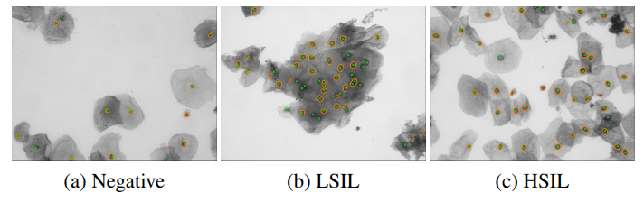
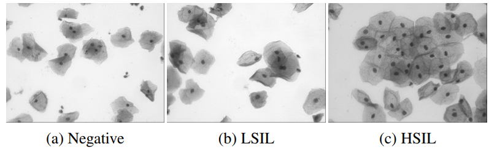

# Cervix93

<div align="center">
    <a href="https://github.com/openmedlab/"></a>
</div>
<p style="text-align:center;font-size:10px;"><em></em></p>

## Dataset Information

The analysis of Pap cytology slides plays a crucial role in medical diagnostics. It is a key step in detecting and grading cervical precancerous lesions and cancer stages. This process not only requires a high level of professional skill but also involves complex cytological image processing techniques. Among these, the precise segmentation of cell nuclei and overlapping cells is a core aspect of cytological image processing and is crucial for subsequent diagnosis and analysis. To advance this field, this paper introduces a brand-new cervical cytology dataset. 

This dataset is rich in content, covering 93 real extended depth of field (EDF) images and their image stacks from Pap smears with three different test grades: negative, low-grade squamous intraepithelial lesion (LSIL), and high-grade squamous intraepithelial lesion (HSIL). These images are not only highly authentic and representative but also meticulously processed and annotated. The dataset contains a total of 2,705 annotated cell nuclei, with each nucleus's position and morphology accurately recorded. Additionally, each image is accompanied by corresponding grade labels, which clearly reflect the cytological characteristics and lesion severity of each image. 

The design of this dataset makes it suitable not only for evaluating the performance and accuracy of cell nucleus segmentation and detection but also for research on cytological image classification. More importantly, this dataset provides strong support for the classification of cervical cytology images. By classifying cytological images into different grade categories, we can more accurately determine the severity and nature of lesions, thus providing more reliable evidence for clinical diagnosis and treatment. This is also one of the primary goals of developing this dataset.

## Dataset Meta Information

| Dimensions | Modality             | Task Type      | Anatomical Structures | Anatomical Area  | Number of Categories | Data Volume | File Format |
|------------|----------------------|----------------|-----------------------|------------------|----------------------|-------------|-------------|
| 2D         | Pathological Imaging | Classification | Cervical cancer       | Cervical cancer  | 3                    | 331         | PNG         |


### Resolution Details

| Dataset Statistics | size         |
|--------------------|--------------|
| min                | (960, 1280)  |
| median             | (960, 1280)  |
| max                | (960, 1280)  |

## Label Information Statistics

| Category                                              | Quantity |
|-------------------------------------------------------|----------|
| 0 (Benign: Negative)                                  | 238      |
| 1 (Low-grade Squamous Intraepithelial Lesion: LSIL)   | 1536     |
| 2 (High-grade Squamous Intraepithelial Lesion: HSIL)  |  931     | 

## Visualization

<div align="center">
    <a href="https://github.com/openmedlab/"></a>
</div>
<p style="text-align:center;font-size:10px;"><em>Paper Visualization Result.</em></p>

<div align="center">
    <a href="https://github.com/openmedlab/"></a>
</div>
<p style="text-align:center;font-size:10px;"><em>Paper Visualization Result.</em></p>

## File Structure

The dataset file structure is as follows:

``` 
Cervix93
├── image
│   ├── train
│   │   ├── xxx.jpg
│   │   ├── xxx.jpg
│   │   ├── xxx.jpg
│   │   ├── xxx.jpg
│   │   └── ...
│   └── test
│   │   ├── xxx.jpg
│   │   ├── xxx.jpg
│   │   ├── xxx.jpg
│   │   ├── xxx.jpg
│   │   └── ...
    ├── train.txt
    └── test.txt
```

## Authors and Institutions

Hady Ahmady Phoulady (University of Southern Maine Department of Computer Science Portland, ME)

Peter R. Mouton (University of South Florida Department of Computer Science and Engineering)

## Source Information

Official Website: https://github.com/parham-ap/cytology_dataset

Download Link: https://github.com/parham-ap/cytology_dataset

Article Address: https://arxiv.org/pdf/1811.09651

Publication Date: 2018

## Citation

``` 
@article{phoulady2018new,
  title={A new cervical cytology dataset for nucleus detection and image classification (Cervix93) and methods for cervical nucleus detection},
  author={Phoulady, Hady Ahmady and Mouton, Peter R},
  journal={arXiv preprint arXiv:1811.09651},
  year={2018}
}
```

Original introduction article is [here](https://zhuanlan.zhihu.com/p/3458238229).