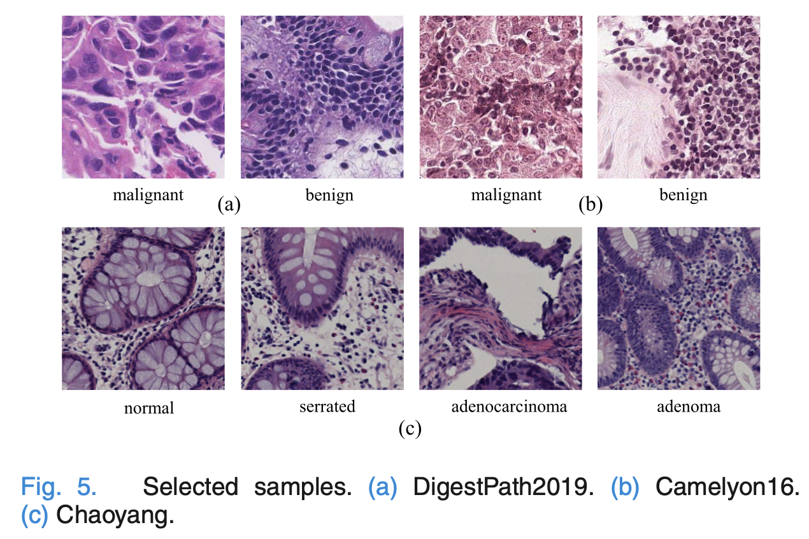
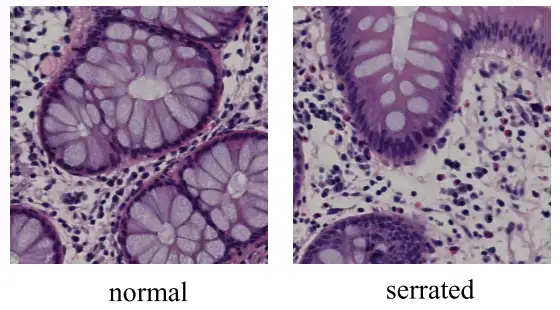
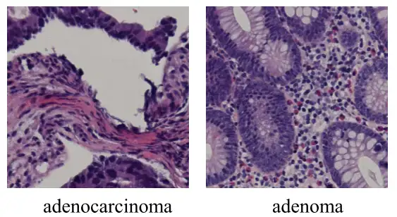

# Chaoyang
<div align="center">
    <a href="https://github.com/openmedlab/"></a>
</div>
<p style="text-align:center;font-size:10px;"><em></em></p>

## Dataset Information

The Chaoyang dataset is a pathological image dataset used for classification, focusing on the diagnosis of colorectal cancer. The dataset comprises colon slice images from Beijing Chaoyang Hospital affiliated with Capital Medical University, scanned under a 20x objective. It includes a variety of lesion categories, such as normal, serrated lesions, adenocarcinomas, and adenomas. The dataset contains a total of 6,160 images, with 4,021 in the training set and 2,139 in the test set. The dataset includes annotation noise common in real-world scenarios, enhancing the robustness of models developed for handling real-world data. Additionally, the test set is annotated consistently by three pathologists, ensuring the reliability of the test set labels. The dataset includes various types of colorectal lesions, providing a multi-class classification challenge that aids in improving the performance of pathology models in fine-grained classification tasks.

Pathological research on colorectal cancer involves a detailed analysis of the carcinogenic process of glandular epithelial cells in the colon wall and their histological characteristics, to facilitate early diagnosis and precise treatment. Lesion types include normal colon mucosa, serrated lesions (with potential for malignancy), adenomas (precancerous lesions), and adenocarcinomas (invasive cancer). Pathological diagnosis allows for the development of personalized treatment plans, improving patient survival rates and providing prognostic assessments.

## Dataset Meta Information

| Dimensions | Modality  | Task Type       | Anatomical Structures | Anatomical Area | Number of Categories | Data Volume | File Format |
|------------|-----------|-----------------|-----------------------|-----------------|----------------------|-------------|-------------|
| 2D         | Pathology | Classification  | Colon                 | Colon           | 4                    | 6160        | JPG         |


### Resolution Details

| Dataset Statistics | size       |
|--------------------|------------|
| min                | (512, 512) |
| median             | (512, 512) |
| max                | (512, 512) | 

## Label Information Statistics

| Category         | Normal  | Serrated  | Adenocarcinoma  | Adenoma |
|------------------|---------|-----------|-----------------|---------|
| Number of Cases  | 1,816   | 1,163     | 2,244           | 937     |
| Percentage       | 29.48%  | 18.88%    | 36.43%          | 15.21%  |


## Visualization

<div align="center">
    <a href="https://github.com/openmedlab/"></a>
</div>
<p style="text-align:center;font-size:10px;"><em>Examples of normal and serrated categories in the article.</em></p>

<div align="center">
    <a href="https://github.com/openmedlab/"></a>
</div>
<p style="text-align:center;font-size:10px;"><em>A dataset of examples of articles with adenocarcinoma and adenoma categories in articles.</em></p>

## File Structure

``` 
chaoyang-dataset
│
├── train
│   ├── image1
│   ├── image2
│   └── ...
├── test
│   ├── image1
│   ├── image2
│   └── ...
├── train.json
├── test.json
```

## Authors and Institutions

Chuang Zhu (School of Artificial Intelligence, Beijing University of Posts and Telecommunications)

Wenkai Chen (School of Artificial Intelligence, Beijing University of Posts and Telecommunications)

Ting Peng (School of Artificial Intelligence, Beijing University of Posts and Telecommunications)

Ying Wang (Beijing Chaoyang Hospital affiliated with Capital Medical University)

Mulan Jin (Beijing Chaoyang Hospital affiliated with Capital Medical University)

## Source Information

Official Website: https://bupt-ai-cz.github.io/HSA-NRL/

Download Link: https://bupt-ai-cz.github.io/HSA-NRL/

Article Address: https://ieeexplore.ieee.org/abstract/document/9600806

Publication Date: 2021-11

## Citation

``` 
@article{zhu2021hard,
  title={Hard sample aware noise robust learning for histopathology image classification},
  author={Zhu, Chuang and Chen, Wenkai and Peng, Ting and Wang, Ying and Jin, Mulan},
  journal={IEEE transactions on medical imaging},
  volume={41},
  number={4},
  pages={881--894},
  year={2021},
  publisher={IEEE}
}
```

Original introduction article is [here](https://zhuanlan.zhihu.com/p/702288370).