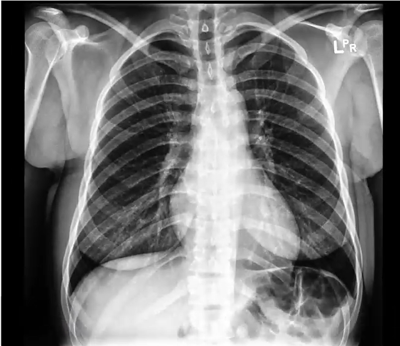
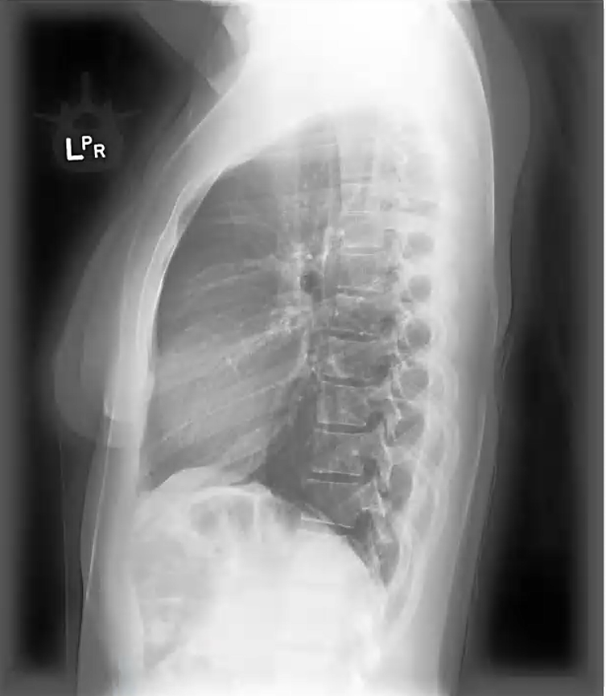

# CheXpert

## Dataset Information

**CheXpert** and **CheXpertPlus** are two large-scale multimodal datasets of chest X-ray images and medical reports released by Stanford University to advance medical imaging analysis and artificial intelligence research. 

- **CheXpert** contains **224,316 chest X-ray images** from **65,240 patients**, with data collected between October 2002 and July 2017, spanning both outpatient and inpatient settings. The dataset includes radiology reports corresponding to 14 cardiopulmonary diseases, such as **atelectasis, cardiomegaly, consolidation, edema, pleural effusion, pneumonia, pneumothorax, enlarged heart, lung lesions, lung opacity, other pleural diseases, fractures, support devices**, and a **"No Finding"** category. A rule-based label extractor was developed to annotate these diseases in each report as **positive**, **negative**, or **uncertain**.

- **CheXpertPlus** is an extended version of CheXpert, featuring **223,462 chest X-ray images** from **64,725 patients**, enriched with additional patient demographic information, complete radiology report texts, and high-quality **DICOM-format** images. It provides large-scale textual data, including **36 million text tokens**, of which **13 million** are from the impressions section, making it one of the largest publicly available radiology text datasets. Additionally, nearly **1 million personal health information fragments** have been de-identified in the dataset.

These datasets offer extensive resources for multimodal research, driving advancements in the field of radiology and enabling cutting-edge developments in artificial intelligence for medical applications.

## Dataset Meta Information

| Dimensions               | Modality | Task Type                                    | Anatomical Structures | Anatomical Area      | Data volume                  | File Format                    |
|--------------------------|----------|----------------------------------------------|-----------------------|----------------------|------------------------------|--------------------------------|
| Front and side pictures  | Report   | Report generation, multimodal understanding  | Lungs, Chest, Heart   | Lungs, Chest, Heart  | 224K images, 36M text tokens | Image: .jpg, dicom, Text: csv  |

## Visualization

<div align="center">
    <a href="https://github.com/openmedlab/"></a>
</div>
<p style="text-align:center;font-size:10px;"><em>patient00004-study1-view1_frontal.jpg</em></p>

<div align="center">
    <a href="https://github.com/openmedlab/"></a>
</div>
<p style="text-align:center;font-size:10px;"><em>patient00004-study1-view1_lateral.jpg</em></p>

## File Structure

Chexpert: Because it has 400GB when it only contains jpg, while it has 3TB when it contains DICOM.

``` 
chexpertchestxrays-u20210408
├── train_cheXbert.csv
├── train_visualCheXbert.csv
├── README.md
├── CheXpert-v1.0 batch 2 (train 1)
│   ├── patient00001
│          ├── study1
│                 ├── view1_frontal.jpg
|                  ├── view1_lateral.jpg
│          ├── study2
│          ├── study3
│   ├── patient00002
│   ├── patient00003
├──CheXpert-v1.0 batch 2 (train 2)
├──CheXpert-v1.0 batch 2 (train 3)
```

## Authors and Institutions

Jeremy Irvin, Pranav Rajpurkar, Michael Ko, Yifan Yu, Silviana Ciurea-Ilcus, Chris Chute, Henrik Marklund, Behzad Haghgoo, Robyn Ball, Katie Shpanskaya, Jayne Seekins, David A. Mong, Safwan S. Halabi, Jesse K. Sandberg, Ricky Jones, David B. Larson, Curtis P. Langlotz, Bhavik N. Patel, Matthew P. Lungren, Andrew Y. Ng

Stanford University

## Source Information

Official Website: 

- Chexpert: https://stanfordmlgroup.github.io/competitions/chexpert/

- ChexpertPLUS: https://stanfordaimi.azurewebsites.net/datasets/5158c524-d3ab-4e02-96e9-6ee9efc110a1

Download Link:

- Chexprt: https://stanfordaimi.azurewebsites.net/datasets/8cbd9ed4-2eb9-4565-affc-111cf4f7ebe2 (Install azcopy first)

- ChexpertPLUS: https://stanfordaimi.azurewebsites.net

Article Address: 

- Chexprt: https://arxiv.org/pdf/1901.07031

- ChexpertPLUS: https://arxiv.org/pdf/2405.1953

Publication Date:

- Chexprt: 2019-01

- ChexpertPLUS: 2024-06

## Citation

``` 
@article{DBLP:journals/corr/abs-1901-07031,
  author       = {Jeremy Irvin and
                  Pranav Rajpurkar and
                  Michael Ko and
                  Yifan Yu and
                  Silviana Ciurea{-}Ilcus and
                  Christopher Chute and
                  Henrik Marklund and
                  Behzad Haghgoo and
                  Robyn L. Ball and
                  Katie S. Shpanskaya and
                  Jayne Seekins and
                  David A. Mong and
                  Safwan S. Halabi and
                  Jesse K. Sandberg and
                  Ricky Jones and
                  David B. Larson and
                  Curtis P. Langlotz and
                  Bhavik N. Patel and
                  Matthew P. Lungren and
                  Andrew Y. Ng},
  title        = {CheXpert: {A} Large Chest Radiograph Dataset with Uncertainty Labels
                  and Expert Comparison},
  journal      = {CoRR},
  volume       = {abs/1901.07031},
  year         = {2019},
  url          = {http://arxiv.org/abs/1901.07031},
  eprinttype    = {arXiv},
  eprint       = {1901.07031},
  timestamp    = {Fri, 23 Jun 2023 22:30:55 +0200},
  biburl       = {https://dblp.org/rec/journals/corr/abs-1901-07031.bib},
  bibsource    = {dblp computer science bibliography, https://dblp.org}
}
```

Original introduction article is [here](https://zhuanlan.zhihu.com/p/6185669331).