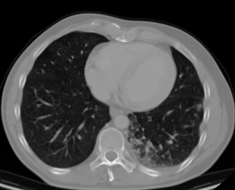
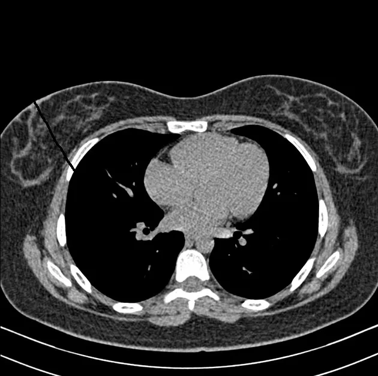
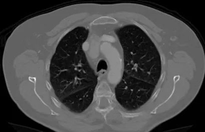
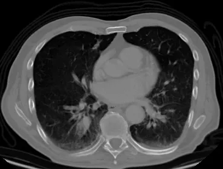

# Chest CT-Scan images

<div align="center">
    <a href="https://github.com/openmedlab/"></a>
</div>
<p style="text-align:center;font-size:10px;"><em></em></p>

## Dataset Information

The **Chest CT-Scan images dataset** is a 2D-CT image dataset for human chest cancer detection. The authors have collected and integrated a total of 1,000 CT images from multiple sources, which include one normal category and three cancer categories: Adenocarcinoma, Large cell carcinoma, and Squamous cell carcinoma. The dataset is pre-divided into 613 training images, 72 validation images, and 315 test images. The authors hope that this dataset will promote the research and development of classification algorithms in this field and that developers will use it to develop related applications to help doctors rescue patients more timely and accurately.

## Dataset Meta Information

| Dimensions | Modality | Task Type      | Anatomical Structures | Anatomical Area | Number of Categories | Data Volume | File Format |
|------------|----------|----------------|-----------------------|-----------------|----------------------|-------------|-------------|
| 2D         | CT       | Classification | Lung                  | Chest           | 4                    | 1000        | JPG, PNG    |


### Resolution Details

| Dataset Statistics | size         |
|--------------------|--------------|
| min                | [172, 110]   |
| median             | [429, 285]   |
| max                | [1200, 874]   |

## Label Information Statistics

| Category           | train | val | test |
|--------------------|-------|-----|------|
| Normal             | 148   | 23  | 120  |
| Adenocarcinoma     | 195   | 21  | 51   |
| Large cell carcinoma | 115   | 13  | 54   |
| Squamous cell carcinoma | 155   | 15  | 90   |

## Visualization

<div align="center">
    <a href="https://github.com/openmedlab/"></a>
</div>
<p style="text-align:center;font-size:10px;"><em> Normal category example.</em></p>

<div align="center">
    <a href="https://github.com/openmedlab/"></a>
</div>
<p style="text-align:center;font-size:10px;"><em> Adenocarcinoma category example.</em></p>

<div align="center">
    <a href="https://github.com/openmedlab/"></a>
</div>
<p style="text-align:center;font-size:10px;"><em> Large cell carcinoma category example.</em></p>

<div align="center">
    <a href="https://github.com/openmedlab/"></a>
</div>
<p style="text-align:center;font-size:10px;"><em> Squamous cell carcinoma category example.</em></p>

## File Structure

The file structure of the dataset is as follows, containing three folders named 'train', 'val', and 'test', each folder contains images corresponding to four different categories.

``` 
Chest CT-Scan images Dataset
├── test
│   ├── adenocarcinoma
│   │   ├── 000108 (3).png
│   │   ├── 000109 (2).png
│   │   ├── ...
│   ├── large.cell.carcinoma
│   │   ├── 000108.png
│   │   ├── 000110.png
│   │   ├── ...
│   ├── normal
│   │   ├── 6 - Copy (2) - Copy.png
│   │   ├── 6 - Copy (2).png
│   │   ├── ...
│   ├── squamous.cell.carcinoma
│   │   ├── 000108 (6).png
│   │   ├── 000110 (2).png
│   │   ├── ...
├── train
│   ├── adenocarcinoma_left.lower.lobe_T2_N0_M0_Ib
│   │   ├── 000000 (6).png
│   │   ├── 000005 (3).png
│   │   ├── ...
│   ├── large.cell.carcinoma_left.hilum_T2_N2_M0_IIIa
│   │   ├── 000002.png
│   │   ├── 000003 (3).png
│   │   ├── ...
│   ├── normal
│   │   ├── 2 - Copy - Copy.png
│   │   ├── 2 - Copy (2) - Copy.png
│   │   ├── ...
│   ├── squamous.cell.carcinoma_left.hilum_T1_N2_M0_IIIa
│   │   ├── 000002 (4).png
│   │   ├── 000002 (6).png
│   │   ├── ...
├── val
│   ├── adenocarcinoma_left.lower.lobe_T2_N0_M0_Ib
│   │   ├── 000108 (7).png
│   │   ├── 000108 (8).png
│   │   ├── ...
│   ├── large.cell.carcinoma_left.hilum_T2_N2_M0_IIIa
│   │   ├── 000108 (2).png
│   │   ├── 000108.png
│   │   ├── ...
│   ├── normal
│   │   ├── 4 - Copy (2).png
│   │   ├── 4 (2).png
│   │   ├── ...
│   ├── squamous.cell.carcinoma_left.hilum_T1_N2_M0_IIIa
│   │   ├── 000108 (3).png
│   │   ├── 000110 (6).png
│   │   ├── ...
```

## Authors and Institutions

SunneYi (Alibaba Cloud Tianchi user, unknown unit)


## Source Information

Official Website: https://tianchi.aliyun.com/dataset/93929

Download Link: https://tianchi.aliyun.com/dataset/93929

Article Address: None

Publication Date: 2021-03-10

## Citation

``` 
@dataset{tianchi93929,
  author       = {SunneYi},
  title        = {{Chest CT-Scan images Dataset}},
  year         = {2021},
  publisher    = {Tianchi},
  url          = {https://tianchi.aliyun.com/dataset/93929},
}
```

Original introduction article is [here](https://zhuanlan.zhihu.com/p/669964624).