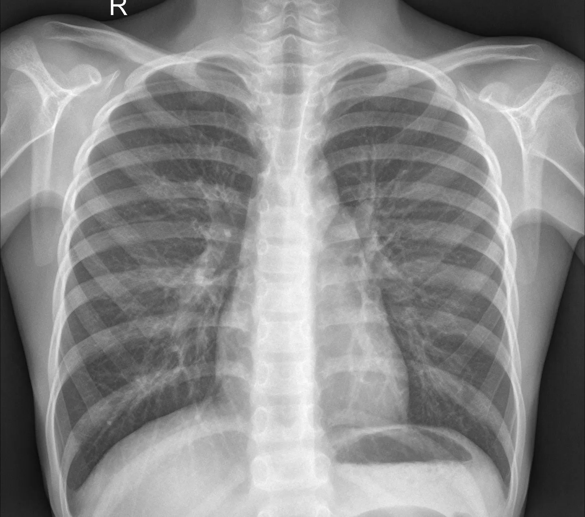
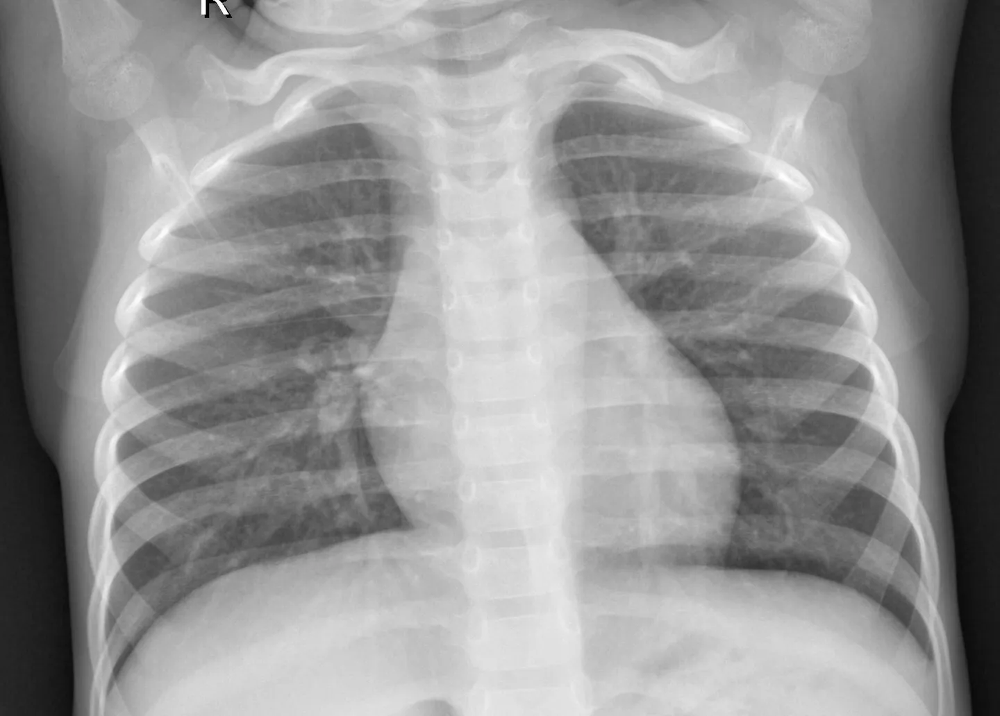
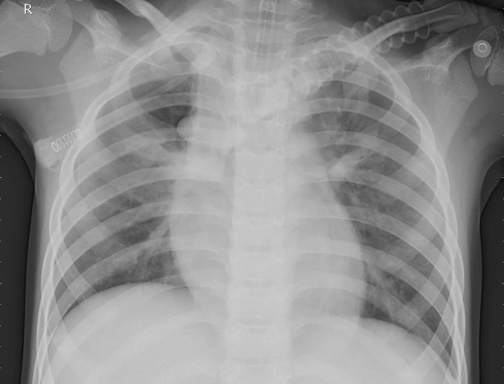
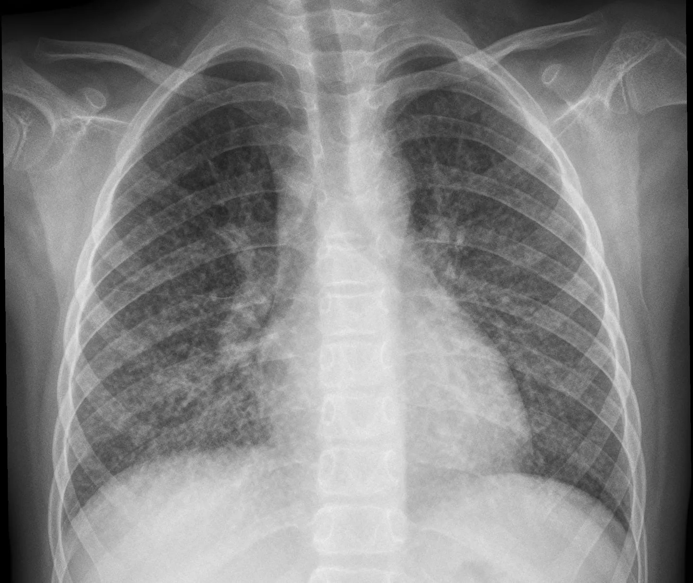

# Chest X-Ray Imaging (Pneumonia) / 胸部 X 线成像（肺炎）

<div align="center">
    <a href="https://github.com/openmedlab/"></a>
</div>
<p style="text-align:center;font-size:10px;"><em></em></p>

## Dataset Information

The dataset targets the classification task for 2D chest X-ray imaging, distinguishing between pneumonia and normal conditions. It comprises 5863 JPEG X-ray images from pediatric patients aged 1-5 years at the Guangzhou Women and Children's Medical Center, verified by experts for diagnostic quality. The data is organized into three folders: training, testing, and validation, for AI research and application purposes.

## Dataset Meta Information

| Dimensions | Modality | Task Type      | Anatomical Structures | Anatomical Area | Number of Categories | Data Volume | File Format |
|------------|----------|----------------|-----------------------|-----------------|----------------------|-------------|-------------|
| 2D         | X Ray    | Classification | Lung                  | Chest           | 2                    | 5856        | .jepg       |


### Resolution Details

| Dataset Statistics | size         |
|--------------------|--------------|
| min                | [384,127]   |
| median             | [1304,872]   |
| max                | [2916,2583]   |

## Label Information Statistics

| Category | train | val | test |
|----------|-------|-----|------|
| Normal   | 1341  | 8   | 234  |
| Pneumonia| 3875  | 8   | 390  |


## Visualization

<div align="center">
    <a href="https://github.com/openmedlab/"></a>
</div>
<p style="text-align:center;font-size:10px;"><em> Normal sample 1.</em></p>

<div align="center">
    <a href="https://github.com/openmedlab/"></a>
</div>
<p style="text-align:center;font-size:10px;"><em> Normal sample 2.</em></p>

<div align="center">
    <a href="https://github.com/openmedlab/"></a>
</div>
<p style="text-align:center;font-size:10px;"><em> Lesion sample 1.</em></p>

<div align="center">
    <a href="https://github.com/openmedlab/"></a>
</div>
<p style="text-align:center;font-size:10px;"><em> Lesion sample 2.</em></p>

## File Structure

The file structure of the dataset is as follows, containing three different folders: training, validation, and testing. Each folder contains two subfolders for normal and abnormal, which store the corresponding images.

``` 
chest_xray Dataset
├── train
│   ├── NORMAL
│   │   ├── IM-0115-0001.jpeg
│   │   ├── IM-0117-0001.jpeg
│   │    ...
│   ├──PNEUMONIA
│   │   ├── person1000_bacteria_2931.jpeg
│   │   ├── person1000_virus_1681.jpeg
│   │    ...
├── val
│   ├── NORMAL
│   │   ├── ...
│   ├──PNEUMONIA
│   │   ├── ...
├── test
│   ├── NORMAL
│   │   ├── ...
│   ├──PNEUMONIA
│   │   ├── ...
```


## Source Information

Official Website: https://www.heywhale.com/mw/dataset/62c2ac49913a54a66037f872/content

Download Link: https://www.heywhale.com/mw/dataset/62c2ac49913a54a66037f872/file

Article Address: https://www.heywhale.com/mw/dataset/62c2ac49913a54a66037f872/content, https://data.mendeley.com/datasets/rscbjbr9sj/2

Publication Date: 2022-07-04

## Citation

``` 
@misc{Merlin1923,
    title = { 胸部 X 线成像（肺炎） },
    author = { Merlin },
    howpublished = { \url{https://www.heywhale.com/mw/dataset/62c2ac49913a54a66037f872} },
    year = { 2022 }
}
```

Original introduction article is [here](https://zhuanlan.zhihu.com/p/657913253).