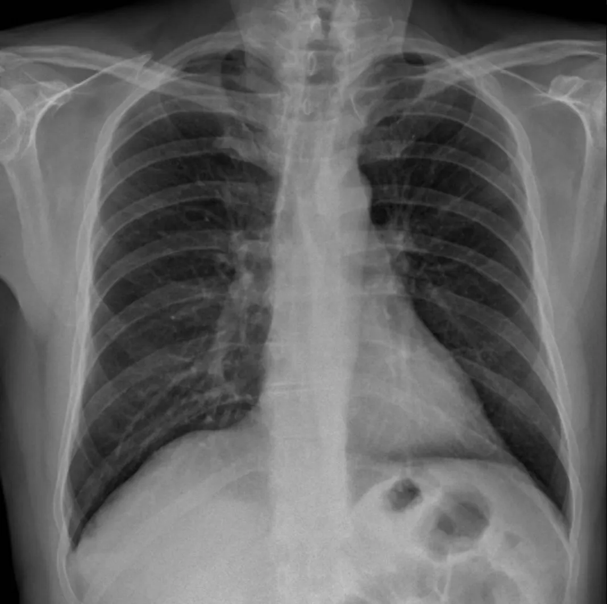
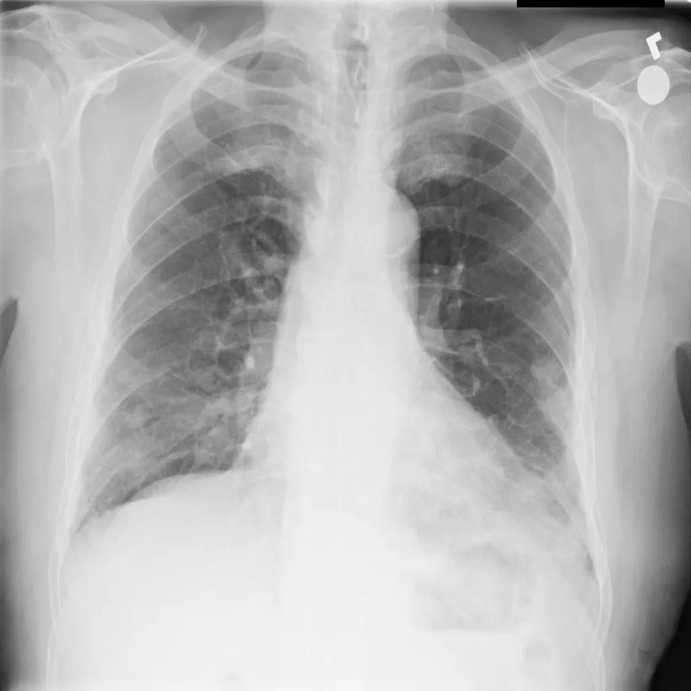
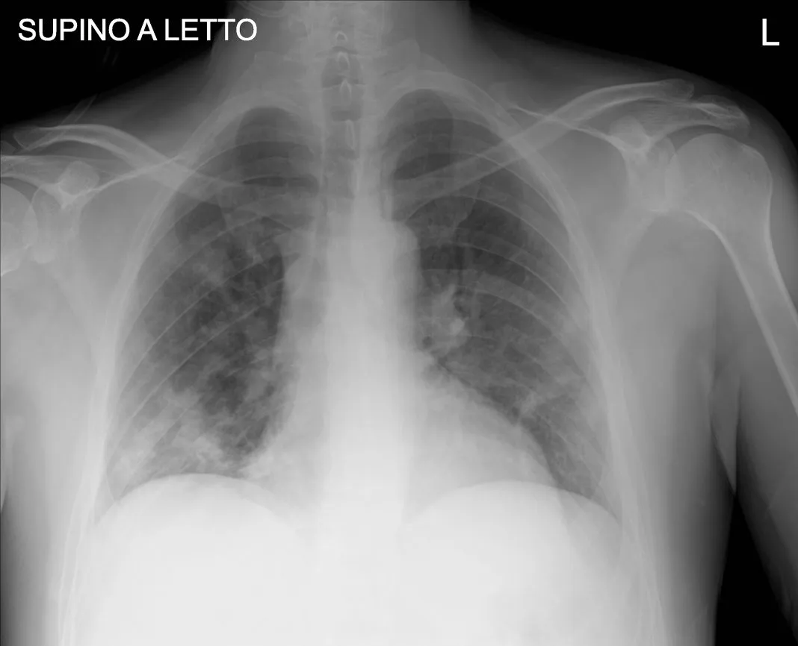
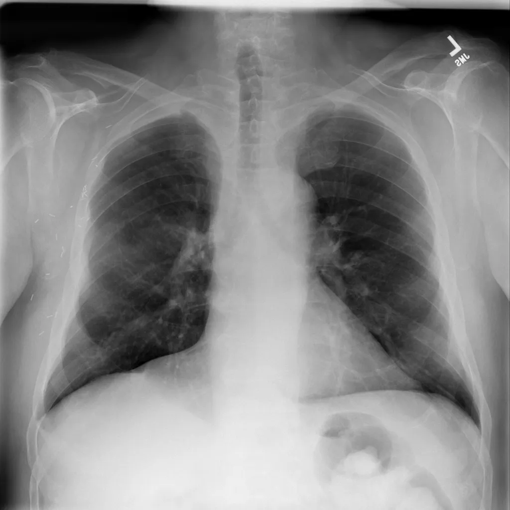

# Chest X-ray PD Dataset

<div align="center">
    <a href="https://github.com/openmedlab/"></a>
</div>
<p style="text-align:center;font-size:10px;"><em></em></p>

## Dataset Information

The Chest X-ray PD Dataset consists of 4575 2D chest X-ray images of COVID-19 infections, other pneumonia infections, and healthy individuals. Initially, 1525 chest X-ray images of COVID-19 infections were obtained from multiple sources [1-6], and an additional 1525 images each of other pneumonia infections and normal images were collected from the Kaggle database [7] and NIH dataset [8].

```
[1] http://arxiv.org/abs/2003.11597
[2] https://github.com/agchung
[3] https://radiopaedia.org/
[4] https://www.cancerimagingarchive.net/
[5] https://www.sirm.org/en/category/articles/covid-19-database/
[6] https://data.mendeley.com/datasets/2fxz4px6d8/4
[7] https://www.kaggle.com/paultimothymooney/chest-xray-pneumonia
[8] https://www.kaggle.com/nih-chest-xrays/data
```

## Dataset Meta Information

| Dimensions | Modality | Task Type      | Anatomical Structures | Anatomical Area | Number of Categories | Data Volume | File Format |
|------------|----------|----------------|-----------------------|-----------------|----------------------|-------------|-------------|
| 2D         | X Ray    | Classification | Lung                  | Chest           | 3                    | 4575        | jpg, png    |


### Resolution Details

| Dataset Statistics | size         |
|--------------------|--------------|
| min                | [224,224]   |
| median             | [1024,1024]   |
| max                | [5623,4757]   |

## Label Information Statistics

| Label           | num  |
|-----------------|------|
| normal	          | 1425 |
| covid          | 1425 |
| pneumonia | 1425 |

## Visualization

<div align="center">
    <a href="https://github.com/openmedlab/"></a>
</div>
<p style="text-align:center;font-size:10px;"><em> Noramal example.</em></p>

<div align="center">
    <a href="https://github.com/openmedlab/"></a>
</div>
<p style="text-align:center;font-size:10px;"><em> Covid example.</em></p>

<div align="center">
    <a href="https://github.com/openmedlab/"></a>
</div>
<p style="text-align:center;font-size:10px;"><em> Pneumonia example.</em></p>

## File Structure

The dataset file structure is as follows, containing one .csv file and folders that separately store images of three categories.

``` 
COVID19_Pneumonia_Normal_Chest_Xray_PA_Dataset
├── normal
│   ├── 00000002_000.png
│   ├── 00000005_000.png
│   │    ...
├── covid
│   ├── 0C7E78DA-FAFC-480D-88B6-1459C51481AF-1068x817.jpeg
│   ├── 01E392EE-69F9-4E33-BFCE-E5C968654078-768x572.jpeg
│   ├── ...
├── pneumonia
│   ├── 00000165_001.png
│   ├── 00000218_001.png
│   ├── ...
├── metadata.csv
```

## Authors and Institutions

Asraf, Amanullah (Bangladesh University of Engineering and Technology)

Islam, Zabirul (Bangladesh University of Engineering and Technology)


## Source Information

Official Website: https://data.mendeley.com/datasets/jctsfj2sfn/1

Download Link: https://prod-dcd-datasets-cache-zipfiles.s3.eu-west-1.amazonaws.com/jctsfj2sfn-1.zip

Article Address: https://data.mendeley.com/datasets/jctsfj2sfn/1

Publication Date: 2021-04-09

## Citation

``` 
@misc{asraf2021covid19,
  title={COVID19, pneumonia and normal chest X-ray PA dataset. Mendeley Data V1 (2021)},
  author={Asraf, A and Islam, Z},
  year={2021},
  publisher={Elsevier, Amsterdam, The Netherlands, Tech. Rep}
}
```

Original introduction article is [here](https://zhuanlan.zhihu.com/p/661311561).