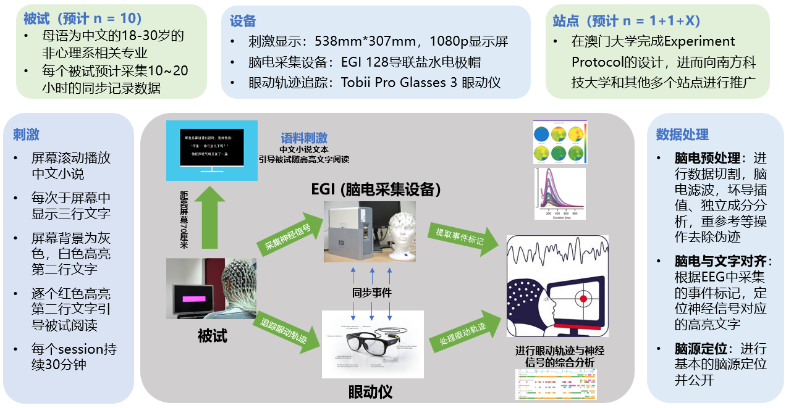
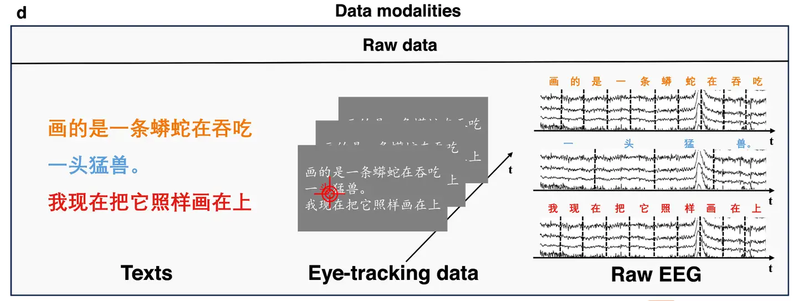

# ChineseEEG

<div align="center">
    <a href="https://github.com/openmedlab/"></a>
</div>
<p style="text-align:center;font-size:10px;"><em></em></p>

## Dataset Information

**ChineseEEG** is a dataset containing high-density EEG (electroencephalography) data and simultaneously collected eye-tracking data. The dataset recorded the brain activity of 10 participants while they silently read approximately 13 hours of Chinese text. The reading materials were from the Chinese translations of two famous novels: *"The Little Prince"* and *"Ganette Dream"*. The EEG data were collected using a 128-channel EGI EEG system, and the eye-tracking data were synchronously recorded with a Tobii Pro Glasses 3 eye tracker.

This dataset aids in researching the mechanisms by which the brain encodes semantic information and supports semantic decoding in brain-computer interfaces (BCI). The rich pairing of Chinese text with EEG data also addresses the significant lack of corresponding datasets in this field. Additionally, the authors demonstrate the value and usability of the dataset in sensor-level EEG analysis, EEG source reconstruction, and aligning EEG with text representations, providing a solid foundation for future research work.

## Dataset Meta Information

| Task Type                      | Language | EEG Sampling Rate | Text Format                    | EEG Format         |
|--------------------------------|----------|-------------------|--------------------------------|---------------------|
| Semantic Decoding and Matching | Chinese  | 1kHz              | txt, xlsx, npy (embedded text) | vhdr, vmrk, eeg     |

## Dataset Information Statistics

| Statistical Information            | Details                   |
|------------------------------------|---------------------------|
| Number of Participants             | 10                        |
| Average Age                        | 22.7 years                |
| Gender Ratio                       | 5 males                   |
| Total Reading Duration             | Approximately 13 hours per participant |
| Total Number of Characters         | 115,233 characters        |
| Number of Characters in "The Little Prince" | 24,324 characters        |
| Number of Characters in "Ganette Dream"     | 90,909 characters        |
| Total Number of Experimental Phases | 25 phases                 |
| Number of Phases in "The Little Prince"     | 7 phases                 |
| Number of Phases in "Ganette Dream"         | 18 phases                |

Each reading session takes approximately 20-35 minutes and covers content from different chapters.

## Visualization

<div align="center">
    <a href="https://github.com/openmedlab/"></a>
</div>
<p style="text-align:center;font-size:10px;"><em>The left side of the image shows a segment of text. The middle section displays eye-tracking data, illustrating the gaze movement trajectory during reading. The right side shows the corresponding EEG data, recording the brain's electrical activity during the reading process.</em></p>

## File Structure

``` 
/ChineseEEG
│
├── dataset_description.json
│   - Meta information describing the dataset, such as name, type, and author.
│
├── participants.tsv
│   - Contains participant information such as age, gender, and handedness.
│
├── README.md
│
├── derivatives
│   ├── eyetracking_data
│   │   ├── sub-04
│   │   │   ├── ses-GarnettDream
│   │   │   │   └── sub-04_ses-GarnettDream_task-reading_run-01_eyetracking.rar
│   │   │   └── ses-LittlePrince
│   │   │       └── sub-04_ses-LittlePrince_task-reading_run-01_eyetracking.rar
│   │   - Store eye movement data in .rar format.
│   │
│   ├── preproc
│   │   ├── sub-04
│   │   │   ├── ses-GarnettDream
│   │   │   │   ├── eeg
│   │   │   │   │   ├── sub-04_ses-GarnettDream_space-CapTrak_coordsystem.json
│   │   │   │   │   ├── sub-04_ses-GarnettDream_space-CapTrak_electrodes.tsv
│   │   │   │   │   ├── sub-04_ses-GarnettDream_task-reading_run-01_bad_channels.json
│   │   │   │   │   ├── sub-04_ses-GarnettDream_task-reading_run-01_channels.tsv
│   │   │   │   │   ├── sub-04_ses-GarnettDream_task-reading_run-01_eeg.eeg
│   │   │   │   │   ├── sub-04_ses-GarnettDream_task-reading_run-01_eeg.json
│   │   │   │   │   ├── sub-04_ses-GarnettDream_task-reading_run-01_eeg.vhdr
│   │   │   │   │   ├── sub-04_ses-GarnettDream_task-reading_run-01_eeg.vmrk
│   │   │   │   │   ├── sub-04_ses-GarnettDream_task-reading_run-01_events.json
│   │   │   │   │   ├── sub-04_ses-GarnettDream_task-reading_run-01_events.tsv
│   │   │   │   ├── sub-04_ses-GarnettDream_scans.tsv
│   │   │   │   ├── ica_components.npy
│   │   │   │   ├── ica_components.json
│   │   │   │   └── ica_components_topography.png
│   │   - Contains preprocessed EEG data and ICA related files.
│   │
│   ├── filtered_0.5_80
│   │   - EEG data filtered at 0.5–80 Hz were stored.
│   │
│   ├── filtered_0.5_30
│   │   - EEG data filtered at 0.5–30 Hz were stored.
│   │
│   ├── novels
│   │   ├── original_novel
│   │   │   ├── GarnettDream.txt
│   │   │   └── LittlePrince.txt
│   │   ├── segmented_novel
│   │   │   ├── GarnettDream
│   │   │   │   ├── segmented_Chinese_novel.xlsx
│   │   │   │   └── segmented_Chinese_novel_preface.xlsx
│   │   └── LittlePrince
│   │       └── segmented_Chinese_novel.xlsx
│   │   - Stores raw and segmented novel text.
│   │
│   ├── text_embeddings
│   │   ├── GarnettDream_text_embedding
│   │   │   └── text_embedding_run_1.npy
│   │   └── LittlePrince_text_embedding
│   │       └── text_embedding_run_1.npy
│   │   - Store text embeddings of novels.
│
├── sub-04
│   ├── ses-GarnettDream
│   │   ├── eeg
│   │   │   ├── sub-04_ses-GarnettDream_task-reading_run-01_eeg.eeg
│   │   │   ├── sub-04_ses-GarnettDream_task-reading_run-01_eeg.json
│   │   │   ├── sub-04_ses-GarnettDream_task-reading_run-01_eeg.vhdr
│   │   │   └── sub-04_ses-GarnettDream_task-reading_run-01_eeg.vmrk
│   │   └── sub-04_ses-GarnettDream_scans.tsv
│   └── ses-LittlePrince
│       ├── eeg
│       └── sub-04_ses-LittlePrince_scans.tsv
│   - Raw EEG data for each participant.
```

## Authors and Institutions

Wu Haiyan (University of Macau)

Liu Quanying (Southern University of Science and Technology)

Wang Qing (Shanghai Jiao Tong University)

Chen Zijiao (National University of Singapore)

Yang Yu-Fang (Freie Universität Berlin)

Hu Chuanpeng (Nanjing Normal University)

Xu Ting (Center for the Integrative Developmental Neuroscience, Child Mind Institute, New York)

Cao Miao (Swinburne University of Technology)

Liang Huadong (iFLYTEK Co., LTD)

## Source Information

Official Website: https://github.com/ncclabsustech/Chinese_reading_task_eeg_processing

Download Link: https://github.com/ncclabsustech/Chinese_reading_task_eeg_processing

Article Address: https://www.nature.com/articles/s41597-024-03398-7

Publication Date: 2024-03

## Citation

``` 
@article{mou2024chineseeeg,
  title={ChineseEEG: A Chinese linguistic corpora EEG dataset for semantic alignment and neural decoding},
  author={Mou, Xinyu and He, Cuilin and Tan, Liwei and Yu, Junjie and Liang, Huadong and Zhang, Jianyu and Tian, Yan and Yang, Yu-Fang and Xu, Ting and Wang, Qing and others},
  journal={Scientific Data},
  volume={11},
  number={1},
  pages={550},
  year={2024},
  publisher={Nature Publishing Group UK London}
}
```

Original introduction article is [here](https://zhuanlan.zhihu.com/p/713863741).