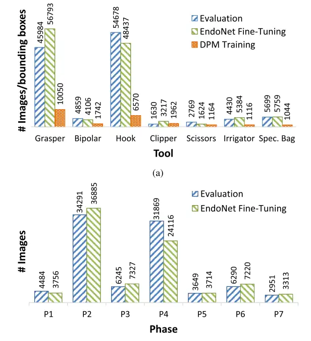
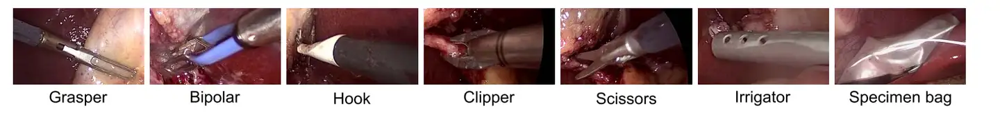
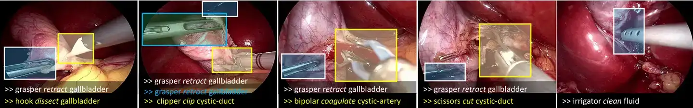

# Cholec80

<div align="center">
    <a href="https://github.com/openmedlab/"></a>
</div>
<p style="text-align:center;font-size:10px;"><em></em></p>

## Dataset Information

The Cholec80 dataset is designed for endoscopic-guided cholecystectomy procedure recognition. It provides annotations for seven types of surgical actions and seven types of surgical tools, with frame-by-frame accuracy, all annotated by professional surgeons. The dataset contains a total of 80 videos, comprising 370,168 frames of video data, sampled at one frame every 25 frames. The dataset is divided into training and testing sets in a 1:1 ratio.

Cholecystectomy is a common surgical procedure aimed at removing a diseased or infected gallbladder. Despite being a widely performed surgery, its complexity and the need for precise surgical operations highlight the importance of leveraging advanced technologies to improve surgical outcomes. The Cholec80 dataset provides fine-grained, richly categorized annotation information, covering common action types and instrument types in cholecystectomy. This supports the development of computer-assisted endoscopic cholecystectomy navigation systems. Furthermore, this dataset also supports the development of surgical robots that can accurately mimic the operations of surgeons.

## Dataset Meta Information

| Dimensions | Modality  | Task Type                   | Anatomical Structures | Anatomical Area       | Number of Categories | Data Volume | File Format |
|------------|-----------|-----------------------------|-----------------------|-----------------------|----------------------|-------------|-------------|
| 2D         | Endoscopy | Recognition, Classification | Gallbladder           | Abdominal cavity      | 14                   | 370168        | PNG         |
 

### Resolution Details

| Dataset Statistics | size     |
|--------------------|----------|
| min                | 480x854  |
| median             | 480x854  |
| max                | 480x854  |

## Label Information Statistics

Figure 1 is taken from the paper and shows the distribution of instrument types and surgical action types in the test set. Since the training set and test set were divided while ensuring the proportion of each category, the distribution in the test set reflects the distribution of the entire dataset. In Figure 1, "Evaluation" corresponds to the distribution of the dataset. The actions P1~P7 correspond to the action names as shown in Table 1.

<div align="center">
    <a href="https://github.com/openmedlab/"></a>
</div>
<p style="text-align:center;font-size:10px;"><em>Figure 1. Distribution of surgical actions and instruments in the dataset.</em></p>


| ID  | Phase                        | Duration (s)  |
|-----|------------------------------|---------------|
| P1  | Preparation                  | 125 ± 95      |
| P2  | Calot triangle dissection    | 954 ± 538     |
| P3  | Clipping and cutting         | 168 ± 152     |
| P4  | Gallbladder dissection       | 857 ± 551     |
| P5  | Gallbladder packaging        | 98 ± 53       |
| P6  | Cleaning and coagulation     | 178 ± 166     |
| P7  | Gallbladder retraction       | 83 ± 56       |

Table 1: The name corresponding to the surgical action ID.

## Visualization

<div align="center">
    <a href="https://github.com/openmedlab/"></a>
</div>
<p style="text-align:center;font-size:10px;"><em>Visualization of surgical instrument types.</em></p>


<div align="center">
    <a href="https://github.com/openmedlab/"></a>
</div>
<p style="text-align:center;font-size:10px;"><em>Visualization of surgical actions (selected from the CholecT45 dataset because it is a subset of the Cholec80 dataset).</em></p>

## File Structure

``` 
TF-Cholec80
├── frames
│   ├── video01
│   │   ├── video01_000001.png
│   │   ├── video01_000002.png
│   │   ├── video01_000003.png
│   │   ├── video01_000004.png
│   │   ├── video01_000005.png
│   │   └── ...
│   ├── video02
│   │   ├── video02_000001.png
│   │   ├── video02_000002.png
│   │   ├── video02_000003.png
│   │   ├── video02_000004.png
│   │   ├── video02_000005.png
│   │   └── ...
│   ├── video03
│   │   ├── video03_000001.png
│   │   ├── video03_000002.png
│   │   ├── video03_000003.png
│   │   ├── video03_000004.png
│   │   ├── video03_000005.png
│   │   └── ...
│   ├── video04
│   │   ├── video04_000001.png
│   │   ├── video04_000002.png
│   │   ├── video04_000003.png
│   │   ├── video04_000004.png
│   │   ├── video04_000005.png
│   │   └── ...
│   ├── video05
│   │   ├── video05_000001.png
│   │   ├── video05_000002.png
│   │   ├── video05_000003.png
│   │   ├── video05_000004.png
│   │   ├── video05_000005.png
│   │   └── ...
│   └── ...
├── phase_annotations
│   ├── video01-phase.txt
│   ├── video02-phase.txt
│   ├── video03-phase.txt
│   ├── video04-phase.txt
│   ├── video05-phase.txt
│   └── ...
└── tool_annotations
    ├── video01-tool.txt
    ├── video02-tool.txt
    ├── video03-tool.txt
    ├── video04-tool.txt
    ├── video05-tool.txt
    └── ...
```

## Authors and Institutions

Andru P. Twinanda (University of Strasbourg)

Sherif Shehata (University of Strasbourg)

Didier Mutter (Strasbourg University Hospital)

Jacques Marescaux (Strasbourg University Hospital)

Michel de Mathelin (University of Strasbourg)

Nicolas Padoy (University of Strasbourg)

## Source Information

Official Website: https://github.com/CAMMA-public/TF-Cholec80

Download Link: https://github.com/CAMMA-public/TF-Cholec80

Article Address: https://ieeexplore.ieee.org/document/7519080

Publication Date: 2016-02

## Citation

``` 
@article{endonet,
author = {Andru Twinanda, Sherif Shehata, Didier Mutter, Jacques Marescaux, Michel De Mathelin, Nicolas Padoy},
year = {2016},
month = {02},
title = {EndoNet: A Deep Architecture for Recognition Tasks on Laparoscopic Videos},
volume = {36},
journal = {IEEE Transactions on Medical Imaging},
doi = {10.1109/TMI.2016.2593957}
}

@inproceedings{yu2019surgicalphase,
title = {Learning from a tiny dataset of manual annotations: a teacher/student approach for surgical phase recognition},
author = {Tong Yu, Didier Mutter, Jacques Marescaux, Nicolas Padoy},
booktitle = {International Conference on Information Processing in Computer-Assisted Interventions},
year = {2019}
}
```

Original introduction article is [here](https://zhuanlan.zhihu.com/p/700024359).