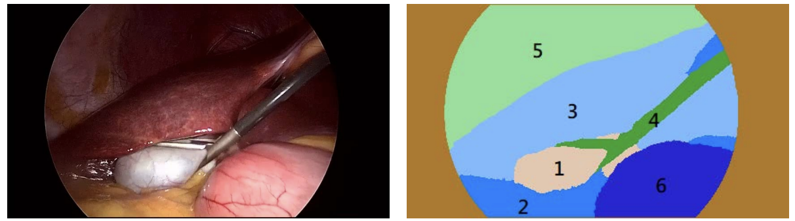
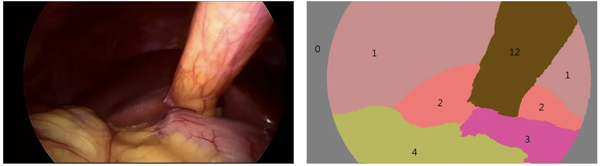
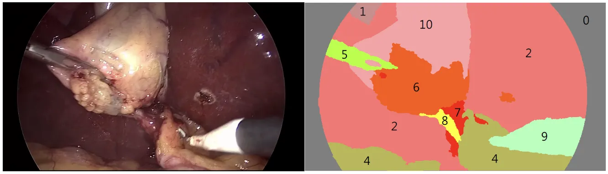

# CholecSeg8k

<div align="center">
    <a href="https://github.com/openmedlab/"></a>
</div>
<p style="text-align:center;font-size:10px;"><em></em></p>

## Dataset Information

The CholecSeg8K dataset is a semantic segmentation dataset in the endoscopic modality, derived from the Cholec80 dataset. It comprises 8080 frames from 17 videos, each annotated at the pixel level. The annotations cover 13 categories commonly encountered in laparoscopic cholecystectomy surgeries. The CholecSeg8K dataset is released under the CC BY-NC-SA 4.0 license.

The release of the CholecSeg8K dataset is clinically significant for enhancing the precision and safety of computer-assisted surgical procedures. By providing accurately annotated images, it promotes the development of semantic segmentation algorithms, which are crucial for understanding the surgical scene in real-time accurately. It offers a valuable resource for researchers to advance the application of computer vision in the medical field, especially in improving surgical navigation and the technological progression of automated tool recognition.

## Dataset Meta Information

| Dimensions | Modality | Number of Categories | Data Volume | File Format |
|------|----------|-------------------|------------------|-------------|
| 2D   | Endoscopy | 13                | 8080             | png         |


### Resolution Details

| Dataset Statistics | size       |
|--------------------|------------|
| min                | 854 × 480  |
| median             | 854 × 480  |
| max                | 854 × 480  |


## Label Information Statistics

| Class Number | Class Name            | RGB hex code | Coverage % |
|--------------|-----------------------|--------------|------------|
| Class 0      | Black Background      | #505050      | \          |
| Class 1      | Abdominal Wall        | #111111      | 29.46%     |
| Class 2      | Liver                 | #212121      | 29.39%     |
| Class 3      | Gastrointestinal Tract| #131313      | 2.56%      |
| Class 4      | Fat                   | #121212      | 20.23%     |
| Class 5      | Grasper               | #313131      | 3.32%      |
| Class 6      | Connective Tissue     | #232323      | 3.125%     |
| Class 7      | Blood                 | #242424      | 0.573%     |
| Class 8      | Cystic Duct           | #252525      | 0.05%      |
| Class 9      | L-hook Electrocautery | #323232      | 1.824%     |
| Class 10     | Gallbladder         | #222222      | 8.893      |
| Class 11     | Hepatic Vein        | #333333      | 0.018      |
| Class 12     | Liver Ligament      | #050505      | 0.561      |


## Visualization

<div align="center">
    <a href="https://github.com/openmedlab/"></a>
</div>
<p style="text-align:center;font-size:10px;"><em></em></p>

<div align="center">
    <a href="https://github.com/openmedlab/"></a>
</div>
<p style="text-align:center;font-size:10px;"><em></em></p>

## File Structure

The root directory of the dataset contains multiple subfolders named after video numbers (e.g., "video01"). Within each subfolder, there are image files related to that video sequence, including frames of the video and their corresponding segmentation mask files.

``` 
Dataset
│
├── video01
│   ├── video01_00080
│   │   ├── frame_100_endo.png
│   │   ├── frame_100_endo_color_mask.png
│   │   ├── frame_100_endo_mask.png
│   │   ├── frame_100_endo_watershed_mask.png
│   │   ├── frame_101_endo.png
│   │   ├── frame_101_endo_color_mask.png
│   │   ├── frame_101_endo_mask.png
│   │   ├── frame_101_endo_watershed_mask.png
│   │   ├── ...
│   └── ...
├── ...
```

## Authors and Institutions

W.-Y. Hong, （National Taiwan University）

C.-L. Kao, （National Taiwan University）

Y.-H. Kuo, （National Taiwan University）

J.-R. Wang, （National Taiwan University）

W.-L. Chang, （National Taiwan University）

C.-S. Shih （National Taiwan University）


## Source Information

Official Website: https://www.kaggle.com/datasets/newslab/cholecseg8k

Download Link: https://www.kaggle.com/datasets/newslab/cholecseg8k

Article Address: https://arxiv.org/abs/2012.12453

Publication Date: 2020-12

## Citation

``` 
@article{hong2020cholecseg8k,
  title={Cholecseg8k: a semantic segmentation dataset for laparoscopic cholecystectomy based on cholec80},
  author={Hong, W-Y and Kao, C-L and Kuo, Y-H and Wang, J-R and Chang, W-L and Shih, C-S},
  journal={arXiv preprint arXiv:2012.12453},
  year={2020}
}
```

Original introduction article is [here](https://zhuanlan.zhihu.com/p/681163989).