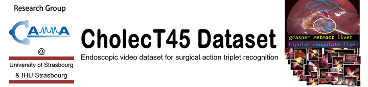
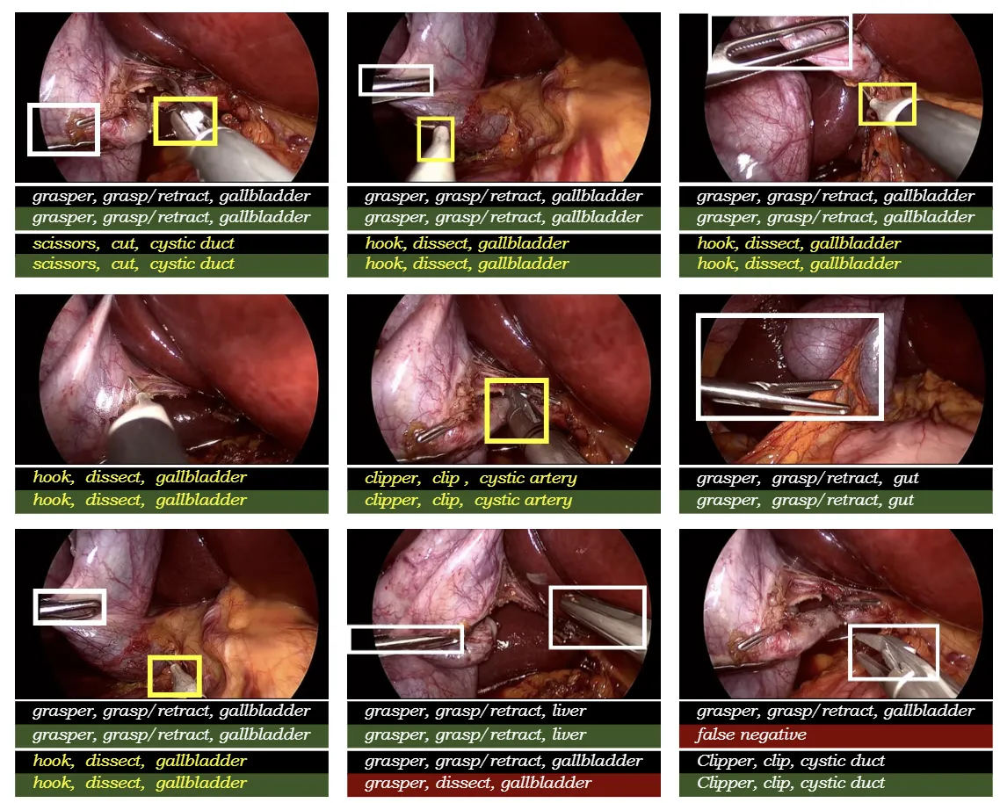
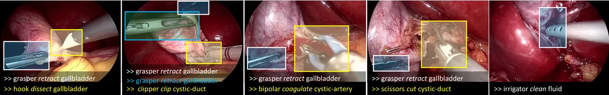

# CholecT45 Dataset

<div align="center">
    <a href="https://github.com/openmedlab/"></a>
</div>
<p style="text-align:center;font-size:10px;"><em></em></p>

## Dataset Information

The CholecT45 dataset consists of videos from 40 cholecystectomy (gallbladder removal) procedures collected in Strasbourg, France. It is a subset of the Cholec80 dataset with additional videos and standardized annotations. The images were extracted from videos at a rate of one frame per second and are annotated with information about surgical actions in the format of <instrument, verb, target> triples, such as using a grasper to retract the gallbladder 〈grasper, retract, gallbladder〉, using scissors to cut the cystic duct 〈scissor, cut, cystic duct〉, etc., with a total of 128 classes of triples. There are a total of 90,489 frames and 127,385 instances of triples in this dataset.

Cholecystectomy is a common surgical procedure aimed at removing a diseased or infected gallbladder. Despite being a widely performed operation, its complexity and the need for precise surgical manipulation highlight the importance of using advanced technologies to improve surgical outcomes. In this context, the creation and application of the CholecT45 dataset provide a significant research platform aimed at analyzing and understanding surgical maneuvers during cholecystectomy procedures through Artificial Intelligence (AI) and machine learning technologies. By analyzing the videos and annotations in the CholecT45 dataset, researchers can develop and train AI models that can automatically recognize and categorize key actions during surgery, improving the understanding and educational training of surgical processes, and providing real-time data for decision support during operations. Furthermore, advancements in this research have the potential to promote the development of surgical robotic technologies that can more accurately mimic expert surgeons' maneuvers, thereby enhancing surgical safety and efficiency and ultimately improving patient treatment outcomes.

## Dataset Meta Information

| Dimensions | Modality | Task Type                 | Anatomical Area | Number of Categories | Data Volume | File Format |
|------------|----------|---------------------------|-----------------|----------------------|-------------|-------------|
| 2D         | Endoscopy       | Recognition, Segmentation | abdominal cavity           | 128                  | 90489        | picture     |


## The triplet annotations 

In each annotation file consist of a table with 101 columns. Each row corresponds to the annotation of a frame in the video. The first column displays the frame index of the annotated image in the video, with the index starting from 0. The remaining 100 columns are binary labels for the triplets (0 = not present; 1 = present). The final 100 columns correspond in order to the triplet IDs (0 to 99) and names found in the mapping file (dict/triplet.txt). 

These annotations are crucial for training machine learning models to recognize and classify surgical actions based on the instruments used, the actions performed, and the targets involved. The structured triplet format provides a clear framework for such tasks.

## The tool annotations 

In each annotation file consist of a table with 7 columns. Each row corresponds to the annotation of a frame in the video. The first column displays the frame index of the annotated image in the video, with the index starting from 0. The remaining 6 columns are binary labels for the tools (0 = not present; 1 = present). The final 6 columns correspond in order to the tool IDs (0 to 5) and names found in the mapping file (dict/instrument.txt).

These annotations provide a binary indication of whether a specific surgical tool is present in each frame of the video. This information is used to train machine learning models to detect the presence of different tools in surgical videos, which can be critical for automated analysis and support during surgical procedures.

## The action annotations 

In each annotation file consist of a table with 11 columns. Each row corresponds to the annotation of a frame in the video. The first column displays the frame index of the annotated image in the video, with the index starting from 0. The remaining 10 columns are binary labels for the actions (0 = not present; 1 = present). The final 10 columns correspond in order to the action IDs (0 to 9) and names found in the mapping file (dict/verb.txt).

These annotations are critical for understanding the actions performed during surgery in each frame of the video. By providing binary labels for actions, it allows the development of algorithms that can recognize and interpret the different surgical actions taking place, which can be beneficial for surgical training, automated documentation, and potentially for real-time decision support systems in operating rooms.

## The target annotations 

In each annotation file consist of a table with 16 columns. Each row corresponds to the annotation of a frame in the video. The first column displays the frame index of the annotated image in the video, with the index starting from 0. The remaining 15 columns are binary labels for the targets (0 = not present; 1 = present). The final 15 columns correspond in order to the target IDs (0 to 14) and names found in the mapping file (dict/target.txt).

These annotations are used to identify the specific targets or anatomical structures that are being interacted with during surgical procedures. By providing a binary indication of the presence of these targets in each frame, researchers and developers can create algorithms capable of recognizing and delineating anatomical structures, which is a crucial aspect of computer-assisted interventions and surgical training simulations.

## Label Information Statistics

The overall tag information is as follows (excerpted from the article on its subset cholecT40; the content is incomplete, but the tag display is very intuitive):

All labels are in the form of <instrument, verb, target>, for example, marked as 〈grasper, retract, gallbladder〉, 〈scissor, cut, cystic duct〉. 

The use of such structured annotations facilitates the training of machine learning models that can understand and predict surgical activities, making it a valuable resource for advancing surgical AI research.

| Instrument Name | Count | Verb Name        | Count | ID  | Count | ID  | Count | ID  | Count |
|-----------------|-------|------------------|-------|-----|-------|-----|-------|-----|-------|
| grasper         | 76196 | null             | 5807  | 0   | 5807  | 8   | 236   | 16  | 88    |
| bipolar         | 5616  | place/pack       | 273   | 1   | 1169  | 9   | 137   | 17  | 114   |
| hook            | 44413 | grasp/retract    | 74720 | 2   | 75331 | 10  | 1950  | 18  | 9     |
| scissors        | 1856  | clip             | 2578  | 3   | 5173  | 11  | 5793  |     |       |
| clipper         | 2851  | dissect          | 42851 | 4   | 4378  | 12  | 8815  |     |       |
| irrigator       | 4522  | cut              | 1544  | 5   | 10023 | 13  | 641   |     |       |
|                 |       | coagulate        | 4306  | 6   | 552   | 14  | 745   |     |       |
|                 |       | clean            | 3375  | 7   | 14433 | 15  | 60    |     |       |

Below are examples:

<div align="center">
    <a href="https://github.com/openmedlab/"></a>
</div>
<p style="text-align:center;font-size:10px;"><em></em></p>

<div align="center">
    <a href="https://github.com/openmedlab/"></a>
</div>
<p style="text-align:center;font-size:10px;"><em></em></p>

## Authors and Institutions

Chinedu Innocent Nwoye (University of Strasbourg)

Nicolas Padoy (University of Strasbourg)


## Source Information

Official Website: https://github.com/CAMMA-public/cholect45

Download Link: https://github.com/CAMMA-public/cholect45

Article Address: https://arxiv.org/abs/2204.05235

Publication Date: 2022-04

## Citation

``` 
@article{nwoye2022data,
  title={Data Splits and Metrics for Benchmarking Methods on Surgical Action Triplet Datasets},
  author={Nwoye, Chinedu Innocent and Padoy, Nicolas},
  journal={arXiv preprint arXiv:2204.05235},
  year={2022}
}
```

Original introduction article is [here](https://zhuanlan.zhihu.com/p/678554236).