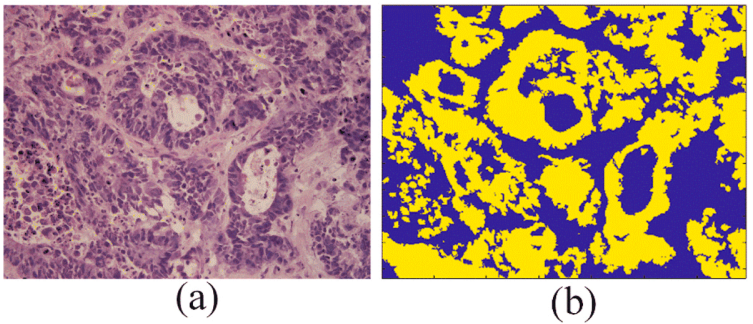

# CoCaHis

<div align="center">
    <a href="https://github.com/openmedlab/"></a>
</div>
<p style="text-align:center;font-size:10px;"><em></em></p>

## Dataset Information

CoCaHis (Colon Cancer Histology Dataset) is a publicly available dataset containing hematoxylin and eosin (H&E) stained images of 82 frozen sections. These images were collected from 19 patients with liver metastatic colon cancer. The dataset includes not only the original stained images but also two sets of images processed through stain normalization. Additionally, the dataset features pixel-level precise annotations provided by seven domain experts.

According to data from the International Agency for Research on Cancer (IARC) of the World Health Organization, there were 18 million new cancer cases worldwide in 2018, with 9.5 million cancer-related deaths. Among these, 10.2% of diagnosed cases were related to colorectal cancer. In 2020, colorectal cancer accounted for 9% of cancer cases among men and 8% among women in the United States. The gold standard for cancer diagnosis remains the microscopic examination of stained histopathological samples by pathologists. Computer-aided diagnosis can improve the efficiency of pathologists, reduce errors due to human factors, and accelerate the diagnostic process.

## Dataset Meta Information

| Dimensions | Modality  | Task Type     | Anatomical Structures | Anatomical Area | Number of Categories | Data Volume | File Format |
|------------|-----------|---------------|-----------------------|-----------------|----------------------|-------------|-------------|
| 2D         | Pathology | Segmentation  | Colorectal            | Colorectal       | 2                    | 82          | HDF5        |


### Resolution Details

| Dataset Statistics | size          |
|--------------------|---------------|
| min                | (1388, 1037)  |
| median             | (1388, 1037)  |
| max                | (1388, 1037)  |

## Visualization

<div align="center">
    <a href="https://github.com/openmedlab/"></a>
</div>
<p style="text-align:center;font-size:10px;"><em>(a) Hematoxylin and Eosin stained frozen section image. (b) Annotation image obtained through majority voting.</em></p>

## File Structure

The official HDF5 data structure is as follows:

``` 
cocahis
│
├── HE [group]
│   ├── raw [dataset]
│   ├── sn1 [dataset]
│   ├── sn2 [dataset]
│   ├── train_test_split [attribute]
│   ├── patient_num [attribute] 
│   ├── image_num [attribute]
├── GT [group]
│   ├── GT1 [dataset]
│   ├── GT2 [dataset]
│   ├── ...
│   ├── train_test_split [attribute]
```

## Authors and Institutions

Dario Sitnik (Division of Electronics, Ruđer Bošković Institute)

Gorana Aralica (Department of Pathology and Cytology, Dubrava Clinical Hospital)

Mirko Hadžija (Division of Molecular Medicine, Ruđer Bošković Institute)

Marijana Popović Hadžija (Division of Molecular Medicine, Ruđer Bošković Institute)

Arijana Pačić (Department of Pathology and Cytology, Dubrava Clinical Hospital)

Marija Milković Periša (Zagreb Clinical Hospital Center; Institute of Pathology, Medical School, University of Zagreb)

Luka Manojlović (Department of Pathology and Cytology, Dubrava Clinical Hospital)

Karolina Krstanac (Department of Pathology and Cytology, Dubrava Clinical Hospital)

Andrija Plavetić (Institute of Pathology, Medical School, University of Zagreb)

Ivica Kopriva (Division of Electronics, Ruđer Bošković Institute)

## Source Information

Official Website: https://cocahis.irb.hr/

Download Link: http://cocahis.irb.hr/wpcontent/uploads/2020/12/CoCaHis.hdf5

Article Address: https://www.sciencedirect.com/science/article/pii/S1746809420305085?via%3Dihub

Publication Date: 2021-01

## Citation

``` 
@article{sitnik2021dataset,
  title={A dataset and a methodology for intraoperative computer-aided diagnosis of a metastatic colon cancer in a liver},
  author={Sitnik, Dario and Aralica, Gorana and Had{\v{z}}ija, Mirko and Had{\v{z}}ija, Marijana Popovi{\'c} and Pa{\v{c}}i{\'c}, Arijana and Peri{\v{s}}a, Marija Milkovi{\'c} and Manojlovi{\'c}, Luka and Krstanac, Karolina and Plaveti{\'c}, Andrija and Kopriva, Ivica},
  journal={Biomedical Signal Processing and Control},
  volume={66},
  pages={102402},
  year={2021},
  publisher={Elsevier}
}
```

Original introduction article is [here](https://zhuanlan.zhihu.com/p/698161755).