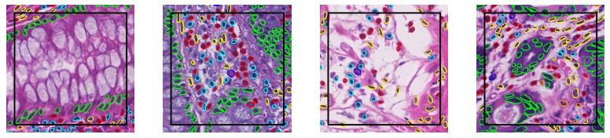
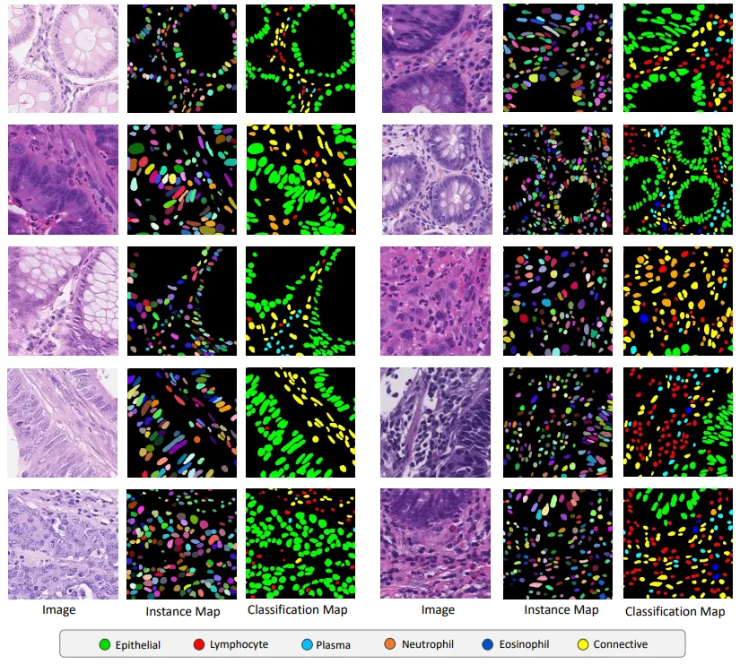

# CoNIC2022 Dataset

<div align="center">
    <a href="https://github.com/openmedlab/"></a>
</div>
<p style="text-align:center;font-size:10px;"><em></em></p>

## Dataset Information

Hematoxylin and eosin-stained histological images of nuclear segmentation, classification, and quantification can extract cell-based features that are interpretable and can be used for downstream interpretable models in computational pathology (CPath). This task requires participants to segment the nuclei within the tissue and classify each nucleus into one of the following categories: epithelial cell, lymphocyte, plasma, eosinophil, neutrophil, or connective tissue. The CoNIC dataset consists of 4,981 blocks of 256*256*3 RGB, containing image sections from colon tissues. Each RGB image block is associated with an instance segmentation map and a classification map, where the instance segmentation map holds values ranging from 0 (background) to N (number of nuclei) to mark each nucleus.

## Dataset Meta Information

| Dimensions | Modality            | Task Type | Anatomical Structures | Anatomical Area | Number of Categories | Data Volume | File Format |
|------------|---------------------|-----------|-----------------------|-----------------|----------------------|-------------|-------------|
| 2D         | Pathological Images | Segmentation | Cell                  | Pathology       | 7                    | 4981        | PNG         |


### Resolution Details

| Dataset Statistics | size        |
|--------------------|-------------|
| min                | (256, 256)  |
| median             | (256, 256)  |
| max                | (256, 256)  |

## Label Information Statistics

| Category            | Retinal Vessel |
|---------------------|----------------|
| Number of Images    | 4841           |
| Coverage Rate       | 97.19%         |
| Minimum Pixel Count | 0              |
| Medium Pixel Count  | 10578          |
| Maximum Pixel Count | 29827          |

## Visualization

<div align="center">
    <a href="https://github.com/openmedlab/"></a>
</div>
<p style="text-align:center;font-size:10px;"><em> Paper Visualization.</em></p>

## File Structure

The CoNIC2022 dataset contains two main directories: image and mask. The image directory contains the original images, and the mask directory contains the corresponding segmentation annotation images.

``` 
CoNIC2022
│
├── images
│       ├── 0.png
│       ├── 1.png
│       ├── ...
│       ├── 4980_xx.png
│
├── masks
│       ├── 0.png
│       ├── 1.png
│       ├── ...
│       ├── 4980.png
```

## Authors and Institutions

Simon Graham (TIA, PathLAKE)

Mostafa Jahanifar (TIA, PathLAKE)

Dang Vu (TIA)

Giorgos Hadjigeorghiou (TIA, PathLAKE)

Thomas Leech (TIA, PathLAKE)

David Snead (UHCW, PathLAKE)

Shan Raza (TIA, PathLAKE)

Fayyaz Minhas (TIA, PathLAKE)

Nasir Rajpoot (TIA, PathLAKE)


## Source Information

Official Website: https://conic-challenge.grand-challenge.org/

Download Link: https://conic-challenge.grand-challenge.org/Data/

Article Address: https://arxiv.org/pdf/2111.14485.pdf

Publication Date: 2022

## Citation

``` 
@inproceedings{graham2021lizard,
  title={Lizard: a large-scale dataset for colonic nuclear instance segmentation and classification},
  author={Graham, Simon and Jahanifar, Mostafa and Azam, Ayesha and Nimir, Mohammed and Tsang, Yee-Wah and Dodd, Katherine and Hero, Emily and Sahota, Harvir and Tank, Atisha and Benes, Ksenija and others},
  booktitle={Proceedings of the IEEE/CVF International Conference on Computer Vision},
  pages={684--693},
  year={2021}
}
@article{graham2111conic,
  title={Conic: Colon nuclei identification and counting challenge 2022. arXiv 2021},
  author={Graham, S and Jahanifar, M and Vu, QD and Hadjigeorghiou, G and Leech, T and Snead, D and Raza, SEA and Minhas, F and Rajpoot, N},
  journal={arXiv preprint arXiv:2111.14485}
}
```

Original introduction article is [here](https://zhuanlan.zhihu.com/p/675247817).