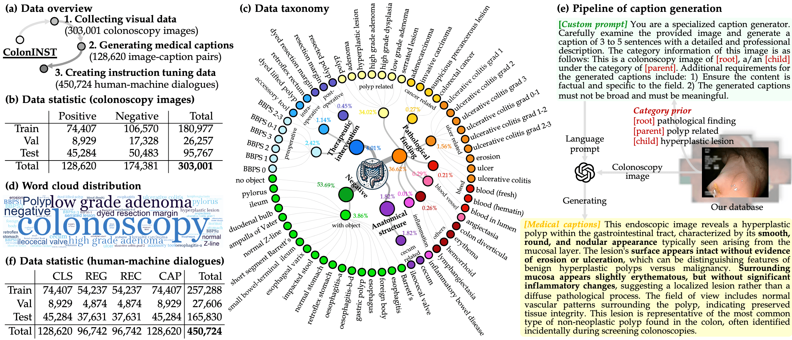
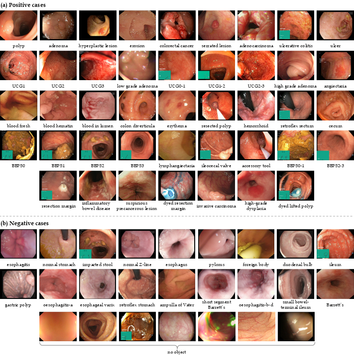

# ColonINST-v1

<div align="center">
    <a href="https://github.com/openmedlab/"></a>
</div>
<p style="text-align:center;font-size:10px;"><em>Visualisation of the ColonINST</em></p>


## Dataset Information

ColonINST is a large-scale instruction tuning dataset designed for multimodal analysis in colonoscopy. This dataset comprises 303,001 colonoscopy images, aggregated from 19 publicly available sub-dataset sources. Utilizing a semi-automated pipeline powered by GPT-4V, we have generated 128,620 detailed medical captions, enhancing the dataset’s utility for AI model training. We finally restructured 450,724 visual dialogues to guide the AI model through four downstream tasks, ie. image classification (CLS), referring expression generation (REG), referring expression comprehension (REC), and caption generation (CAP), critical for multimodal medical AI applications.


## Dataset Meta Information

|Language | Task |File Format        |Data Count |Data Type      |
|---------|------|-------------------|-----------|---------------|
|English  | VQA  |.json, .jpg, .png  |450,724    |image-text pair|

## Dataset Information Statistics

<div align="center">
    <a href="https://github.com/openmedlab/"></a>
</div>
<p style="text-align:center;font-size:10px;">
<em> Details of the multimodal instruction tuning dataset, ColonINST.</em></p>

This figure shows: (a) Three sequential steps to create the instruction tuning dataset for multimodal research. (b) Numbers of colonoscopy images designated for training, validation, and testing purposes. (c) Data taxonomy of three-level categories. (d) A word cloud of the category distribution by name size. (e) Caption generation pipeline using the VL prompting mode of GPT-4V. (f) Numbers of human-machine dialogues created for four downstream tasks.

- Colonoscopy images

    The following table shows the data statistics of colonoscopy images designated for training, validation, and testing purposes. 

    |         | Positive | Negative | Total    |
    |---------|----------|----------|----------|
    | Train set  | 74,407   | 106,570  | 180,977  |
    | Val set    | 8,929    | 17,328   | 26,257   |
    | Test set   | 45,284   | 50,483   | 95,767   |
    | **Total** | **128,620** | **174,381** | **303,001** |

- Medical captions: We feed a custom prompt and a hierarchical category prior to the advanced chatbot, GPT-4V. This model can generate detailed, professional medical descriptions for colonoscopy images, enhancing diagnostic clarity and specificity. 

- Instruction tuning pairs: In the following table, we summarise the image-instruction pairs used for the training, validation, and test by four task purposes.

    | | CLS | REG | REC | CAP | Total |
    |---|---:|---:|---:|---:|---:|
    | Train | 74,407 | 54,237 | 54,237 | 74,407 | 257,288 |
    | Val | 8,929 | 4,874 | 4,874 | 8,929 | 27,606 |
    | Test | 45,284 | 37,631 | 37,631 | 45,284 | 165,830 |
    | Total | 128,620 | 96,742 | 96,742 | 128,620 | 450,724 |


## Dataset Example

<div align="center">
    <a href="https://github.com/openmedlab/"></a>
</div>
<p style="text-align:center;font-size:10px;"><em></em></p>


## File Structure
```text
├──cache
    ├──ColonINST
        ├──Json-file
            ├──train
                ├──ColonINST-train.json
            ├──val
                ├──ColonINST-val-cls.json
                |...
            ├──test
                ├──ColonINST-test-cls.json
                |...

        ├──Positive-images
            ├──CPC-Paired
                ├──Train
                    ├──polyp
                        |──image_name.jpg
                        |...
                ├──Val
                    ├──polyp
                        |──image_name.jpg
                        |...
                ├──Test
                    ├──polyp
                        |──image_name.jpg
                        |...
            |...
```

## Authors and Institutions

Ge-Peng Ji (Australian National University, Canberra, Australia)

Jingyi Liu (Keio University, Yokohama, Japan)

Peng Xu (Tsinghua University, Beijing, China)

Nick Barnes (Australian National University, Canberra, Australia)

Fahad Shahbaz Khan (Mohamed bin Zayed University of Artificial Intelligence, Abu Dhabi, UAE)

Salman Khan (Mohamed bin Zayed University of Artificial Intelligence, Abu Dhabi, UAE)
 
Deng-Ping Fan (Nankai University, Tianjin, China)

## Source Information

Official Website: https://github.com/ai4colonoscopy/IntelliScope

Download Link: https://huggingface.co/ai4colonoscopy/ColonGPT-v1

Article Address: https://arxiv.org/abs/2410.17241

Publication Date: 2024-10

## Citation

``` 
@article{ji2024frontiers
  author = {Ji, Ge-Peng and Liu, Jingyi and Xu, Peng and Barnes, Nick and Khan, Fahad Shahbaz and Khan, Salman and Fan, Deng-Ping},
  title = {Frontiers in Intelligent Colonoscopy},
  journal = {arXiv preprint arXiv:2410.17241},
  year = {2024}
}
```