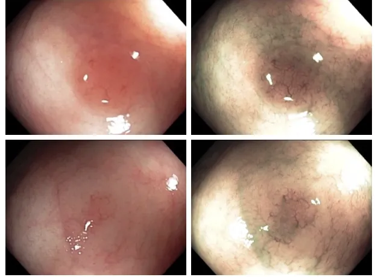
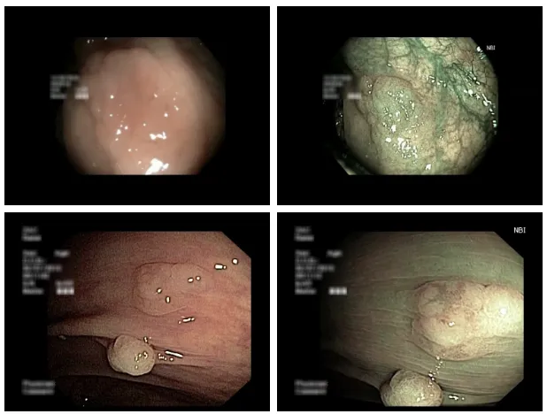
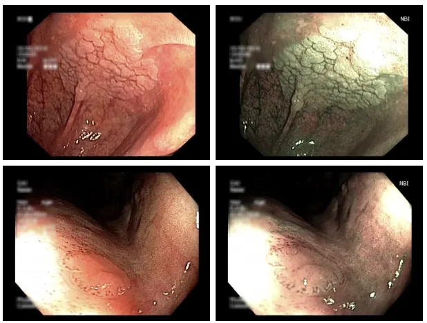
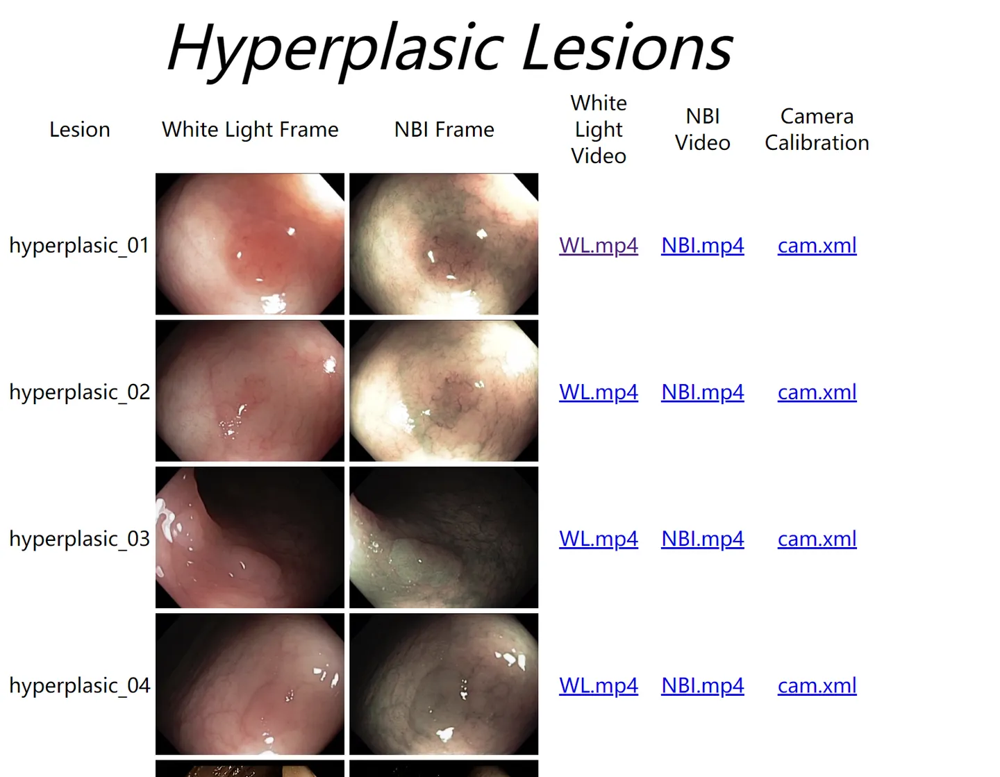

# Colonoscopic

<div align="center">
    <a href="https://github.com/openmedlab/"></a>
</div>
<p style="text-align:center;font-size:10px;"><em></em></p>

## Dataset Information

The Colonoscopic Dataset is a dataset for the diagnosis of gastrointestinal lesions such as polyps and adenomas in colonoscopy videos. It is widely used in challenges related to machine learning and computer vision algorithms for the diagnosis of gastrointestinal lesions. The dataset is categorized into three types of lesions: hyperplastic (hyperplastic lesions), serrated (serrated adenomas), and adenoma (adenomas). For each video data, there is both white light and Narrow Band Imaging (NBI) data, with a total dataset size of 76*2.

The clinical significance of this task lies in improving the efficiency and accuracy of gastrointestinal lesion diagnosis, especially in differentiating between high-risk and low-risk lesions. By using this dataset, researchers can develop and test algorithms to accurately classify and recognize various types of gastrointestinal lesions, such as hyperplastic lesions, serrated adenomas, and adenomas. The dataset is particularly valuable for challenging classifications such as serrated adenomas, as these lesions may lead to colorectal cancer through different pathological pathways.

## Dataset Meta Information

| Dimensions | Modality | Task Type           | Anatomical Area | Number of Categories | Data Volume | File Format |
|------------|----------|-----------|-----------------|----------------------|-------------|-------------|
| 2D         | Endoscopy       | Detection | Colon           | 3                    | 76*2        | mp4         |


### Resolution Details

| Dataset Statistics | size      |
|--------------------|-----------|
| min                | 340 x 256 |
| median             | 340 x 256 |
| max                | 340 x 256 |

## Label Information Statistics

| Lesion Type | hyperplastic (Hyperplasia) | serrated (Serrated Lesions) | adenoma (Adenoma) |
|-------------|----------------------------|----------------------------|--------------------|
| Number of Videos | 21x2 (White Light + NBI) | 15x2 (White Light + NBI) | 40x2 (White Light + NBI) |
| Percentage | 27.6% | 19.7% | 52.6% |

## Visualization


<div align="center">
    <a href="https://github.com/openmedlab/"></a>
</div>
<p style="text-align:center;font-size:10px;"><em></em></p>

<div align="center">
    <a href="https://github.com/openmedlab/"></a>
</div>
<p style="text-align:center;font-size:10px;"><em></em></p>

<div align="center">
    <a href="https://github.com/openmedlab/"></a>
</div>
<p style="text-align:center;font-size:10px;"><em></em></p>

## File Structure

Officially provided files can be downloaded directly from the official website, and the structure is as shown below:

<div align="center">
    <a href="https://github.com/openmedlab/"></a>
</div>
<p style="text-align:center;font-size:10px;"><em></em></p>

``` 
Dataset
│
├── hyperplasic
│   ├── hyperplasic_01
│   │   ├── WL.mp4
│   │   ├── NBI.mp4
│   ├── hyperplasic_02
│   │   ├── WL.mp4
│   │   ├── NBI.mp4
│   └── ...
├── serrated
│   ├── serrated_01
│   │   ├── WL.mp4
│   │   ├── NBI.mp4
│   ├── serrated_02
│   │   ├── WL.mp4
│   │   ├── NBI.mp4
│   └── ...
├── adenoma
│   ├── adenoma_01
│   │   ├── WL.mp4
│   │   ├── NBI.mp4
│   ├── adenoma_02
│   │   ├── WL.mp4
│   │   ├── NBI.mp4
│   └── ...
```

## Authors and Institutions

Pablo Mesejo (University of Auvergne, Grenoble Alpes Research Institute)

Daniel Pizarro (University of Auvergne, University of Alcalá)

Armand Abergel (Digestive Department, Estaing Central Hospital)

Olivier Rouquette (Digestive Department, Estaing Central Hospital)

Sylvain Beorchia (Sauvegarde Clinic)

Laurent Poincloux (Digestive Department, Estaing Central Hospital)

Adrien Bartoli (University of Auvergne)


## Source Information

Official Website: https://www.depeca.uah.es/colonoscopy_dataset/

Download Link: https://www.depeca.uah.es/colonoscopy_dataset/

Article Address: https://ieeexplore.ieee.org/abstract/document/7442848

Publication Date: 2016-9

## Citation

``` 
@article{mesejo2016computer,
  title={Computer-aided classification of gastrointestinal lesions in regular colonoscopy},
  author={Mesejo, Pablo and Pizarro, Daniel and Abergel, Armand and Rouquette, Olivier and Beorchia, Sylvain and Poincloux, Laurent and Bartoli, Adrien},
  journal={IEEE transactions on medical imaging},
  volume={35},
  number={9},
  pages={2051--2063},
  year={2016},
  publisher={IEEE}
}
```

Original introduction article is [here](https://zhuanlan.zhihu.com/p/672452720).