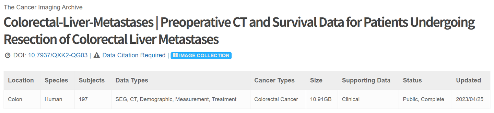
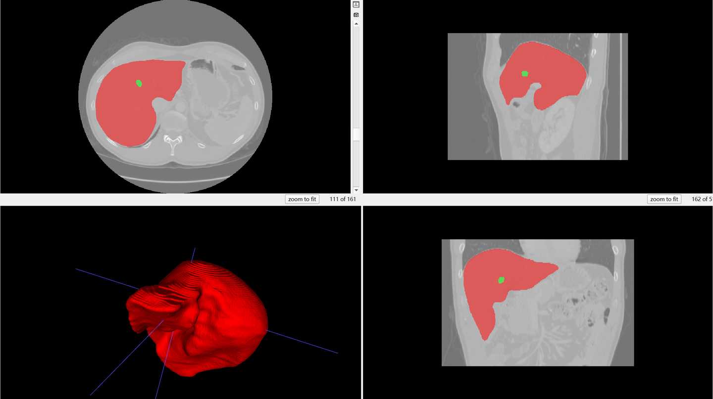
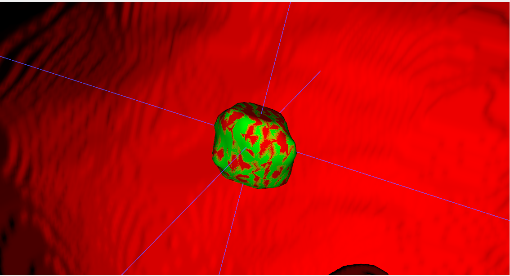

# Colorectal-Liver-Metastases

<div align="center">
    <a href="https://github.com/openmedlab/"></a>
</div>
<p style="text-align:center;font-size:10px;"><em></em></p>

## Dataset Information

The **Colorectal-Liver-Metastases (CRLM)** dataset includes DICOM images and DICOM segmentation objects (DSO) from **197 CRLM patients**. All patients underwent CRLM resection surgery, with preoperative computed tomography (CT) images available for quantitative imaging analysis. The CT images were extracted from a PACS system, de-identified in compliance with institutional approval and HIPAA regulations. The liver, tumors, and vessels were semi-automatically segmented using **Scout Liver** (Pathfinder Technologies Inc., TN, USA) software, generating 3D models. Each case includes the original DICOM CT images and segmentation masks for each subject. The segmentation covers the liver and hepatic tumors. All DSO (segmentation objects) were validated by relevant experts.

This dataset provides a unique and comprehensive resource for studying the relationship between preoperative and postoperative imaging characteristics of CRLM and patient survival and disease-free survival rates. Through radiomics analysis, researchers can explore the heterogeneity of imaging features in tumors and liver parenchyma to determine whether these features can serve as biomarkers for predicting recurrence and survival. This enables the precise identification of patients likely to benefit from liver resection surgery. The dataset accelerates research progress in CRLM imaging analysis, offers valuable data support to other researchers, and lays a foundation for larger-scale datasets and external validation studies in the future.

## Dataset Meta Information

| Dimensions | Modality | Task Type      | Anatomical Structures | Anatomical Area | Number of Categories | Data Volume | File Format |
|------------|----------|----------------|-----------------------|-----------------|----------------------|-------------|-------------|
| 3D         | CT       | Segmentation   | Liver, Liver Tumor    | Liver           | 2                    | 197         | .dcm        |


### Resolution Details

| Dataset Statistics | spacing (mm)           | size           |
|--------------------|------------------------|----------------|
| min                | (0.609, 0.609, 0.800)  | (512,512,21)   |
| median             | (0.781, 0.781, 5.000)  | (512,512,55)   |
| max                | (0.977, 0.977, 7.500)  | (512,512,240)  |

Number of 2D slices in the dataset: 17639.

## Label Information Statistics

| Segmentation Structure | liver | liver_tumor |
|-------------------------|-------|-------------|
| Occurrence Count        | 197   | 197         |
| Percentage of Occurrence | 100%  | 100%        |
| Minimum Volume (cm³)    | 770   | 0.24        |
| Median Volume (cm³)     | 1553.36 | 9.53      |
| Maximum Volume (cm³)    | 3280.68 | 1099.98   |

## Visualization

The following figure shows an example. The red area represents the liver and the green area represents the liver tumor.

<div align="center">
    <a href="https://github.com/openmedlab/"></a>
</div>
<p style="text-align:center;font-size:10px;"><em></em></p>

Liver tumors

<div align="center">
    <a href="https://github.com/openmedlab/"></a>
</div>
<p style="text-align:center;font-size:10px;"><em></em></p>

## File Structure

``` 
Colorectal-Liver-Metastases
│
├── manifest-1669817128730
│   └── Colorectal-Liver-Metastases
│       └── metadata.csv
│
├── Colorectal Liver Metastases Clinical data April 2023.xlsx
├── Colorectal Liver Metastases November 2022 manifest.tcia
│
├── CRLM-CT-1001
│   └── 06-06-1992-NA-CT ANGIO ABD WITH PEL-75163
│       ├── 100.000000-Segmentation-46600
│       │   └── 1-1.dcm
│       └── 101.000000-NA-71548
│           ├── 1-001.dcm
│           ├── 1-002.dcm
│           ├── 1-003.dcm
│           └── ...
│
├── CRLM-CT-1002
│   └── ...
│
├── CRLM-CT-1003
│   └── ...
│
└── ...
```

## Authors and Institutions

- Amber Simpson (Memorial Sloan Kettering Cancer Center, USA)  

- Jacob Peoples (School of Computing, Queen’s University, Canada)  

- John M. Creasy (The Oregon Clinic, USA)  

- Gabor Fichtinger (School of Computing, Queen’s University, Canada)  

- Natalie Gangai (Memorial Sloan Kettering Cancer Center, USA)  

- Krishna N. Keshavamurthy (Memorial Sloan Kettering Cancer Center, USA)  

- Andras Lasso (School of Computing, Queen’s University, Canada)  

- Jinru Shia (Memorial Sloan Kettering Cancer Center, USA)  

- Michael I. D’Angelica (Memorial Sloan Kettering Cancer Center, USA)  

- Richard K. G. Do (Memorial Sloan Kettering Cancer Center, USA)  

## Source Information

Official Website: https://www.cancerimagingarchive.net/collection/colorectal-liver-metastases/

Download Link: https://www.cancerimagingarchive.net/collection/colorectal-liver-metastases/

Article Address: https://www.nature.com/articles/s41597-024-02981-2

Publication Date: 2023-04

## Citation

``` 
@article{simpson2024preoperative,
  title={Preoperative CT and survival data for patients undergoing resection of colorectal liver metastases},
  author={Simpson, Amber L and Peoples, Jacob and Creasy, John M and Fichtinger, Gabor and Gangai, Natalie and Keshavamurthy, Krishna N and Lasso, Andras and Shia, Jinru and D’Angelica, Michael I and Do, Richard KG},
  journal={Scientific Data},
  volume={11},
  number={1},
  pages={172},
  year={2024},
  publisher={Nature Publishing Group UK London}
}
```

Original introduction article is [here](https://zhuanlan.zhihu.com/p/4192156609).