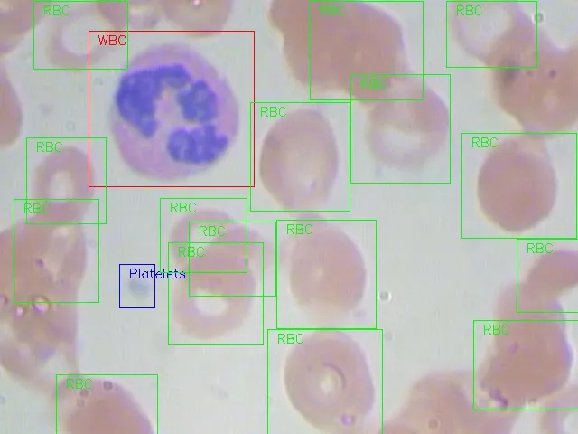

# Complete Blood Count 

<div align="center">
    <a href="https://github.com/openmedlab/"></a>
</div>
<p style="text-align:center;font-size:10px;"><em></em></p>

## Dataset Information

The Complete Blood Count (CBC) dataset contains 360 blood smear images, each with its corresponding annotation file providing location information for the red blood cells (RBC), white blood cells (WBC), and platelets in the image. This dataset originates from [1], but after inspection, it was discovered that the annotations for the 364 images provided in the original dataset were incomplete. After correcting the annotations and removing problematic images, the authors reorganized and obtained this CBC dataset with 360 images.

A complete blood count is an important indicator in medical diagnostics for assessing human health. Traditional methods of blood cell counting involve using a hemocytometer and other laboratory equipment and chemical compounds for manual counting, a time-consuming and tedious task. The authors hope to use automatic counting methods from computer vision to improve the efficiency and accuracy of the entire cell counting process. To this end, they have compiled this dataset to promote the research and application of rapid automatic counting in complete blood cell counting.

GitHub: [Shenggan/BCCD_Dataset: BCCD (Blood Cell Count and Detection) Dataset is a small-scale dataset for blood cells detection.](https://github.com/Shenggan/BCCD_Dataset)

## Dataset Meta Information

| Dimensions | Modality | Task Type       | Anatomical Structures | Anatomical Area | Number of Categories | Data Volume | File Format |
|------------|----------|-----------------|-----------------------|-----------------|----------------------|-------------|-------------|
| 2D         | Blood Smear       | Counting Number | Cell                  | Cell            | 3                    | 360         | JPG         |


### Resolution Details

| Dataset Statistics | size         |
|--------------------|--------------|
| min                | [640,480]   |
| median             | [640,480]   |
| max                | [640,480]   |

## Label Information Statistics

| Class          | Number |
|----------------|--------|
| RBC            | 792    |
| WBC            | 61     |
| Platelet | 55     |

## Visualization

<div align="center">
    <a href="https://github.com/openmedlab/"></a>
</div>
<p style="text-align:center;font-size:10px;"><em> Data Visualization Example.</em></p>

## File Structure

The file structure of the dataset is as follows: it includes one .yaml file and one readme file that record the main information of the dataset, one folder named 'raw' that contains each image and its annotation, one folder named 'dsdl' that stores all data in the structure of an object detection dataset, and one folder named 'sample' that contains only all the images.

``` 
Complete Blood Cell Count Dataset
├── metafile.yaml
├── README.md
├── raw
│   ├── Testing
│   │   ├── Annotations
│   │   │   ├── BloodImage_00339.xml
│   │   │   ├── BloodImage_00340.xml
│   │   │   ├── ...
│   │   ├── Images
│   │   │   ├──  BloodImage_00339.jpg
│   │   │   ├──  BloodImage_00340.jpg
│   │   │   ├── ...
│   ├── Training
│   │   ├── Annotations
│   │   │   ├── BloodImage_00000.xml
│   │   │   ├── BloodImage_00001.xml
│   │   │   ├── ...
│   │   ├── Images
│   │   │   ├── BloodImage_00000.jpg
│   │   │   ├── BloodImage_00001.jpg
│   │   │   ├── ...
│   ├── Validation
│   │   ├── Annotations
│   │   │   ├── BloodImage_00002.xml
│   │   │   ├── BloodImage_00004.xml
│   │   │   ├── ...
│   │   ├── Images
│   │   │   ├── BloodImage_00002.jpg
│   │   │   ├── BloodImage_00004.jpg
│   │   │   ├── ...
│   ├── LICENSE
│   ├── README.md
│   ├── _config.yml
├── dsdl
│   ├── set-val
│   │   ├── val.yaml
│   │   ├── val_samples.json
│   ├── set-test
│   │   ├── test.yaml
│   │   ├── test_samples.json
│   ├── set-train
│   │   ├── train.yaml
│   │   ├── train_samples.json
│   ├── defs
│   │   ├── class-dom.yaml
│   │   ├── object-detection-def.yaml
│   ├── README.md
│   ├── config.py
├── sample
│   ├── image
│   │   ├── sample_0.jpg
│   │   ├── sample_1.jpg
│   │   │    ...
```

## Authors and Institutions

Mohammad Mahmudul Alam（Bangladesh University of Engineering and Technology, People's Republic of Bangladesh）

Mohammad Tariqul Islam（Bangladesh University of Engineering and Technology, People's Republic of Bangladesh）


## Source Information

Official Website: https://github.com/MahmudulAlam/Complete-Blood-Cell-Count-Dataset

Download Link: https://github.com/MahmudulAlam/Complete-Blood-Cell-Count-Dataset/archive/master.zip, https://opendatalab.com/OpenDataLab/CBC

Article Address: https://ietresearch.onlinelibrary.wiley.com/doi/10.1049/htl.2018.5098

Publication Date: 2019-07-17

## Citation

``` 
@article{alam2019machine,
  title={Machine learning approach of automatic identification and counting of blood cells},
  author={Alam, Mohammad Mahmudul and Islam, Mohammad Tariqul},
  journal={Healthcare Technology Letters},
  volume={6},
  number={4},
  pages={103--108},
  year={2019},
  publisher={IET}
}
```

Original introduction article is [here](https://zhuanlan.zhihu.com/p/683549281).