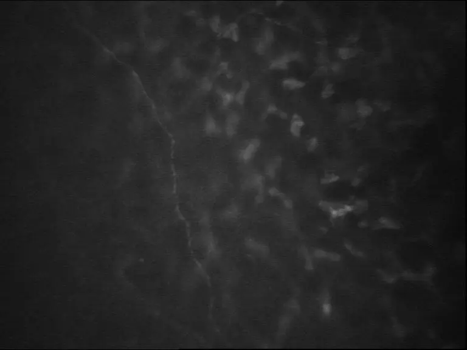
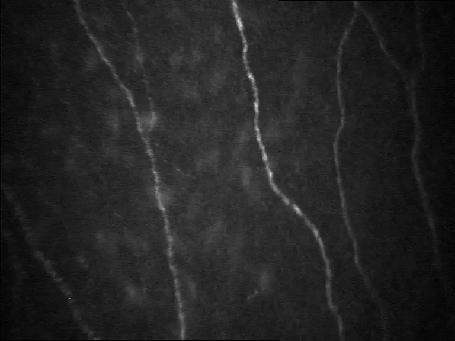

# Corneal Nerve Dataset

<div align="center">
    <a href="https://github.com/openmedlab/"></a>
</div>
<p style="text-align:center;font-size:10px;"><em></em></p>

## Dataset Information

The Corneal Nerve dataset includes 90 confocal microscopy images of the corneal basal epithelium from both normal and pathological patients, with a field size of 460x350 μm and a magnification of 40 times. Confocal microscopic imaging can rapidly and non-invasively obtain images of corneal layers, providing important information about corneal nerve structures and corneal health status. Clinically, assessments of the health of the corneal basal epithelium are based on tedious manual nerve tracing and analysis. Therefore, conclusions require a significant amount of time and are somewhat subjective. The authors hope that this dataset will promote research on automated image analysis algorithms in this field and the development of related programs, thereby increasing the accuracy and efficiency of clinical diagnoses.

## Dataset Meta Information

| Dimensions | Modality | Task Type       | Anatomical Structures | Anatomical Area | Number of Categories | Data Volume | File Format |
|------------|----------|-----------------|-----------------------|-----------------|----------------------|-------------|-------------|
| 2D         | Microscopy Images       | Classification  | Eye                   | Head            | 2                    | 90          | JPG         |


### Resolution Details

| Dataset Statistics | size        |
|--------------------|-------------|
| min                | [768,576]  |
| median             | [768,576]  |
| max                | [768,576]  |

## Label Information Statistics

| Category  | Number |
|-----------|--------|
| Normal    | 76     |
| Nonnormal | 14     |

## Visualization

<div align="center">
    <a href="https://github.com/openmedlab/"></a>
</div>
<p style="text-align:center;font-size:10px;"><em> Normal Corneal Basal Epithelium Image Example.</em></p>

<div align="center">
    <a href="https://github.com/openmedlab/"></a>
</div>
<p style="text-align:center;font-size:10px;"><em> Nonnormal Corneal Basal Epithelium Image Example.</em></p>


## File Structure

The dataset's file structure is as follows, containing 90 jpg images, and note that the label for each image is indicated after the underscore in its name (Normal / NonNormal).

``` 
Corneal Nerve Dataset
├── Imm01_Normal.jpg
├── Imm02_Normal.jpg
├──  ...
├── Imm90_Normal.jpg
```

## Authors and Institutions

Fabio Scarpa(University of Padova, Italy)

Enrico Grisan(University of Padova, Italy)

Alfredo Ruggeri(University of Padova, Italy)


## Source Information

Official Website: http://bioimlab.dei.unipd.it/Corneal%20Nerve%20Data%20Set.htm

Download Link: http://bioimlab.dei.unipd.it/Corneal%20Nerve%20Data%20Set.htm

Article Address: https://iovs.arvojournals.org/article.aspx?articleid=2125558

Publication Date: 2008-11

## Citation

``` 
@article{scarpa2008automatic,
  title={Automatic recognition of corneal nerve structures in images from confocal microscopy},
  author={Scarpa, Fabio and Grisan, Enrico and Ruggeri, Alfredo},
  journal={Investigative ophthalmology \& visual science},
  volume={49},
  number={11},
  pages={4801--4807},
  year={2008},
  publisher={The Association for Research in Vision and Ophthalmology}
}
```

Original introduction article is [here](https://zhuanlan.zhihu.com/p/668445618).