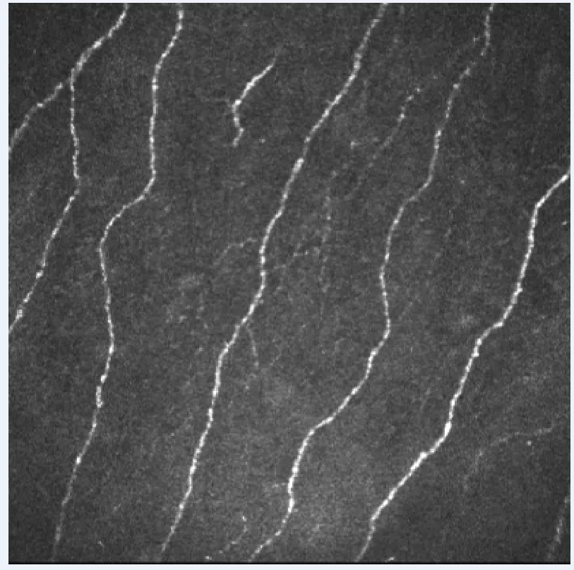
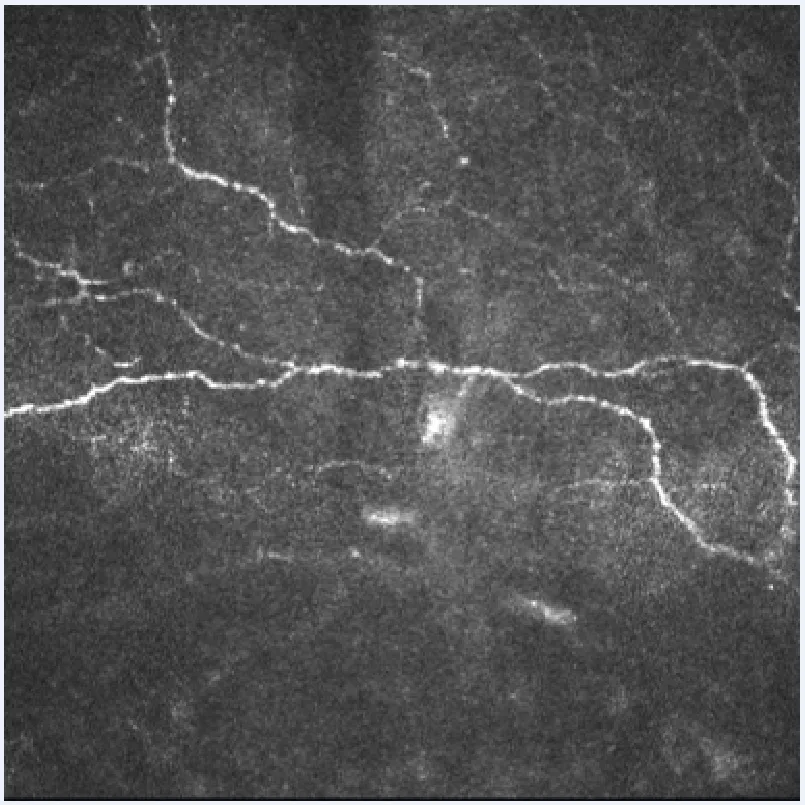
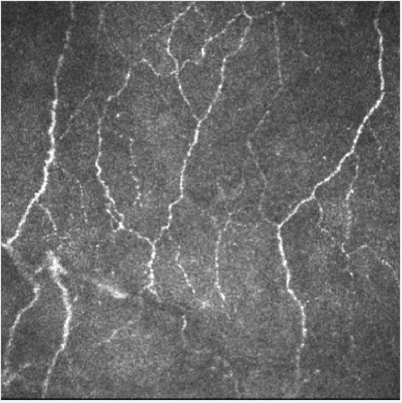

# Corneal Nerve Tortuosity Dataset

<div align="center">
    <a href="https://github.com/openmedlab/"></a>
</div>
<p style="text-align:center;font-size:10px;"><em> </em></p>

## Dataset Information

This dataset contains 30 confocal laser scanning microscopy images of sub-basal corneal nerve plexus. Each image in the dataset comes from different subjects, specifically including patients with diabetes, pseudoexfoliation syndrome, keratoconus, or healthy individuals. In each image, the corneal nerves have been categorized by medical experts into one of three levels of tortuosity: low, medium, or high. The sub-basal corneal nerve structure provides important clinical information about human aging, eye diseases, and more, and a key characteristic of the sub-basal corneal nerve structure is its degree of nerve tortuosity. The provided Corneal Nerve Tortuosity dataset can assist researchers in developing corresponding algorithmic models to evaluate the degree of tortuosity in sub-basal corneal nerves.

## Dataset Meta Information

| Dimensions | Modality | Task Type       | Anatomical Structures | Anatomical Area | Number of Categories | Data Volume | File Format |
|------------|----------|-----------------|-----------------------|-----------------|----------------------|-------------|-------------|
| 2D         | Microscopy Images       | Classification  | Eye                   | Head            | 3                    | 30          | .tif        |


### Resolution Details

| Dataset Statistics | size        |
|--------------------|-------------|
| min                | [384,384]  |
| median             | [384,384]  |
| max                | [384,384]  |

## Label Information Statistics

| Category            | Number |
|---------------------|--------|
| Distortion - Low    | 10     |
| Distortion - Middle | 10     |
| Distortion - High   | 10     |

## Visualization

<div align="center">
    <a href="https://github.com/openmedlab/"></a>
</div>
<p style="text-align:center;font-size:10px;"><em> Distortion - Low Example. </em></p>

<div align="center">
    <a href="https://github.com/openmedlab/"></a>
</div>
<p style="text-align:center;font-size:10px;"><em> Distortion - Middle Example. </em></p>

<div align="center">
    <a href="https://github.com/openmedlab/"></a>
</div>
<p style="text-align:center;font-size:10px;"><em> Distortion - High Example. </em></p>

## File Structure

The dataset's file structure is as follows, containing 30 .tif images and a PDF file that provides the corresponding labels for all the images.

``` 
Corneal Nerve Tortuosity Dataset
├── image01.tif
├── image02.tif
├──  ...
├── Manual grading table.pdf
```

## Authors and Institutions

Fabio Scarpa（University of Padua, Italy）

Xiaodong Zheng（Ehime University School of Medicine, Japan）

Yuichi Ohashi（Ehime University School of Medicine, Japan）

Alfredo Ruggeri（University of Padua, Italy）


## Source Information

Official Website: http://bioimlab.dei.unipd.it/Corneal%20Nerve%20Tortuosity%20Data%20Set.htm

Download Link: http://bioimlab.dei.unipd.it/Corneal%20Nerve%20Tortuosity%20Data%20Set.htm

Article Address: https://iovs.arvojournals.org/article.aspx?articleid=2187659

Publication Date: 2011-08

## Citation

``` 
@article{scarpa2011automatic,
  title={Automatic evaluation of corneal nerve tortuosity in images from in vivo confocal microscopy},
  author={Scarpa, Fabio and Zheng, Xiaodong and Ohashi, Yuichi and Ruggeri, Alfredo},
  journal={Investigative ophthalmology \& visual science},
  volume={52},
  number={9},
  pages={6404--6408},
  year={2011},
  publisher={The Association for Research in Vision and Ophthalmology}
}
```

Original introduction article is [here](https://zhuanlan.zhihu.com/p/667442146).