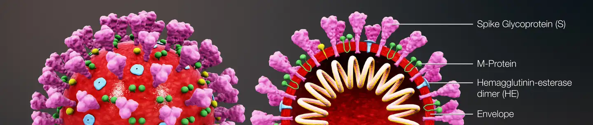
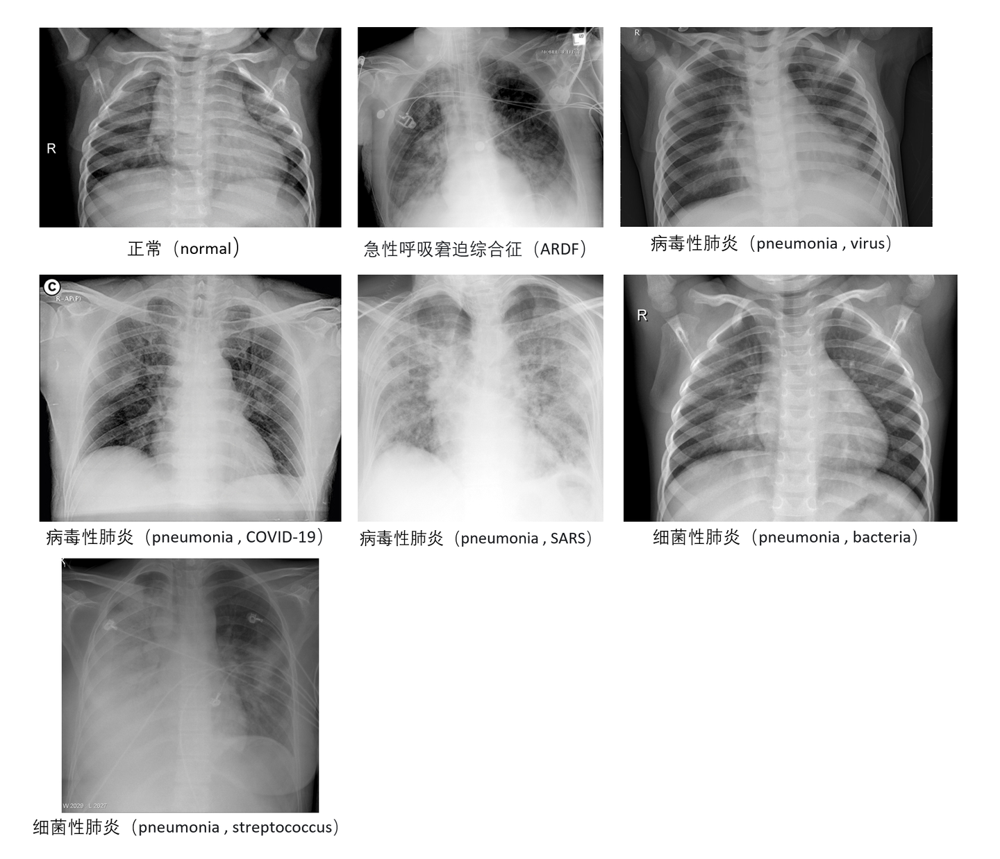

# CoronaHack

<div align="center">
    <a href="https://github.com/openmedlab/"></a>
</div>
<p style="text-align:center;font-size:10px;"><em></em></p>

## Dataset Information

The **CoronaHack** dataset contains data for chest X-ray image analysis, primarily aimed at distinguishing between healthy individuals and patients with pneumonia. The dataset includes various types of chest X-ray images with a total of 7 labels: Normal, ARDS due to stress smoking (Acute Respiratory Distress Syndrome), Viral Pneumonia (including COVID-19 and SARS), and Bacterial Pneumonia (including Streptococcus infections). The total number of images is 5,910, with 1,576 normal samples.

The significance of this dataset lies in providing a rich data foundation for the development of machine learning models for automated lung infection diagnosis. By utilizing this data, researchers can develop effective classification and detection tools to help doctors speed up the diagnostic process and improve diagnostic accuracy. This is particularly valuable in responding to severe epidemics like COVID-19, as it can significantly enhance the efficiency and effectiveness of clinical work.

## Dataset Meta Information

| Dimensions | Modality | Task Type                    | Anatomical Structures | Anatomical Area | Number of Categories | Data Volume | File Format |
|------------|----------|------------------------------|-----------------------|-----------------|----------------------|-------------|-------------|
| 2D         | CXR      | Segmentation, Classification | Lung                  | Chest           | 2 (7)                | 5910        | PNG         |

Note: The labels of this dataset are only normal/pneumonia, but the pneumonia data is subdivided into 6 different types of pneumonia, so the number of categories is 2 (normal + pneumonia) or 7 (normal + 6 different pneumonia).

### Resolution Details

| Dataset Statistics | size          |
|--------------------|---------------|
| min                | (384, 127)    |
| median             | (1214, 937)   |
| max                | (4248, 3480)  |

## Label Information Statistics

| Label           | Disease Tag 1                | Disease Tag 2                              | Quantity | Percentage |
|-----------------|------------------------------|--------------------------------------------|----------|------------|
| Normal          | N/A                          | N/A                                        | 1576     | 26.67%     |
| Pneumonia       | Stress Smoking               | Acute Respiratory Distress Syndrome (ARDS) | 2        | 0.03%      |
| Pneumonia       | Virus                        | N/A                                        | 1493     | 25.26%     |
| Pneumonia       | Virus                        | COVID-19                                   | 58       | 0.98%      |
| Pneumonia       | Virus                        | SARS                                       | 4        | 0.07%      |
| Pneumonia       | Bacteria                     | N/A                                        | 2772     | 46.9%      |
| Pneumonia       | Bacteria                     | Streptococcus                              | 5        | 0.08%      |


## Visualization

<div align="center">
    <a href="https://github.com/openmedlab/"></a>
</div>
<p style="text-align:center;font-size:10px;"><em>Sample Display.</em></p>

## File Structure

``` 
Coronahack-Chest-XRay-Dataset
├── test
│   ├── IM-0001-0001.jpeg
│   ├── IM-0003-0001.jpeg
│   ├── IM-0005-0001.jpeg
│   ├── IM-0006-0001.jpeg
│   └── ...
├── train
│   ├── 1-s2.0-S0140673620303706-fx1_lrg.jpg
│   ├── 1-s2.0-S0929664620300449-gr2_lrg-a.jpg
│   ├── 1-s2.0-S0929664620300449-gr2_lrg-b.jpg
│   ├── 1-s2.0-S0929664620300449-gr2_lrg-c.jpg
│   └── ...
├── Chest_xray_Corona_dataset_Summary.csv
├── Chest_xray_Corona_Metadata.csv
```

## Authors and Institutions

- Joseph Paul Cohen (Mila Institute, Université de Montréal)
- Paul Morrison (Fontbonne University, Mila Institute)
- Lan Dao (Department of Medicine, Université de Montréal, Mila Institute)
- Karsten Roth (Vector Institute, Mila Institute, Université de Montréal, Heidelberg University)
- Tim Q Duong (Stony Brook University Medical Center)
- Marzyeh Ghassemi (Vector Institute, University of Toronto)

## Source Information

Official Website: https://www.kaggle.com/datasets/praveengovi/coronahack-chest-xraydataset/data

Download Link: https://www.kaggle.com/datasets/praveengovi/coronahack-chest-xraydataset/data

Article Address: https://arxiv.org/abs/2006.11988

Publication Date: 2020-06

## Citation

``` 
@article{cohen2020covidProspective,
  title={COVID-19 Image Data Collection: Prospective Predictions Are the Future},
  author={Joseph Paul Cohen and Paul Morrison and Lan Dao and Karsten Roth and Tim Q Duong and Marzyeh Ghassemi},
  journal={arXiv 2006.11988},
  url={https://github.com/ieee8023/covid-chestxray-dataset},
  year={2020}
}
```

Original introduction article is [here](https://zhuanlan.zhihu.com/p/720307048).