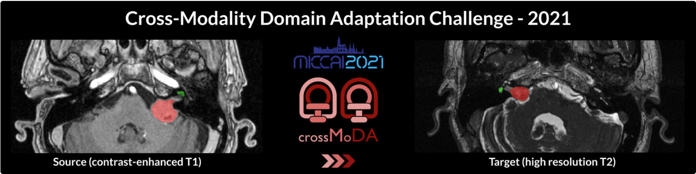
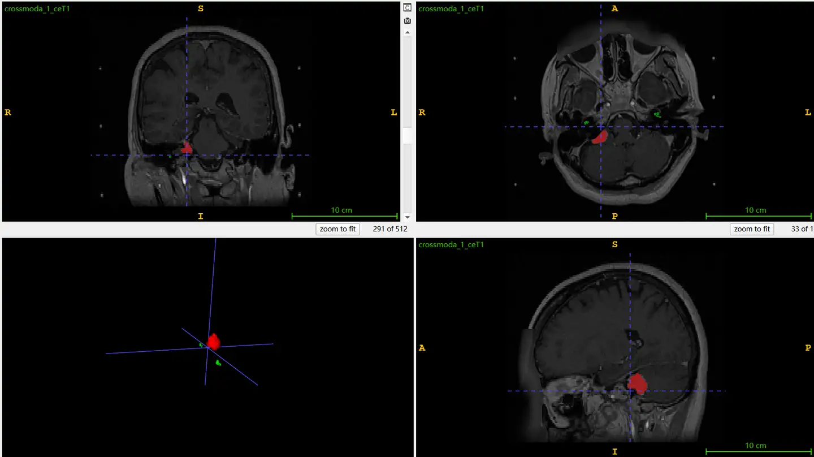

# CrossMoDA2021

<div align="center">
    <a href="https://github.com/openmedlab/"></a>
</div>
<p style="text-align:center;font-size:10px;"><em></em></p>

## Dataset Information

The CrossMoDA2021 dataset is a classic dataset for cross-modal domain adaptation tasks in medical image segmentation. It was the first unsupervised domain adaptation benchmark in the field of medical imaging at that time. The dataset provides brain MRI images in two modalities: Contrast-enhanced T1-weighted (T1-CE) and High-resolution T2-weighted (T2-HR). It includes manually annotated masks of vestibular schwannomas and cochleae for both modalities. The training set comprises 105 cases of T1-CE modality brain images with segmentation masks, and 105 cases of unlabeled T2-HR modality brain images. The validation set contains 32 cases of T2-HR modality MRI brain images, and the test set includes 107 cases of T2-HR modality MRI brain images.

Patients with vestibular schwannomas (VS) involve two critical brain structures (tumor and cochlea) in their treatment planning and follow-up. Segmenting these tumors and cochlear structures is crucial for VS radiotherapy and also key to improving routine monitoring. This dataset offers images in the most common MRI modalities, T1-weighted and T2-weighted, and provides precise annotations for vestibular schwannomas and cochleae. It lays the groundwork for developing artificial intelligence methods in this field. Additionally, domain adaptation (DA) has garnered significant attention in the medical imaging community. By maintaining robustness of algorithms in unseen situations or different input data domains, domain adaptation enhances the applicability of machine learning methods in various clinical settings. This dataset also plays an important role in developing more privacy-preserving unsupervised domain adaptation methods.

We have also introduced the [2023 version of this dataset](./CrossMoDA2023.md) previously.

## Dataset Meta Information

| Dimensions | Modality     | Task Type    | Anatomical Structures | Anatomical Area | Number of Categories | Data Volume | File Format |
|------------|--------------|--------------|-----------------------|-----------------|----------------------|-------------|-------------|
| 3D         | T1-CE, T2-HR | Segmentation | Tumor, cochlea        | Brain           | 2                    | 349         | .nii.gz     |


### Resolution Details

| Dataset Statistics | spacing (mm)                 | size        |
|--------------------|------------------------------|-------------|
| min                | (0.41015625,0.41015625,1)    | 512x512x120 |
| median             | (0.41015625,0.41015625,1.5)	 | 512x512x120 |
| max                | (0.41015625,0.41015625,1.5)  | 512x512x160 |

Number of 2D slices in the dataset: 12920

## Label Information Statistics

| Anatomical Structure | Vestibular Schwannoma | Cochlea |
|----------------------|-----------------------|---------|
| Number of Cases      | 105                   | 105     |
| Segmentation Accuracy| 100.00%               | 100.00% |
| Min Volume (cm³)     | 0.04                  | 0.07    |
| Median Volume (cm³)  | 1.33                  | 0.17    |
| Max Volume (cm³)     | 9.8                   | 0.22    |


## Visualization

Three views of T1-CE MRI images and schematic diagrams of the three-dimensional shapes of the tumor and cochlea. In the images, red annotations represent the tumor, and green annotations represent the cochlea.

<div align="center">
    <a href="https://github.com/openmedlab/"></a>
</div>
<p style="text-align:center;font-size:10px;"><em></em></p>

## File Structure

``` 
CrossMoDA21/
├── crossmoda_training/
│   ├── source_training/
│   │   ├── crossmoda_1_ceT1.nii.gz
│   │   ├── crossmoda_1_Label.nii.gz
│   │   ├── crossmoda_2_ceT1.nii.gz
│   │   ├── crossmoda_2_Label.nii.gz
│   │   ├── crossmoda_3_ceT1.nii.gz
│   │   ├── crossmoda_3_Label.nii.gz
│   │   ├── ...
│   ├── target_training/
│   │   ├── crossmoda_106_hrT2.nii.gz
│   │   ├── crossmoda_107_hrT2.nii.gz
│   │   ├── crossmoda_108_hrT2.nii.gz
│   │   ├── crossmoda_109_hrT2.nii.gz
│   │   ├── ...
├── crossmoda_validation/
│   ├── target_validation/
│   │   ├── crossmoda_211_hrT2.nii.gz
│   │   ├── crossmoda_212_hrT2.nii.gz
│   │   ├── crossmoda_213_hrT2.nii.gz
│   │   ├── crossmoda_214_hrT2.nii.gz
│   │   ├── ...
```

## Authors and Institutions

Reuben Dorent (King's College London, UK)

Tom Vercauteren (King's College London, UK)

Jonathan Shapey (King's College London, UK)

Aaron Kujawa (King's College London, UK)

Ben Glocker (Imperial College London, UK)

Nicola Rieke (NVIDIA)

Jorge Cardoso (King's College London, UK)

Spyridon Bakas (University of Pennsylvania, USA)

Samuel Joutard (King's College London, UK)

Marc Modat (King's College London, UK)

## Source Information

Official Website: https://crossmoda.grand-challenge.org/

Download Link: https://crossmoda.grand-challenge.org/Data/

Article Address: https://doi.org/10.7937/TCIA.9YTJ-5Q73

Publication Date: 2021-03

## Citation

``` 
@article{shapey2021segmentation,
  title={Segmentation of vestibular schwannoma from MRI, an open annotated dataset and baseline algorithm},
  author={Shapey, Jonathan and Kujawa, Aaron and Dorent, Reuben and Wang, Guotai and Dimitriadis, Alexis and Grishchuk, Diana and Paddick, Ian and Kitchen, Neil and Bradford, Robert and Saeed, Shakeel R and others},
  journal={Scientific Data},
  volume={8},
  number={1},
  pages={286},
  year={2021},
  publisher={Nature Publishing Group UK London}
}
```

Original introduction article is [here](https://zhuanlan.zhihu.com/p/704140533).