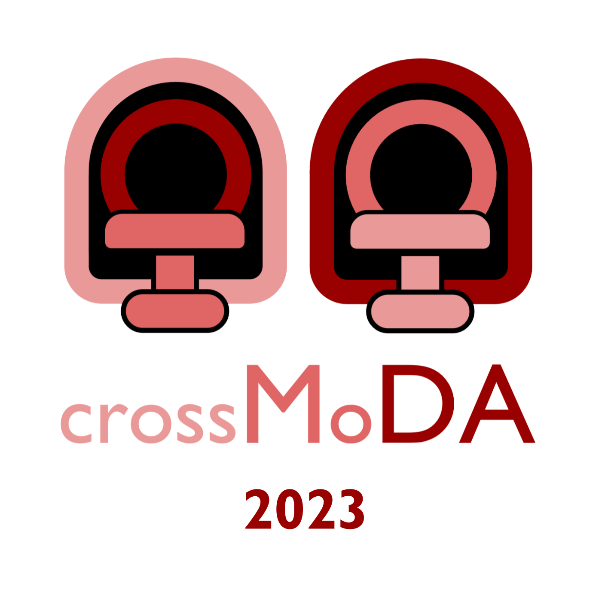
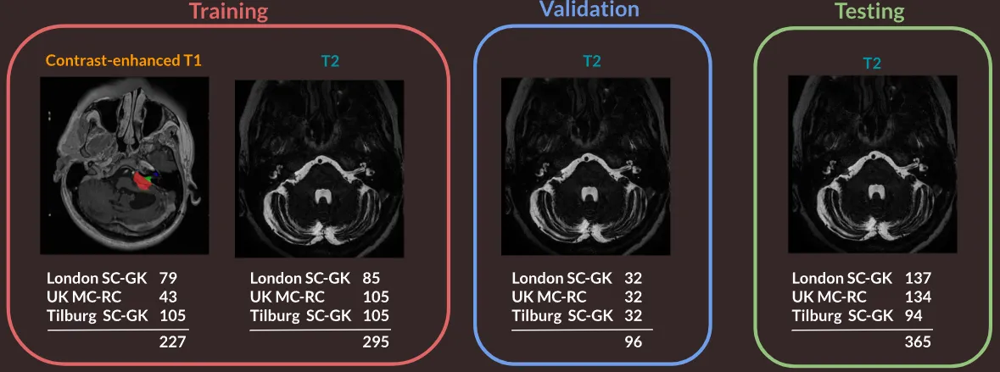
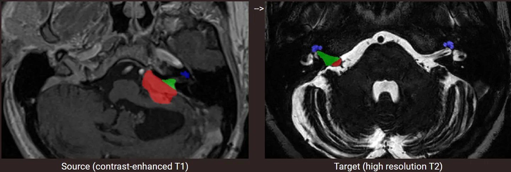
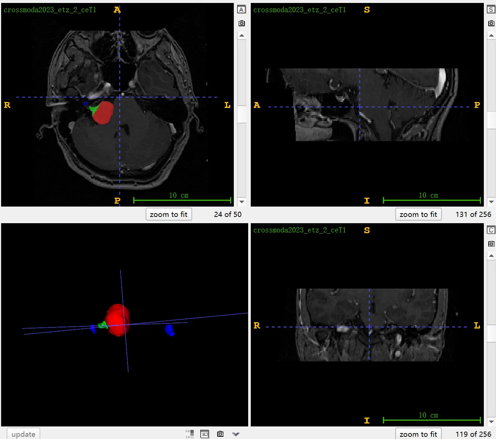

# CrossMoDA 2023

<div align="center">
    <a href="https://github.com/openmedlab/"></a>
</div>
<p style="text-align:center;font-size:10px;"><em></em></p>

## Dataset Information

**CrossMoDA 2023 (Cross-Modality Domain Adaptation)** is currently the largest cross-modality domain adaptation dataset in the field of medical imaging. It focuses on segmenting key structures involved in the follow-up and treatment planning of Vestibular Schwannoma (VS): the tumor and cochlea. Since its first edition in 2021, the challenge has successfully been held three times, with this introduction pertaining to the latest CrossMoDA 2023 dataset. Unlike the first two editions (CrossMoDA 2021, CrossMoDA 2022), which focused on two types of segmentation tasks (tumor and cochlea), the 2023 challenge further subdivides the tumor into intracochlear and extracochlear regions, forming a three-category segmentation task. A notable feature of this challenge is the unsupervised cross-modality segmentation, where the training uses source datasets and target datasets that are preoperative and postoperative unpaired annotated ceT1 scans and unannotated hrT2 scans, respectively. The training set offers 227 annotated enhanced T1 cases from 3 different institutions and 295 unannotated T2 cases. The validation set consists of 96 unannotated T2 cases, and the test set comprises 365 unannotated T2 cases. The specific division is as follows in the chart:

<div align="center">
    <a href="https://github.com/openmedlab/"></a>
</div>
<p style="text-align:center;font-size:10px;"><em>CrossMoDA 2023 dataset division. </em></p>

In the treatment planning and follow-up of patients with Vestibular Schwannoma (VS), two key brain structures are involved (the tumor and the cochlea). The segmentation of these tumor and cochlear structures is vital for the radiotherapy of VS and is also key to improving routine monitoring. Anatomically, the tumor region can be divided into two subregions, referred to as the intrameatal (intracochlear) and extrameatal (extracochlear) areas. Guidelines for reporting results of vestibular schwannoma specify that the intracochlear and extracochlear parts of the tumor must be differentiated, and the maximum diameter of the extracochlear part should be used to report the size of the tumor. Additionally, size and volume features extracted from the extracochlear part are considered the most sensitive radiomic features for assessing VS growth. Enhanced T1 (ceT1) MR imaging is typically used for the diagnosis and monitoring of VS patients. However, there is increasing interest in using non-contrast imaging sequences, such as high-resolution T2 (hrT2) imaging, as it reduces the risks associated with gadolinium-based contrast agents and offers higher resolution.

## Dataset Meta Information

| Dimensions | Modality | Task Type | Anatomical Structures           | Anatomical Area | Number of Categories | Data Volume | File Format |
|------------|----------|-----------|---------------------------------|-----------------|----------------------|-------------|-------------|
| 3D         | MR       | Segmentation | Vestibular Schwannoma, cochlea. | Head            | 3                    | 983         | .nii.gz     |


### Resolution Details

| Dataset Statistics | spacing (mm)     | size            |
|--------------------|------------------|-----------------|
| min                | (0.35, 0.35, 0.78)              | (232, 30, 11)     |
| median             | (0.63, 0.63, 1.5)           | (288, 288, 50) |
| max                | (0.86, 0.86, 3.5)              | (512, 512, 256) |

Number of 2D slices in the dataset: 16,749 (counting only the annotated 227 cases).

## Label Information Statistics

| Segmentation Class | intra-meatal tumor | extra-meatal tumor | cochlea |
|--------------------|--------------------------------|--------------------------------|---------------|
| Case Count         | 220                            | 226                            | 227           |
| Detection Rate     | 96.92%                         | 99.56%                         | 100%          |
| Min Volume (cm³)   | 0                              | 0.02                           | 0.07          |
| Median Volume (cm³)| 1.05                           | 0.23                           | 0.21          |
| Max Volume (cm³)   | 26.95                          | 0.93                           | 0.38          |


## Visualization

<div align="center">
    <a href="https://github.com/openmedlab/"></a>
</div>
<p style="text-align:center;font-size:10px;"><em> Official website visualization. Red: Intrameatal tumor; Green: Extrameatal tumor; Blue: Cochlea.</em></p>

<div align="center">
    <a href="https://github.com/openmedlab/"></a>
</div>
<p style="text-align:center;font-size:10px;"><em> ITK-SNAP Visualization. Red: Intrameatal tumor; Green: Extrameatal tumor; Blue: Cochlea.</em></p>

## File Structure

The file structure of the crossMoDA dataset includes the `TrainingSource` folder for the training data, which contains preoperative ceT1 scan images and their annotations (formatted as `crossmoda2023_etz_#_ceT1.nii.gz` and `crossmoda2023_etz_#_Label.nii.gz`), as well as the `TrainingTarget` folder, which contains postoperative hrT2 scan images (named `crossmoda2023_etz_#_T2.nii.gz`). The validation data are stored in the `crossmoda23_validation` folder, including unannotated T2 scan images (formatted as `crossmoda2023_etz_#_T2.nii.gz`).

``` 
crossMoDA
│
├── crossmoda23_training
│   ├── TrainingSource
│   │   ├── crossmoda2023_etz_1_ceT1.nii.gz
│   │   ├── crossmoda2023_etz_1_Label.nii.gz
│   │   └── ...
│   │
│   └── TrainingTarget
│       ├── crossmoda2023_etz_106_T2.nii.gz
│       ├── crossmoda2023_etz_107_T2.nii.gz
│       └── ...
│
└── crossmoda23_validation
    ├── crossmoda2023_etz_211_T2.nii.gz
    ├── crossmoda2023_etz_212_T2.nii.gz
    └── ...
```

## Authors and Institutions

Navodini Wijethilake (King's College London, UK)

Reuben Dorent (Harvard Medical School, USA)

Marina Ivory (King's College London, UK)

Tom Vercauteren (King's College London, UK)

Jonathan Shapey (King's College London / National Health Service Foundation Trust, King's College Hospital, UK)

Aaron Kujawa (King's College London, UK)

Samuel Joutard (King's College London, UK)

Nicola Rieke (NVIDIA)

Spyridon Bakas (University of Pennsylvania, USA)


## Source Information

Official Website: https://crossmoda-challenge.ml/

Download Link: https://www.synapse.org/#!Synapse:syn51236108/files/

Article Address: https://www.sciencedirect.com/science/article/pii/S1361841522002560

Publication Date: April, 2023.

## Citation

``` 
@article{DORENT2023102628,
title = {CrossMoDA 2021 challenge: Benchmark of cross-modality domain adaptation techniques for vestibular schwannoma and cochlea segmentation},
journal = {Medical Image Analysis},
volume = {83},
pages = {102628},
year = {2023},
issn = {1361-8415},
doi = {https://doi.org/10.1016/j.media.2022.102628},
url = {https://www.sciencedirect.com/science/article/pii/S1361841522002560},
author = {Reuben Dorent and Aaron Kujawa and Marina Ivory and Spyridon Bakas and Nicola Rieke and Samuel Joutard and Ben Glocker and Jorge Cardoso and Marc Modat and Kayhan Batmanghelich and Arseniy Belkov and Maria Baldeon Calisto and Jae Won Choi and Benoit M. Dawant and Hexin Dong and Sergio Escalera and Yubo Fan and Lasse Hansen and Mattias P. Heinrich and Smriti Joshi and Victoriya Kashtanova and Hyeon Gyu Kim and Satoshi Kondo and Christian N. Kruse and Susana K. Lai-Yuen and Hao Li and Han Liu and Buntheng Ly and Ipek Oguz and Hyungseob Shin and Boris Shirokikh and Zixian Su and Guotai Wang and Jianghao Wu and Yanwu Xu and Kai Yao and Li Zhang and Sébastien Ourselin and Jonathan Shapey and Tom Vercauteren},
keywords = {Domain adaptation, Segmentation, Vestibular schwannoma},
abstract = {Domain Adaptation (DA) has recently been of strong interest in the medical imaging community. While a large variety of DA techniques have been proposed for image segmentation, most of these techniques have been validated either on private datasets or on small publicly available datasets. Moreover, these datasets mostly addressed single-class problems. To tackle these limitations, the Cross-Modality Domain Adaptation (crossMoDA) challenge was organised in conjunction with the 24th International Conference on Medical Image Computing and Computer Assisted Intervention (MICCAI 2021). CrossMoDA is the first large and multi-class benchmark for unsupervised cross-modality Domain Adaptation. The goal of the challenge is to segment two key brain structures involved in the follow-up and treatment planning of vestibular schwannoma (VS): the VS and the cochleas. Currently, the diagnosis and surveillance in patients with VS are commonly performed using contrast-enhanced T1 (ceT1) MR imaging. However, there is growing interest in using non-contrast imaging sequences such as high-resolution T2 (hrT2) imaging. For this reason, we established an unsupervised cross-modality segmentation benchmark. The training dataset provides annotated ceT1 scans (N=105) and unpaired non-annotated hrT2 scans (N=105). The aim was to automatically perform unilateral VS and bilateral cochlea segmentation on hrT2 scans as provided in the testing set (N=137). This problem is particularly challenging given the large intensity distribution gap across the modalities and the small volume of the structures. A total of 55 teams from 16 countries submitted predictions to the validation leaderboard. Among them, 16 teams from 9 different countries submitted their algorithm for the evaluation phase. The level of performance reached by the top-performing teams is strikingly high (best median Dice score — VS: 88.4%; Cochleas: 85.7%) and close to full supervision (median Dice score — VS: 92.5%; Cochleas: 87.7%). All top-performing methods made use of an image-to-image translation approach to transform the source-domain images into pseudo-target-domain images. A segmentation network was then trained using these generated images and the manual annotations provided for the source image.}
}
```

Original introduction article is [here](https://zhuanlan.zhihu.com/p/670098600).