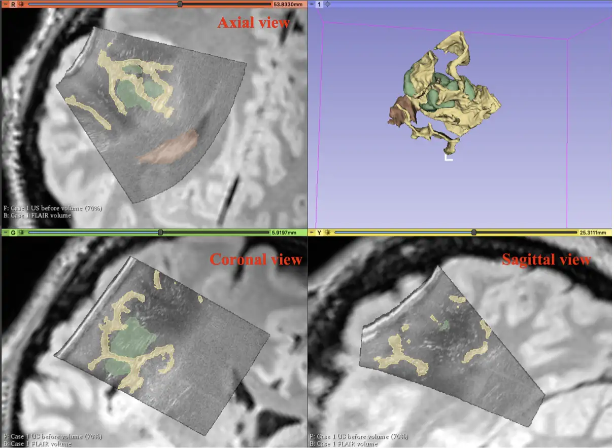
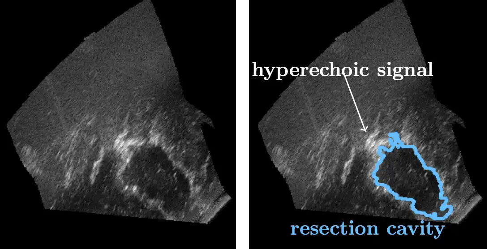
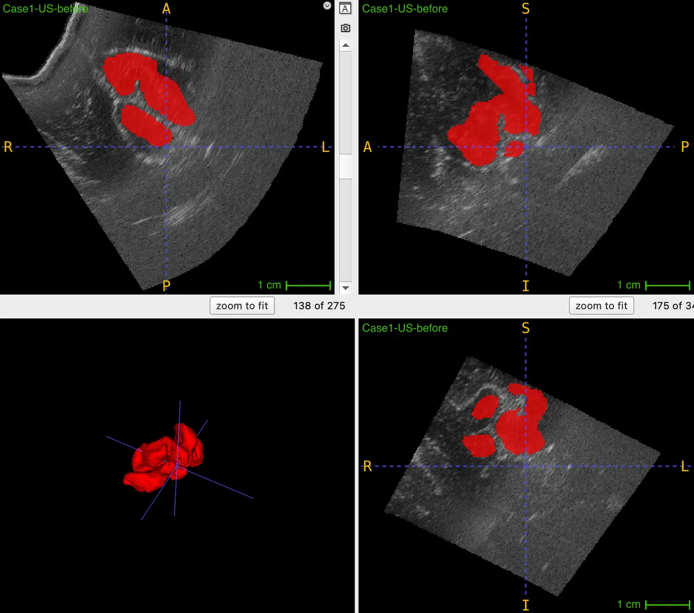
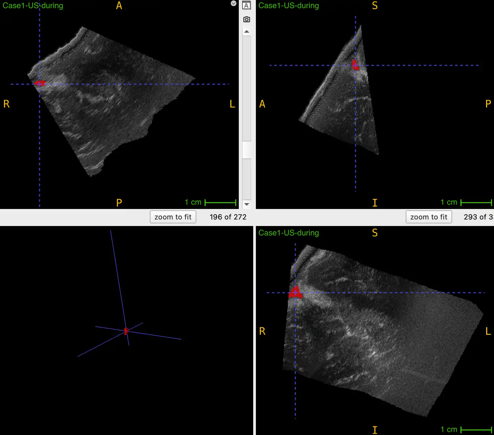
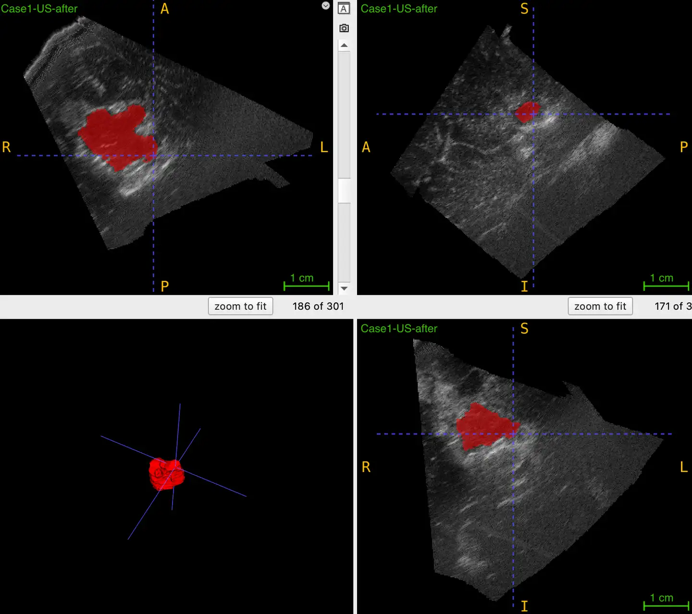

# CuRIOUS2022 Intraoperative Ultrasound Images of Brain Tumors and Resection Cavity Segmentation

<div align="center">
    <a href="https://github.com/openmedlab/"></a>
</div>
<p style="text-align:center;font-size:10px;"><em></em></p>

## Dataset Information

The CuRIOUS2022 dataset contains preoperative Magnetic Resonance Imaging (MRI) and intraoperative ultrasound images of 23 patients with low-grade gliomas. The dataset provides preoperative 3T MRI images (including gadolinium-enhanced T1-weighted and T2 FLAIR scans), **intraoperative 3D ultrasound (iUS)** images (covering the entire tumor area after craniotomy, involving various stages before, during, and after surgery), and segmentation annotations of the preoperative brain tumor and the resection cavity during and after surgery. All medical images were acquired after the patients provided informed consent and were used for routine clinical care. Images and segmentation results are provided in NIFTI format and are stored in a unified reference space.

Early resection of brain tumors can effectively improve patient survival rates. However, the quality and safety of surgery are often significantly affected by intraoperative brain tissue shift. This tissue shift can be caused by various factors, including gravity, the application of drugs, changes in intracranial pressure, and tissue resection. Such shifts may alter the positions of surgical targets and critical structures (such as blood vessels) shown in preoperative imaging, and these displacements may not be directly observable in the surgeon's field of view. Intraoperative ultrasound (iUS) is a stable and relatively low-cost technology used to track tissue shift during surgery and monitor surgical tools. The application of automatic segmentation algorithms for brain tissue, brain tumors, and resection cavities in iUS can significantly improve the stability and accuracy of brain shift correction through image registration and make the interpretation of iUS more intuitive. These technologies have the potential to improve surgical outcomes and increase patient survival rates. The CuRIOUS2022 challenge is an expansion of the previous CuRIOUS 2018 and CuRIOUS 2019 challenges, which primarily focused on image registration algorithms. This challenge will showcase the latest developments in current and emerging technologies in the field of intraoperative ultrasound (iUS) image segmentation and provide participants with an opportunity to benchmark these methods on the newly released iUS brain tumor and resection cavity segmentation dataset.

## Dataset Meta Information

| Dimensions | Modality    | Task Type | Anatomical Structures          | Anatomical Area | Number of Categories | Data Volume | File Format |
|------------|-------------|-----------|--------------------------------|-----------------|----------------------|-------------|-------------|
| 3D         | Ultra Sound | Segmentation | Brain tumor (area of brain tumor removed) | Brain           | 1                    | 23          | .nii.gz     |


### Resolution Details

There are 69 actual ultrasound images (corresponding to 23 patients, three images before surgery, during surgery, and after surgery)

| Dataset Statistics | spacing (mm)         | size            |
|--------------------|----------------------|-----------------|
| min                | (0.14, 0.14, 0.14)   | (221, 286, 245) |
| median             | (0.20, 0.20, 0.20)   | (337, 375, 339) |
| max                | (0.36, 0.36, 0.36)	 | (423, 452, 492) |

Number of two-dimensional slices in the data set: 23,472

## Label Information Statistics

### Preoperative ultrasound images

| Metric              | Tumor  |
|---------------------|--------|
| Case Count          | 23     |
| Coverage            | 100%   |
| Min Volume (cm³)    | 0.61   |
| Median Volume (cm³) | 12.43  |
| Max Volume (cm³)    | 99.14  |

### Intraoperative ultrasound images

| Metric              | Resection |
|---------------------|-----------|
| Case Count          | 21        |
| Coverage            | 91%       |
| Min Volume (cm³)    | 0.01      |
| Median Volume (cm³) | 1.66      |
| Max Volume (cm³)    | 7.49      |

### Postoperative ultrasound images

| Metric              | Resection |
|---------------------|-----------|
| Case Count          | 22        |
| Coverage            | 96%       |
| Min Volume (cm³)    | 0.44      |
| Median Volume (cm³) | 2.46      |
| Max Volume (cm³)    | 18.11     |

## Visualization

<div align="center">
    <a href="https://github.com/openmedlab/"></a>
</div>
<p style="text-align:center;font-size:10px;"><em>Example view of the paper: In 3D Slicer, the iUS 3D scan is displayed overlaid with the tumor annotation (MR image as reference). (Green: tumor, yellow: sulci, brown: ventricles)</em></p>

<div align="center">
    <a href="https://github.com/openmedlab/"></a>
</div>
<p style="text-align:center;font-size:10px;"><em> Schematic diagram of the resection cavity in the ultrasound image of the paper.</em></p>

<div align="center">
    <a href="https://github.com/openmedlab/"></a>
</div>
<p style="text-align:center;font-size:10px;"><em> Local visualization, preoperative ultrasound tumor visualization.</em></p>

<div align="center">
    <a href="https://github.com/openmedlab/"></a>
</div>
<p style="text-align:center;font-size:10px;"><em> Local visualization, intraoperative ultrasound visualization of resection cavity.</em></p>

<div align="center">
    <a href="https://github.com/openmedlab/"></a>
</div>
<p style="text-align:center;font-size:10px;"><em> Local visualization, postoperative resection cavity visualization.</em></p>

## File Structure

The data set file structure is as follows, which mainly displays ultrasound images and corresponding segmentation annotations.

``` 
RESECT
├── MINC
├── NIFTI
│   ├── Case1
│   │   ├── MRI
│   │   ├── Landmark
│   │   └── US
│   │       ├── Case1-US-after.nii.gz
│   │       ├── Case1-US-after.nii.gz.md5
│   │       ├── Case1-US-before.nii.gz
│   │       ├── Case1-US-before.nii.gz.md5
│   │       ├── Case1-US-during.nii.gz
│   │       └── Case1-US-during.nii.gz.md5
│   └── ...
RESECT_segmentation
├── Case1
│   ├── Case1-US-after-resection.nii.gz
│   ├── Case1-US-before-tumor.nii.gz
│   └── Case1-US-during-resection.nii.gz
├── Case2
├── Case3
└── ...
```

## Authors and Institutions

Ingerid Reinertsen (SINTEF, Trondheim, Norway)

Yiming Xiao (Concordia University, Montreal, Canada)

Hassan Rivaz (Concordia University, Montreal, Canada)

Matthieu Chabanas (University of Grenoble Alpes, Grenoble Institute of Technology, Grenoble, France)

Bahareh Behboodi (Concordia University, Montreal, Canada)

Francois-Xavier Carton (University of Grenoble Alpes, Grenoble Institute of Technology, Grenoble, France)


## Source Information

Official Website: https://curious2022.grand-challenge.org

Download Link: https://curious2022.grand-challenge.org/data/

Article Address: https://aapm.onlinelibrary.wiley.com/doi/full/10.1002/mp.12268, https://arxiv.org/pdf/2207.07494.pdf

Publication Date: 2022-07

## Citation

``` 
@article{Xiao2017RESECT,
  title={REtroSpective Evaluation of Cerebral Tumors (RESECT): a clinical database of pre-operative MRI and intra-operative ultrasound in low-grade glioma surgeries},
  author={Xiao, Y. and Fortin, M. and Unsg{\aa}rd, G. and Rivaz, H. and Reinertsen, I.},
  journal={Medical Physics},
  volume={44},
  number={7},
  pages={3875--3882},
  year={2017}
}

@article{Behboodi2022RESECTSEG,
  title={RESECT-SEG: Open access annotations of intra-operative brain tumor ultrasound images},
  author={Behboodi, B. and Carton, F.X. and Chabanas, M. and De Ribaupierre, S. and Solheim, O. and Munkvold, B.K.R. and Rivaz, H. and Xiao, Y. and Reinertsen, I.},
  journal={arXiv preprint arXiv:2207.07494},
  year={2022}
}
```

Original introduction article is [here](https://zhuanlan.zhihu.com/p/693671241).