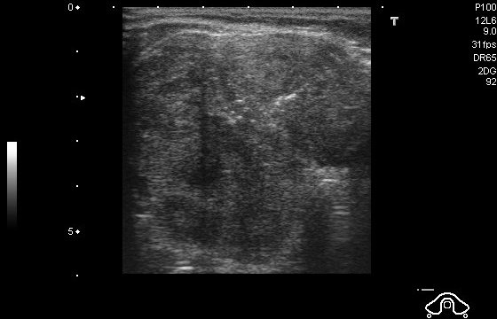
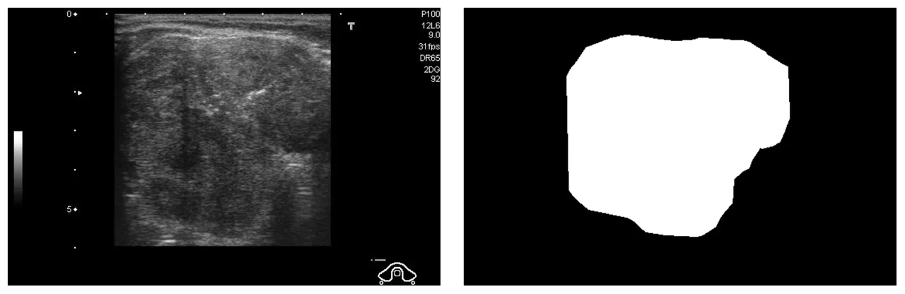

# DDTI

<div align="center">
    <a href="https://github.com/openmedlab/"></a>
</div>
<p style="text-align:center;font-size:10px;"><em></em></p>

## Dataset Information

The DDTI dataset contains 637 ultrasound thyroid images with pixel-level labels from a single device, provided by Pedraza and others. Thyroid ultrasound image analysis is a continuously expanding field, primarily due to the difficulty of nodule detection in ultrasound. The value of this database lies in the diagnostic diversity and the variety of cases it includes, such as thyroiditis, goiters, nodules, and cancer. The complexity of the images and their interpretation reflects the need to develop strategies to support the diagnostic and prognostic process. Thyroid nodule segmentation in ultrasound images is a valuable and challenging task, which is significant for the diagnosis of thyroid cancer.

## Dataset Meta Information

| Dimensions | Modality | Task Type | Anatomical Structures          | Anatomical Area | Number of Categories | Data Volume | File Format |
|------------|----------|-----------|--------------------------------|-----------------|----------------------|-------------|-------------|
| 2D         | Ultra Sound       | Segmentation | Thyroid Nodule | Head and Neck   | 1                    | 637         | PNG         |


### Resolution Details

| Dataset Statistics | size         |
|--------------------|--------------|
| min                | (245, 360)   |
| median             | (280, 360)   |
| max                | (560, 360)   |

## Label Information Statistics

| Segmentation Class | Thyroid Nodules |
|--------------------|-----------------|
| Case Count         | 637             |
| Detection Rate     | 100%            |
| Min Volume (cm³)    | 997             |
| Median Volume (cm³) | 10076            |
| Max Volume (cm³)    | 61575           |

## Visualization

<div align="center">
    <a href="https://github.com/openmedlab/"></a>
</div>
<p style="text-align:center;font-size:10px;"><em> (a) Ultrasound image (b) Segmentation annotation.</em></p>

## File Structure

The file structure of the DDTI dataset is as follows. The DDTI dataset consists of two folders: "1_or_data" and "2_preprocessed_data." The former is the folder for original data, while the latter is for data that has been preprocessed. The primary data statistics are mainly based on "1_or_data," and all files end with a .png extension. The specific file architecture is as follows:

``` 
DDTI/
├── 1_or_data
│   ├── category.csv
│   │── image
│   │   ├── 0000.PNG
│   │   ├── 0001.PNG
│   │   ├── 0002.PNG
│   │   ├── 0003.PNG
│   │   └── ...
│   └── mask
│       ├── 0000.PNG
│       ├── 0001.PNG
│       ├── 0002.PNG
│       ├── 0003.PNG
│       └── ...
│   
└── 2_preprocessed_data
    ├── readme.txt
    ├── stage1
    ├── stage2
    └── train.csv
```

## Authors and Institutions

Lina Pedraza (Cim@Lab, School of Medicine, National University of Colombia, Bogotá, Colombia)

Carlos Vargas (Cim@Lab, School of Medicine, National University of Colombia, Bogotá, Colombia)

Fabián Narváez (Cim@Lab, School of Medicine, National University of Colombia, Bogotá, Colombia)

Oscar Durán (IDIME - Institute of Medical Diagnosis, Bogotá, Colombia)

Emma Muñoz (IDIME - Institute of Medical Diagnosis, Bogotá, Colombia)

Eduardo Romero (Cim@Lab, School of Medicine, National University of Colombia, Bogotá, Colombia)


## Source Information

Official Website: http://cimalab.intec.co/applications/thyroid/

Download Link: http://cimalab.intec.co/applications/thyroid/

Article Address: https://www.spiedigitallibrary.org/conference-proceedings-of-spie/9287/92870W/An-open-access-thyroid-ultrasound-image-database/10.1117/12.2073532.short?SSO=1

Publication Date: 2015.1.28

## Citation

``` 
@inproceedings{pedraza2015open,
  title={An open access thyroid ultrasound image database},
  author={Pedraza, Lina and Vargas, Carlos and Narv{\'a}ez, Fabi{\'a}n and Dur{\'a}n, Oscar and Mu{\~n}oz, Emma and Romero, Eduardo},
  booktitle={10th International symposium on medical information processing and analysis},
  volume={9287},
  pages={188--193},
  year={2015},
  organization={SPIE}
}
```

Original introduction article is [here](https://zhuanlan.zhihu.com/p/671227139).