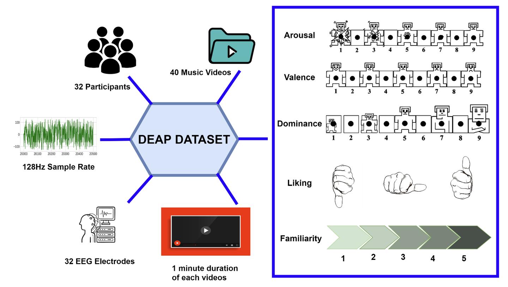
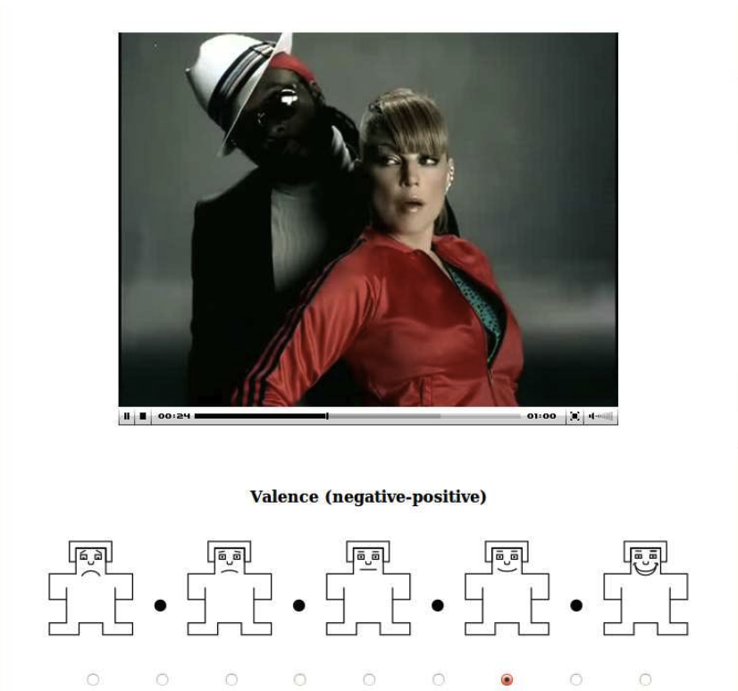
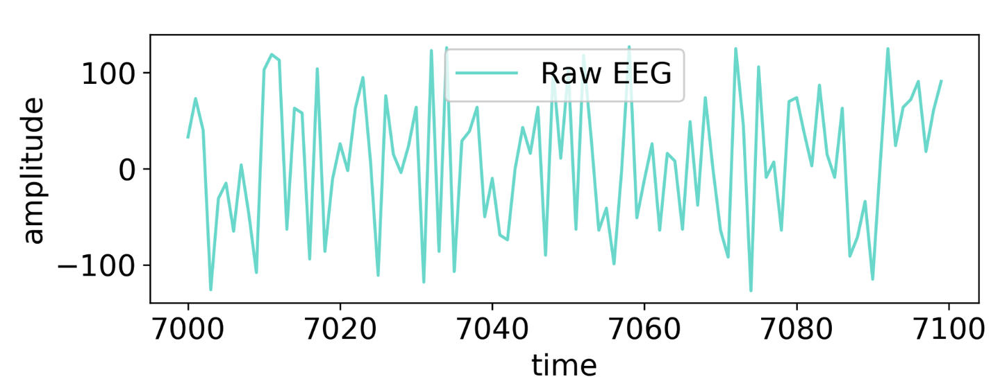

# DEAP
<div align="center">
    <a href="https://github.com/openmedlab/"></a>
</div>
<p style="text-align:center;font-size:10px;"><em></em></p>

## Dataset Information

DEAP (Database for Emotion Analysis using Physiological signals) is a multimodal dataset primarily designed for the field of emotion computation. It aims to study human emotional states through the analysis of physiological signals. The dataset consists of EEG (electroencephalography) and peripheral physiological signals collected from 32 participants while watching 40 one-minute music video clips. Facial videos of 22 participants were also recorded. The dataset is intended for emotion classification using videos, EEG signals, and physiological signals, with decision fusion across different modalities to improve the accuracy of emotion recognition.

The goal of this dataset is to address the issue of human-computer interaction systems lacking emotional intelligence, making it difficult to properly recognize and respond to human emotions. By detecting emotional cues through affective computing, it aims to enhance the emotional intelligence of systems, thereby improving the human-computer interaction experience.

## Experimental Design

- **Experiment Process:** Each participant watches 40 one-minute music video clips. After watching each video, participants are asked to rate emotional dimensions such as arousal, valence, like/dislike, dominance, and familiarity. During the experiment, EEG brain signals, peripheral physiological signals (including skin conductivity, respiration, heart rate, etc.), and facial videos of some participants were recorded.
  
- **Emotion Induction Material:** The video clips were selected from the online music platform Last.fm based on emotional tags. The initial video set contained 120 music videos, from which 40 clips were chosen for the emotion induction experiment through online subjective evaluation.

- **Signal Acquisition:** EEG data from 32 channels were recorded at a sampling rate of 512 Hz using the Biosemi ActiveTwo system. Peripheral physiological signals included 13 physiological parameters such as skin conductivity, respiration rate, heart rate, etc. For 22 participants, facial videos were also recorded during the experiment.

## Dataset Meta Information

| Task Type           | EGG Channel | EEG Sampling Rate | Data Format | EGG Format |
|---------------------|-------------|-------------------|-------------|------------|
| Emotion Recognition | 312         | 512Hz             | .mat, .csv  | .ods       |


## Dataset Statistics Information


| subjective annotation    |                                                     |
|--------------------------|-----------------------------------------------------|
| Number of videos         | 120                                                 |
| Video duration           | 1 minute affective highlight (section 2.2)          |
| Selection method         | 60 via last.fm affective tags, 60 manually selected |
| No. of ratings per video | 14 - 16                                             |
| Rating scales            | Arousal, Valence, Dominance                         |
| Rating values            | Discrete scale of 1 - 9                             |

| Physiological Experiment    	    |                                                                                                                      |
|----------------------------------|----------------------------------------------------------------------------------------------------------------------|
| Number of participants           | 32                                                                                                                   |
| Number of videos	                | 40                                                                                                                   |
| Selection method                 | Subset of online annotated videos with clearest responses (see section 2.3)                                          |
| Rating scales	                   | Arousal, Valence, Dominance, Liking (how much do you like the video?), Familiarity (how well do you know the video?) |
| Rating values                    | Familiarity: discrete scale of 1 - 5, Others: continuous scale of 1 - 9                                              |
| Recorded signals	                | 32 - channel 512Hz EEG, Peripheral physiological signals, Face video (for 22 participants)                           |

The study involved 120 one-minute emotional videos, and evaluated their arousal, valence, and dominance through subjective annotation and physiological experiments. A total of 32 participants recorded multiple physiological signals.

## Dataset Example

<div align="center">
    <a href="https://github.com/openmedlab/"></a>
</div>
<p style="text-align:center;font-size:10px;"><em></em></p>

<div align="center">
    <a href="https://github.com/openmedlab/"></a>
</div>
<p style="text-align:center;font-size:10px;"><em>The subjects marked the content on the screen and recorded the EEG signal at the same time.</em></p>

## File Structure

``` 
DEAP_Dataset
│
├── EEG_Signals/
│   ├── sub001.mat
│   ├── sub002.mat
│   └── ...
├── Physiological_Signals/
│   ├── sub001_phys.mat
│   ├── sub002_phys.mat
│   └── ...
├── Self-Report_Ratings/
│   ├── sub001_ratings.csv
│   ├── sub002_ratings.csv
│   └── ...
└── README.md
    └── Dataset Description and Usage Guide
```

## Authors and Institutions

Sander Koelstra, Queen Mary University of London, United Kingdom

Christian Mühl, University of Twente, The Netherlands

Mohammad Soleymani, University of Geneva, Switzerland

Ashkan Yazdani, EPFL, Switzerland

Jong_seok Lee, EPFL, Switzerland

## Source Information

Official Website: http://www.eecs.qmul.ac.uk/mmv/datasets/deap/

Download Link: http://www.eecs.qmul.ac.uk/mmv/datasets/deap/download.html

Article Address: https://www.eecs.qmul.ac.uk/mmv/datasets/deap/doc/tac_special_issue_2011.pdf

Publication Date: 2011

## Citation

``` 
@article{koelstra2011deap,
  title={Deap: A database for emotion analysis; using physiological signals},
  author={Koelstra, Sander and Muhl, Christian and Soleymani, Mohammad and Lee, Jong-Seok and Yazdani, Ashkan and Ebrahimi, Touradj and Pun, Thierry and Nijholt, Anton and Patras, Ioannis},
  journal={IEEE transactions on affective computing},
  volume={3},
  number={1},
  pages={18--31},
  year={2011},
  publisher={IEEE}
}
```

Original introduction article is [here](https://zhuanlan.zhihu.com/p/753884305).