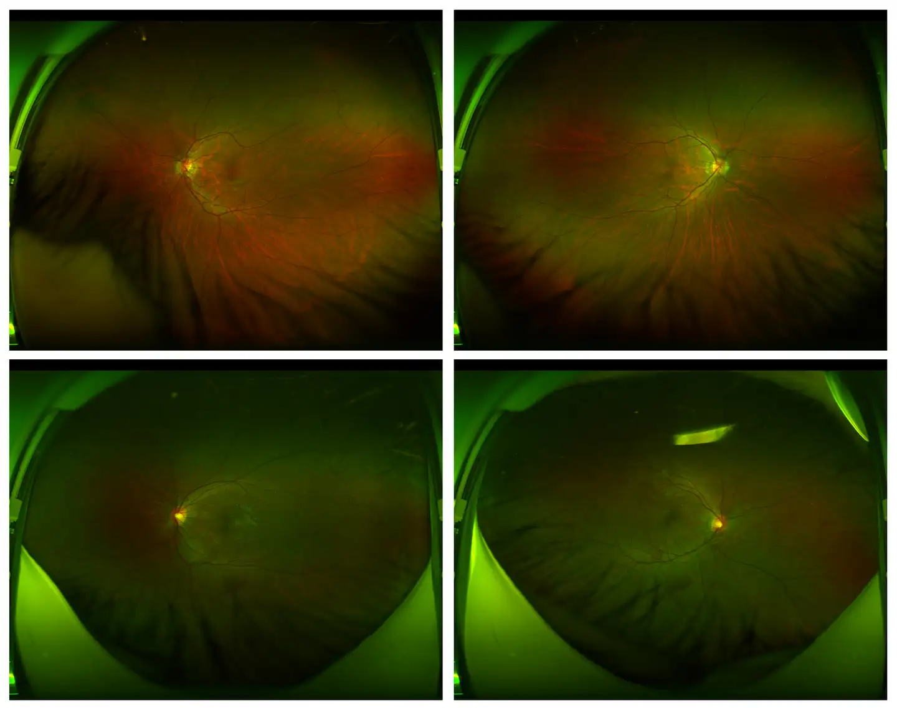

# MICCAI 2024 DIAMOND

<div align="center">
    <a href="https://github.com/openmedlab/"></a>
</div>
<p style="text-align:center;font-size:10px;"><em> ITK-SNAP Visualization.</em></p>

## Dataset Information

The DIAMOND dataset is designed for predicting center-involved diabetic macular edema (ci-DME) and originates from the MICCAI 2024 challenge. Both the training and validation sets are derived from the Deep Diabetic Retinopathy Image Dataset (DeepDRiD), but only the ultra-widefield_image portion is used. In this challenge, if the DR label is classified as moderate non-proliferative DR or higher, it is predicted that a ci-DME event will occur at the next visit; otherwise, it is considered non-ci-DME. The dataset contains a total of 204 samples, with 154 in the training set and 50 in the validation set.

The DIAMOND dataset introduces a novel approach to predicting center-involved diabetic macular edema by integrating ultra-widefield color fundus photography (UWF-CFP). This aids in the early detection and prevention of vision loss, promoting the development and implementation of personalized treatment plans. Additionally, by utilizing data from different countries, the DIAMOND dataset ensures broad applicability and diversity of research outcomes, ultimately contributing to better eye health management for diabetic patients worldwide.

## Dataset Meta Information

| Dimensions | Modality | Task Type      | Anatomical Structures | Anatomical Area | Number of Categories             | Data Volume          | File Format |
|------------|----------|----------------|-----------------------|-----------------|----------------------------------|----------------------|-------------|
| 2D         | Fundus   | Classification | Eye                   | Eye             | 5(Grading), 2(Predicting ci-DME) | 154(train) + 50(val) | JPG         |


### Resolution Details

| Dataset Statistics | size         |
|--------------------|--------------|
| min                | (3900, 3072) |
| median             | (3900, 3072) |
| max                | (3900, 3072) |

## Label Information Statistics

| Category                                   | No Apparent Diabetic Retinopathy | Mild Non-Proliferative Diabetic Retinopathy (NPDR) | Moderate Non-Proliferative Diabetic Retinopathy (NPDR) | Severe Non-Proliferative Diabetic Retinopathy (NPDR) | Proliferative Diabetic Retinopathy (PDR) | Poor Image Quality, Unable to Diagnose and Grade |
|--------------------------------------------|---------------------------------|---------------------------------------------------|-------------------------------------------------------|-----------------------------------------------------|------------------------------------------|------------------------------------------------|
| Occurrences                                | 44 (train) + 16 (val)           | 43 (train) + 14 (val)                             | 44 (train) + 12 (val)                                 | 17 (train) + 6 (val)                                 | 2 (train) + 2 (val)                      | 4 (train)                                       |
| Percentage of Occurrences                  | 29.41%                          | 27.94%                                            | 28.43%                                                | 11.27%                                              | 1.96%                                   | 1.96%                                          |  

| Prediction                        | ci-DME Will Occur (> Moderate NPDR) | ci-DME Will Not Occur (< Moderate NPDR) |
|-----------------------------------|-------------------------------------|-----------------------------------------|
| Number of Occurrences             | 63 (train) + 20 (val)               | 87 (train) + 30 (val)                   |
| Percentage of Occurrences         | 41.5%                               | 58.5%                                   |

## Visualization

<div align="center">
    <a href="https://github.com/openmedlab/"></a>
</div>
<p style="text-align:center;font-size:10px;"><em></em></p>

## File Structure

```
.
└── ultra-widefield_images
    ├── Online-Challenge3-Evaluation
    │   ├── Challenge3_upload.csv
    │   ├── Challenge3_labels.xlsx
    │   ├── Images
    │   └── Readme.docx
    ├── ultra-widefield-training
    │   ├── Images
    │   ├── Readme.txt
    │   └── ultra-widefield-training.csv
    └── ultra-widefield-validation
        ├── Images
        ├── Readme.txt
        └── ultra-widefield-validation.csv
```

## Authors and Institutions

- Ruhan Liu (Department of Computer Science and Engineering, Shanghai Jiao Tong University)
- Xiangning Wang (Institute of Artificial Intelligence, Shanghai Jiao Tong University)
- Qiang Wu (Department of Ophthalmology, Sixth People's Hospital of Shanghai Jiao Tong University)
- Ling Dai (Department of Electronic Engineering, Shanghai Jiao Tong University)
- Xi Fang (Department of Electromechanical Engineering, University of Macau)
- Tao Yan (VUNO Inc., South Korea)
- Jaemin Son (Department of Mathematics, City University of Hong Kong)
- Shiqi Tang (Institute of Image Processing and Pattern Recognition, Department of Automation, Shanghai Jiao Tong University)
- Jiang Li (Department of Electronic Information, Hangzhou Dianzi University)
- Zijian Gao (Bournemouth University, United Kingdom)
- Adrian Galdran (Center for Healthcare Technology Innovation, Indian Institute of Technology Madras)
- J.M. Poorneshwaran (Department of Computer Science and Engineering, Beihang University, Beijing)
- Hao Liu (Nanjing University of Science and Technology)
- Jie Wang (Shri Guru Gobind Singhji Institute of Engineering and Technology, Nanded, India)
- Yerui Chen (Singapore Eye Research Institute, Singapore National Eye Centre)
- Prasanna Porwal (Shanghai Zhitan Health Technology Co., Ltd.)
- Gavin Siew Wei Tan (Shanghai Key Laboratory of Computer Software Testing and Evaluation, Shanghai Computer Software Technology Development Center)
- Xiaokang Yang (Department of Endocrinology and Metabolism, Sixth People's Hospital of Shanghai Jiao Tong University)
- Chao Dai (Shanghai Diabetes Institute, Shanghai Clinical Center for Diabetes)
- Haitao Song (School of Biomedical Engineering, Shanghai Jiao Tong University)
- Minggang Chen (Research and Development Department, United Imaging Intelligence, Shanghai)
- Huating Li (Department of Computer Science and Engineering, The Ohio State University, USA)
- Weiping Jia (Department of Biomedical Informatics, The Ohio State University, USA)
- Dinggang Shen (Institute for Interdisciplinary Data Science, The Ohio State University, USA)
- Bin Sheng (Institute for Interdisciplinary Data Science, The Ohio State University, USA)
- Ping Zhang (Institute for Interdisciplinary Data Science, The Ohio State University, USA)

## Source Information

Official Website: https://www.codabench.org/competitions/2333/

Download Link: https://github.com/Mostafa-EHD/DIAMOND_Challenge?tab=readme-ov-file

Article Address: https://www.sciencedirect.com/science/article/pii/S2666389922001040

Publication Date: 2024-03

## Citation

``` 
@article{LIU2022100512,
title = {DeepDRiD: Diabetic Retinopathy—Grading and Image Quality Estimation Challenge},
journal = {Patterns},
pages = {100512},
year = {2022},
issn = {2666-3899},
doi = {https://doi.org/10.1016/j.patter.2022.100512},
url = {https://www.sciencedirect.com/science/article/pii/S2666389922001040},
author = {Ruhan Liu and Xiangning Wang and Qiang Wu and Ling Dai and Xi Fang and Tao Yan and Jaemin Son and Shiqi Tang and Jiang Li and Zijian Gao and Adrian Galdran and J.M. Poorneshwaran and Hao Liu and Jie Wang and Yerui Chen and Prasanna Porwal and Gavin Siew {Wei Tan} and Xiaokang Yang and Chao Dai and Haitao Song and Mingang Chen and Huating Li and Weiping Jia and Dinggang Shen and Bin Sheng and Ping Zhang},
keywords = {diabetic retinopathy, screening, deep learning, artificial intelligence, challenge, retinal image, image quality analysis, ultra-widefield, fundus image},
}
```

Original introduction article is [here](https://zhuanlan.zhihu.com/p/711071320).