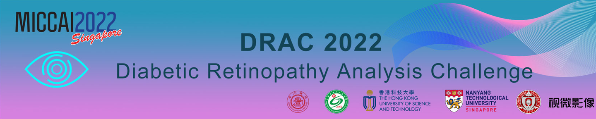
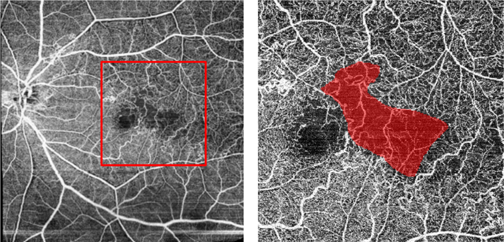
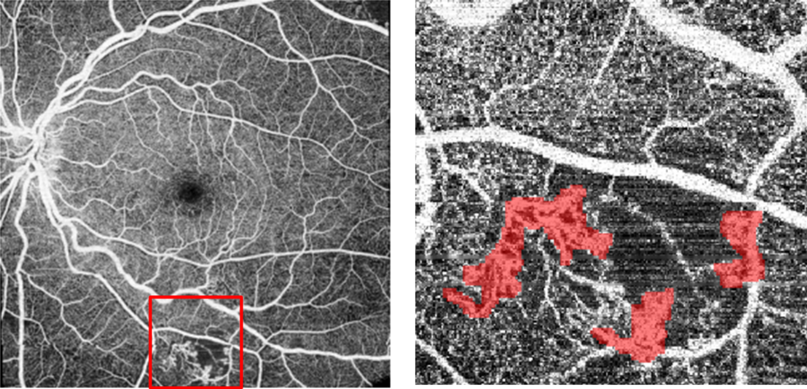

# DRAC22

<div align="center">
    <a href="https://github.com/openmedlab/"></a>
</div>
<p style="text-align:center;font-size:10px;"><em></em></p>

## Dataset Information

The Diabetic Retinopathy Analysis Challenge (DRAC) provides a relevant dataset aimed at the quantitative analysis of diabetic retinopathy-related pathologies, predicated on the accurate segmentation of lesions from fundus images. The dataset consists of 174 fundus images, including three types of diabetic retinopathy lesions: 1. Intraretinal Microvascular Abnormalities; 2. Nonperfusion Areas; 3. Neovascularization. The dataset is divided into a training set with 109 images and a test set with 65 images.

This dataset is of significant importance and value in the field of automated analysis of Diabetic Retinopathy (DR), a leading cause of blindness. Accurate detection of retinal lesions is crucial for the diagnosis of DR. With the prevalence of Ultra-Widefield Optical Coherence Tomography Angiography (UW-OCTA), this technology allows for detailed, non-invasive detection of retinal and choroidal vascular changes at the microvascular level, and holds advantages in detecting peripheral retinal lesions that traditional imaging fails to capture. However, there are currently no algorithms capable of automatically analyzing DR using UW-OCTA. The standardized UW-OCTA dataset provided by the competition offers a testing platform for automated tasks such as image quality assessment and lesion segmentation, advancing the application of machine learning and deep learning algorithms in automated DR analysis. This dataset allows researchers to fairly compare the performance of different algorithms, accelerating the application of related technologies in clinical DR diagnosis, aiding the development of more flexible and robust automated diagnostic models, marking a significant milestone in the field.

## Dataset Meta Information

| Dimensions | Modality | Task Type    | Anatomical Structures | Anatomical Area | Number of Categories | Data Volume | File Format |
|------------|----------|--------------|-----------------------|-----------------|----------------------|-------------|-------------|
| 2D         | Retinal  | Segmentation | Retinopathy           | Fundus          | 1                    | 174         | PNG         |


### Resolution Details

| Dataset Statistics | size         |
|--------------------|--------------|
| min                | 1024x1024x3  |
| median             | 1024x1024x3  |
| max                | 1024x1024x3  |

## Label Information Statistics

| Category        | Diabetic Retinopathy Lesions |
|-----------------|------------------------------|
| Case Count      | 109                          |
| Percentage      | 100%                         |


## Visualization

Original image and lesion range, the red area indicates the lesion

<div align="center">
    <a href="https://github.com/openmedlab/"></a>
</div>
<p style="text-align:center;font-size:10px;"><em></em></p>

<div align="center">
    <a href="https://github.com/openmedlab/"></a>
</div>
<p style="text-align:center;font-size:10px;"><em></em></p>

## File Structure

``` 
DRAC2022
└── ori_dataset
    └── A. Segmentation
        ├── 1. Original Images
        │   ├── a. Training Set
        │   │   ├── 065.png
        │   │   ├── 074.png
        │   │   └── ...
        │   └── b. Testing Set
        │       ├── 086.png
        │       ├── 285.png
        │       └── ...
        └── 2. Groundtruths
            └── a. Training Set
                ├── 1. Intraretinal Microvascular Abnormalities
                │   ├── 075.png
                │   ├── 082.png
                │   └── ...
                ├── 2. Nonperfusion Areas
                │   ├── 065.png
                │   ├── 074.png
                │   └── ...
                └── 3. Neovascularization
                    ├── 082.png
                    ├── 083.png
                    └── ...
```

## Authors and Institutions

Bin Sheng (Shanghai Jiao Tong University)

Huating Li (The Sixth People's Hospital of Shanghai)

Hao Chen (Hong Kong University of Science and Technology, Hong Kong)

Yiyu Cai (Nanyang Technological University, Singapore)

Qiang Wu (The Sixth People's Hospital of Shanghai)

Weiping Jia (The Sixth People's Hospital of Shanghai)

Xiangning Wang (The Sixth People's Hospital of Shanghai)

Bo Qian (Shanghai Jiao Tong University)

Ruhan Liu (Shanghai Jiao Tong University)

Ling Dai (Shanghai Jiao Tong University)

Haoxuan Che (Hong Kong University of Science and Technology, Hong Kong)

Ping Zhang (Ohio State University, USA)

## Source Information

Official Website: https://drac22.grand-challenge.org

Download Link: https://drac22.grand-challenge.org

Article Address: https://arxiv.org/pdf/2304.02389

Publication Date: 2022.07

## Citation

``` 
@article{qian2023drac,
  title={Drac: diabetic retinopathy analysis challenge with ultra-wide optical coherence tomography angiography images},
  author={Qian, Bo and Chen, Hao and Wang, Xiangning and Che, Haoxuan and Kwon, Gitaek and Kim, Jaeyoung and Choi, Sungjin and Shin, Seoyoung and Krause, Felix and Unterdechler, Markus and others},
  journal={arXiv preprint arXiv:2304.02389},
  year={2023}
}
```

Original introduction article is [here](https://zhuanlan.zhihu.com/p/719680163).