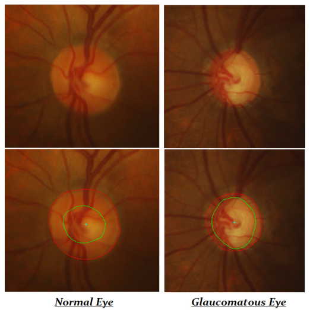
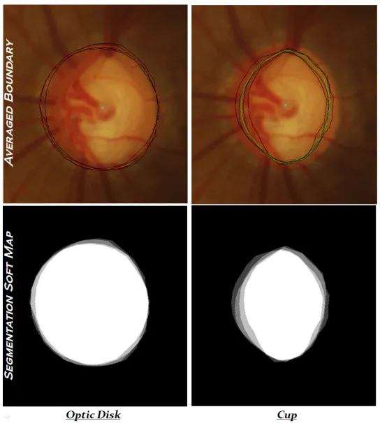
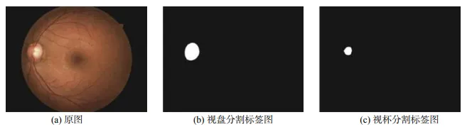

# DRISHTI-GS

<div align="center">
    <a href="https://github.com/openmedlab/"></a>
</div>
<p style="text-align:center;font-size:10px;"><em></em></p>

## Dataset Information

The DRISHTI-GS dataset is created to address the segmentation of the optic nerve head (ONH) to automate the assessment of glaucoma. It comprises a total of 101 retinal images, divided into 50 training images and 51 testing images. Ground truth is provided for the training set, including manual segmentations by multiple human experts. The dataset includes images of normal eyes and glaucomatous eyes captured using color fundus (retinal) imaging. The image size is 2896 × 1944 pixels, in PNG image format. The ground truth for each image includes the average boundaries of the optic disc (OD) and cup regions, soft maps of segmentation obtained from multiple experts, and the cup to disc ratio (CDR) values corresponding to the expert markings.

Glaucoma is one of the leading causes of irreversible vision loss worldwide, and structural changes in the ONH are one of the standards for assessing the extent of glaucoma damage. To accurately quantify the degree of cupping and estimate parameters indicative of glaucoma, any automatic analysis method must accurately segment the OD and cup regions from retinal images. This dataset provides retinal images including both normal and glaucomatous eyes as well as manual segmentations by multiple human experts to evaluate various aspects related to the problem of glaucoma assessment.

## Dataset Meta Information

| Dimensions | Modality | Task Type | Anatomical Structures | Anatomical Area | Number of Categories | Data Volume | File Format |
|------------|----------|-----------|-----------------------|-----------------|----------------------|-------------|-------------|
| 2D         | Fundus   | Segmentation | Eye                   | optic disc       | 2                    | 101         | .png        |


### Resolution Details

| Dataset Statistics | size        |
|--------------------|-------------|
| min                | (2896, 1944)  |
| median             | (2896, 1944)  |
| max                | (2896, 1944)  |

## Label Information Statistics

| Metric        | Tumor |
|---------------|-------|
| Case Count    | 101   |
| Coverage      | 100%  |
| Minimum Pixel Count | 13571   |
| Medium Pixel Count | 63341    |
| Maximum Pixel Count | 134815  |

## Visualization

<div align="center">
    <a href="https://github.com/openmedlab/"></a>
</div>
<p style="text-align:center;font-size:10px;"><em> Paper Visualization.</em></p>

<div align="center">
    <a href="https://github.com/openmedlab/"></a>
</div>
<p style="text-align:center;font-size:10px;"><em></em></p>

## File Structure

The file structure is divided into two main parts: images and masks, each further subdivided into training and testing sets. The training and testing sets contain retinal images named "drishtiGS_xxx.png," where "xxx" represents the image number.

``` 
DRISHTI-GS       
├── images            
│   ├── train
│       ├── drishtiGS_xxx.png
│       ├── drishtiGS_xxx.png
│       └──  ...
│   ├── test
│       ├── drishtiGS_xxx.png
│       ├── drishtiGS_xxx.png
│       └──  ...
├── masks            
│   ├── train
│       ├── drishtiGS_xxx.png
│       ├── drishtiGS_xxx.png
│       └──  ...
│   ├── test
│       ├── drishtiGS_xxx.png
│       ├── drishtiGS_xxx.png
│       └──  ...
```

## Authors and Institutions

Jayanthi Sivaswamy (IIIT, Hyderabad,India)

S.R. Krishnadas (Arvind Eye Hospital, Madurai,India)

Gopal Datt Joshi (IIIT, Hyderabad,India)

Madhulika Jain (IIIT, Hyderabad,India)

Ujjwal (IIIT, Hyderabad,India)

Syed Tabish A. （IIIT, Hyderabad,India）


## Source Information

Official Website: https://ieeexplore.ieee.org/document/6867807

Download Link: https://www.kaggle.com/datasets/lokeshsaipureddi/drishtigs-retina-dataset-for-onh-segmentation

Article Address: https://ieeexplore.ieee.org/stamp/stamp.jsp?tp=&arnumber=6867807

Publication Date: 2014

## Citation

``` 
@INPROCEEDINGS{6867807,
  author={Sivaswamy, Jayanthi and Krishnadas, S. R. and Datt Joshi, Gopal and Jain, Madhulika and Syed Tabish, A. Ujjwaft},
  booktitle={2014 IEEE 11th International Symposium on Biomedical Imaging (ISBI)}, 
  title={Drishti-GS: Retinal image dataset for optic nerve head(ONH) segmentation}, 
  year={2014},
  volume={},
  number={},
  pages={53-56},
  keywords={Image segmentation;Retina;Optical imaging;Manuals;Shape;Image color analysis;Glaucoma;Dataset;Optic Nerve Head;Cup;Optic Disk},
  doi={10.1109/ISBI.2014.6867807}}
```

Original introduction article is [here](https://zhuanlan.zhihu.com/p/683285378).