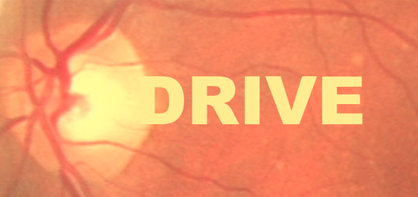
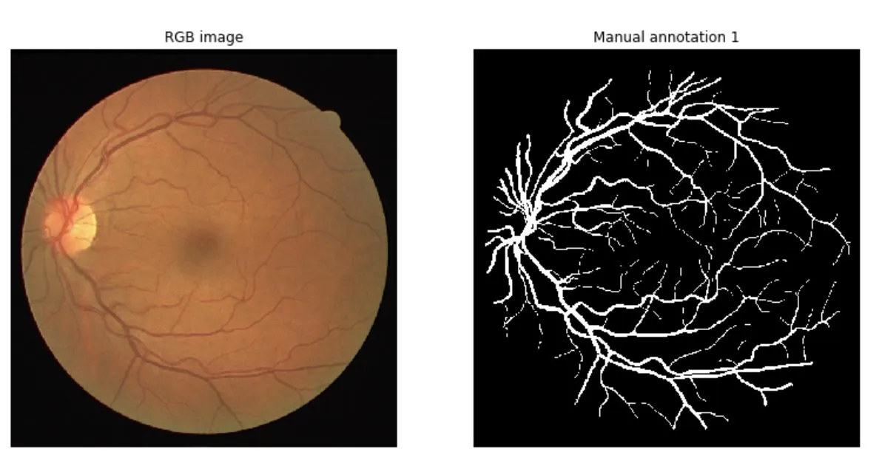

# DRIVE

<div align="center">
    <a href="https://github.com/openmedlab/"></a>
</div>
<p style="text-align:center;font-size:10px;"><em></em></p>

## Dataset Information

The Digital Retinal Images for Vessel Extraction (DRIVE) dataset is designed for retinal vessel segmentation. It comprises a total of 40 color fundus images in JPEG format, including 7 abnormal pathology cases. These images were obtained during a screening program for diabetic retinopathy in the Netherlands. The images were captured using a Canon CR5 non-mydriatic 3CCD camera with a field of view (FOV) of 45 degrees. Each image has a resolution of 584x565 pixels with 8-bit depth for each color channel. The 40 images are evenly divided into a training set of 20 images and a testing set of 20 images. In both sets, each image is accompanied by a circular FOV mask with a diameter of approximately 540 pixels. For the training set, manual segmentation was performed by an ophthalmologist. For the testing set, manual segmentation was conducted by two different observers, where the segmentation by the first observer is accepted as the standard for performance evaluation.

## Dataset Meta Information

| Dimensions | Modality | Task Type | Anatomical Structures | Anatomical Area | Number of Categories | Data Volume                  | File Format |
|------------|----------|-----------|-----------------------|-----------------|----------------------|------------------------------|-------------|
| 2D         | Retinal Image       | Segmentation | Fundus blood vessels  | Eye             | 1                    | 20 for training, 20 for test | .tif / .gif     |


### Resolution Details

| Dataset Statistics | size        |
|--------------------|-------------|
| min                | (584, 565)  |
| median             | (584, 565)  |
| max                | (584, 565)  |

## Label Information Statistics

| Category         | Retinal Vessel (Retinal vessels) |
|------------------|----------------------------------|
| Number of Images | 20*                              |
| Coverage         | 100% (8.63% excluding background)|
| Small Vessels    | 397960                           |
| Medium Vessels   | 568249                           |
| Large Vessels    | 764580                           |


*：Only the training set is labeled, and only the training set is counted.

## Visualization

<div align="center">
    <a href="https://github.com/openmedlab/"></a>
</div>
<p style="text-align:center;font-size:10px;"><em></em></p>

## File Structure

The official dataset provided includes two folders: `training` and `test`. The approximate file structure is as follows:

- The `image` folder contains the retinal images.
- The `mask` folder contains the field of view masks.
- The `1st_manual` folder contains the segmentation masks for the retinal blood vessels.

The detailed file structure is as follows:

``` 
DRIVE Dataset
├── test
│   ├── images
│   │   ├── 01_test.tif
│   │   ├── 02_test.tif
│   │   ├── 03_test.tif
│   │   └── ...
│   └── mask
│       ├── 01_test_mask.gif
│       ├── 02_test_mask.gif
│       ├── 03_test_mask.gif
│       └── ...
├── training
    ├── 1st_manual
    │   ├── 21_manual1.gif
    │   ├── 22_manual1.gif
    │   ├── 23_manual1.gif
    │   └── ...
    ├── images
    │   ├── 21_training.tif
    │   ├── 22_training.tif
    │   ├── 23_training.tif
    │   └── ...
    └── mask
        ├── 21_training_mask.gif
        ├── 22_training_mask.gif
        ├── 23_training_mask.gif
        └── ...
```

## Authors and Institutions

Joes Staal (Image Sciences Institute, University Medical Center Utrecht)

Michael D. Abràmoff (Department of Ophthalmology and Visual Sciences, University of Iowa)

Meindert Niemeijer (Image Sciences Institute, University Medical Center Utrecht)

Max A. Viergever (Image Sciences Institute, University Medical Center Utrecht)

Bram van Ginneken (Image Sciences Institute, University Medical Center Utrecht)

## Source Information

Official Website: https://drive.grand-challenge.org/

Download Link: https://drive.grand-challenge.org/Download/

Article Address: https://ieeexplore.ieee.org/document/1282003

Publication Date: 2004.4

## Citation

``` 
@ARTICLE{1282003,
  author={Staal, J. and Abramoff, M.D. and Niemeijer, M. and Viergever, M.A. and van Ginneken, B.},
  journal={IEEE Transactions on Medical Imaging}, 
  title={Ridge-based vessel segmentation in color images of the retina}, 
  year={2004},
  volume={23},
  number={4},
  pages={501-509},
  doi={10.1109/TMI.2004.825627}}
```

Original introduction article is [here](https://zhuanlan.zhihu.com/p/663779773).