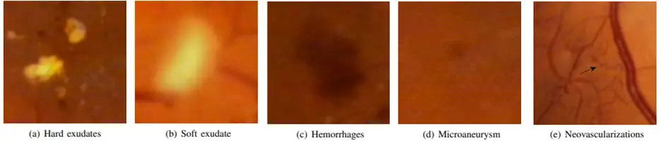

# DRiDB

<div align="center">
    <a href="https://github.com/openmedlab/"></a>
</div>
<p style="text-align:center;font-size:10px;"><em></em></p>

## Dataset Information

The DRiDB database contains 50 color fundus images, with 36 images showing signs of diabetic retinopathy (DR) and the remaining 14 images showing no signs of DR. Each image has a set of ground truth images, where each image has been independently annotated by five experts for DR findings. The experts were asked to mark areas related to microaneurysms, hemorrhages, hard exudates, and soft exudates. Additionally, they marked blood vessels, the optic disc, and the macula. The images in the DRiDB database were selected and captured by medical experts at a university hospital in Zagreb, showcasing a range of conditions from minimal signs of DR to visible new fragile blood vessels. The images were captured using a Zeiss VISUCAM 200 fundus camera in RGB color with a resolution of 720×576 pixels per color plane at 8 bits, and stored in an uncompressed BMP file format. These images exhibit varying degrees of image noise but can be used to assess the overall performance of diagnostic methods.

This database is the first to provide annotations of DR pathology and major fundus structures for each image, making it an ideal choice for designing and evaluating image processing algorithms for early detection of DR. The database includes annotations of typical DR symptoms such as microvascular lesions, hemorrhages, hard exudates, and soft exudates, as well as annotations of fundus structures like blood vessels, the optic disc, and the macula. These detailed annotations not only help evaluate the performance of image processing algorithms but also serve as a valuable resource for developing machine learning-based image processing algorithms.

## Dataset Meta Information

| Dimensions | Modality | Task Type      | Anatomical Structures | Anatomical Area | Number of Categories | Data Volume | File Format |
|------------|----------|----------------|-----------------------|-----------------|----------------------|-------------|-------------|
| 2D         | Fundus   | Classification | Eye                   | Eye             | 3                    | 648         | BMP         |


### Resolution Details

| Dataset Statistics | size         |
|--------------------|--------------|
| min                | (75, 100)    |
| median             | (413, 550)   |
| max                | (1704, 2272) |

## Label Information Statistics

The statistical results are subject to the actual data collected by the author:

| Categories | Number |
|------------|--------|
| 0          | 207    |
| 1          | 375    |
| 2          | 66     |


## Visualization


<div align="center">
    <a href="https://github.com/openmedlab/"></a>
</div>
<p style="text-align:center;font-size:10px;"><em> Paper Visualization.</em></p>

## File Structure

The file structure of the dataset is as follows: images are stored in the "images" directory, and the annotations for train and val are provided in txt format.

``` 
DRiDB
├── image
│   ├── xxx.BMP
│   ├── xxx.BMP
│   │    ...
│   ├── xxx.BMP
│   ├── xxx.BMP
│   │    ...
├── train.txt
├── val.txt
```

## Authors and Institutions

Pavle Prentaˇsi´c ( University of Zagreb, Faculty of Electrical Engineering and Computing)

Sven Lonˇcari´c ( University of Zagreb, Faculty of Electrical Engineering and Computing)


## Source Information

Official Website: https://ipg.fer.hr/ipg/resources/image_database

Download Link: https://ipg.fer.hr/ipg/resources/image_database

Article Address: https://ieeexplore.ieee.org/document/6703830

Publication Date: 2013

## Citation

``` 
@inproceedings{prentavsic2013diabetic,
  title={Diabetic retinopathy image database (DRiDB): a new database for diabetic retinopathy screening programs research},
  author={Prenta{\v{s}}i{\'c}, Pavle and Lon{\v{c}}ari{\'c}, Sven and Vatavuk, Zoran and Ben{\v{c}}i{\'c}, Goran and Suba{\v{s}}i{\'c}, Marko and Petkovi{\'c}, Tomislav and Dujmovi{\'c}, Lana and Malenica-Ravli{\'c}, Maja and Budimlija, Nikolina and Tadi{\'c}, Ra{\v{s}}eljka},
  booktitle={2013 8th International symposium on image and signal processing and analysis (ISPA)},
  pages={711--716},
  year={2013},
  organization={IEEE}
}
```

Original introduction article is [here](https://zhuanlan.zhihu.com/p/691172878).