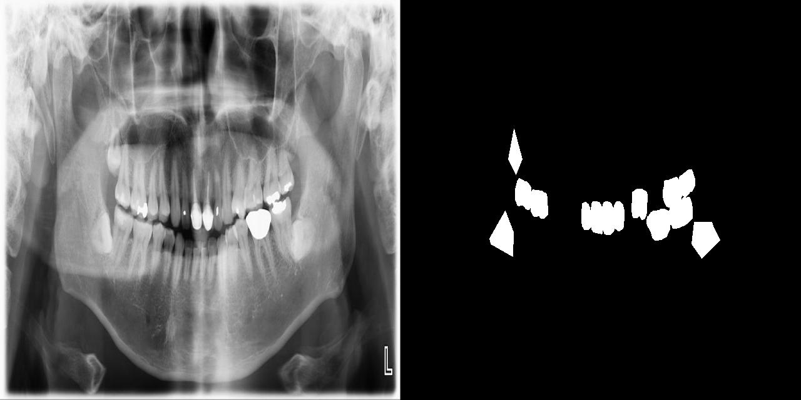

# Dental X Ray Computacional Vision Segmentation

<div align="center">
    <a href="https://github.com/openmedlab/"></a>
</div>
<p style="text-align:center;font-size:10px;"><em></em></p>

## Dataset Information

This dataset is a specialized medical imaging collection designed for dental X-ray image analysis. It originates from the Kaggle (processed) and Universe Roboflow (raw data) platforms. The dataset includes **8,188 high-quality dental X-ray images**, divided into training (4,772 images), validation (2,071 images), and testing sets (1,345 images) in approximately 58%, 25%, and 16% proportions, respectively.

The primary task for this dataset is **multi-class segmentation**, covering **14 different dental feature categories**, such as cavities, crowns, fillings, implants, and more. Each image is accompanied by detailed segmentation masks in **PNG format**, while the original images are stored in **JPG format**. Annotation data is stored in **COCO JSON format**, providing precise segmentation details.

This dataset serves as a valuable resource for researchers and medical professionals to develop and optimize algorithms for the automatic detection and diagnosis of dental conditions. Utilizing this dataset can enable the development of more accurate and efficient tools to assist dentists in diagnostics, enhancing their workflow and providing educational resources for dental students. Additionally, the dataset supports dental research by offering large-scale standardized data, facilitating the creation of novel diagnostic methods and treatment techniques. Ultimately, it aims to improve the quality and accessibility of dental care for patients. 

The relatively large validation set proportion (25%) is particularly beneficial for thorough model evaluation and fine-tuning, ensuring that the developed algorithms demonstrate high reliability and accuracy in real-world applications.

## Dataset Meta Information

| Dimensions | Modality | Task Type      | Number of Categories | Data Volume | File Format |
|------------|----------|----------------|----------------------|-------------|-------------|
| 2D         | X-Ray    | Segmentation   | 14                   | 8188        | JPG         |


### Resolution Details

| Dataset Statistics | size     |
|--------------------|----------|
| min                | 640x640  |
| median             | 640x640  |
| max                | 640x640  |

## Label Information Statistics

| English Name          | Chinese Name | Count  | Percentage |
|-----------------------|--------------|--------|------------|
| Caries               | 龋齿           | 6714   | 9.98%      |
| Crown                | 牙冠           | 7302   | 10.85%     |
| Filling              | 充填           | 28163  | 41.84%     |
| Implant              | 植入物          | 1377   | 2.05%      |
| Malaligned           | 错位           | 10     | 0.01%      |
| Mandibular Canal     | 下颌管          | 621    | 0.92%      |
| Missing teeth        | 缺牙           | 2592   | 3.85%      |
| Periapical lesion    | 根尖周病变        | 4092   | 6.08%      |
| Retained root        | 残留根          | 43     | 0.06%      |
| Root Canal Treatment | 根管治疗         | 12670  | 18.83%     |
| Root Piece           | 根段           | 2060   | 3.06%      |
| Croen (Crown)        | 牙冠           | 1      | 0.00%      |
| Impacted tooth       | 阻生齿          | 16362  | 24.31%     |
| Maxillary sinus      | 上颌窦          | 462    | 0.69%      |

## Visualization

<div align="center">
    <a href="https://github.com/openmedlab/"></a>
</div>
<p style="text-align:center;font-size:10px;"><em>Data Example 1 X-ray and mask.</em></p>

<div align="center">
    <a href="https://github.com/openmedlab/"></a>
</div>
<p style="text-align:center;font-size:10px;"><em>Data Example 2 X-ray and mask.</em></p>

## File Structure

``` 
DXR/
├── Dental X_Ray/
│   ├── test/
│   │   ├── test_mask/
│   │   │   └── [mask_files.png]
│   │   └── [image_files.jpg]
│   ├── train/
│   │   ├── train_mask/
│   │   │   └── [mask_files.png]
│   │   └── [image_files.jpg]
│   └── valid/
│   │   ├── train_mask/
│   │   │   └── [mask_files.png]
│   │   └── [image_files.jpg]
├── test_annotations.coco.json
├── train_annotations.coco.json
└── valid_annotations.coco.json
```

## Authors and Institutions

Arshs Workspace Radio (Unknown Institute)

## Source Information

Official Website: https://www.kaggle.com/datasets/henriquerezermosqur/dental-x-ray-computacional-vision-segmentation/data

Download Link: https://www.kaggle.com/datasets/henriquerezermosqur/dental-x-ray-computacional-vision-segmentation/data

Article Address: TBD

Publication Date: 2024-01

## Citation

``` 
@misc{
 vzrad2_dataset,
title = { vzrad2 Dataset },
type = { Open Source Dataset },
author = { Arshs Workspace Radio },
howpublished = { \url{ https://universe.roboflow.com/arshs-workspace-radio/vzrad2 } },
url = { https://universe.roboflow.com/arshs-workspace-radio/vzrad2 },
journal = { Roboflow Universe },
publisher = { Roboflow },
year = { 2024 },
month = { sep },
}
```

Original introduction article is [here](https://zhuanlan.zhihu.com/p/740707394).
