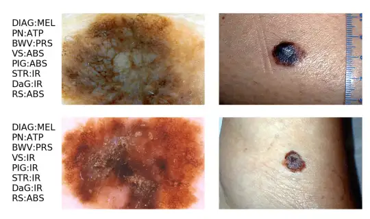
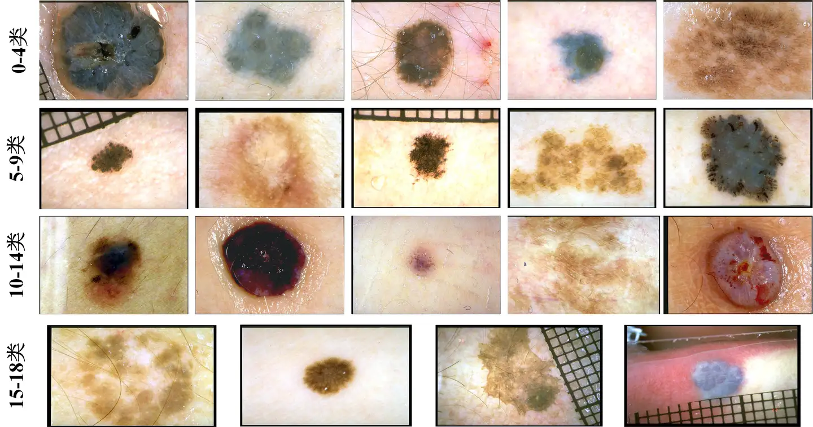

# Derm7pt

<div align="center">
    <a href="https://github.com/openmedlab/"></a>
</div>
<p style="text-align:center;font-size:10px;"><em></em></p>

## Dataset Information

**Derm7pt** is used to evaluate computer-based image predictions of the 7-point checklist for skin lesion malignancy. The dataset contains over 2,000 clinical and dermoscopic color images, along with corresponding structured metadata. These data are specifically tailored for training and evaluating computer-aided diagnosis (CAD) systems. The 7-point checklist consists of seven criteria that identify characteristics of skin lesions indicative of melanoma, with each criterion in the checklist associated with different labels. For example, "pigment network" is one of the checklist criteria and has three labels: atypical, typical, and absent. The term "category" refers to the diagnosis and the 7-point checklist criteria, while the term "label" refers to the specific items within a category.

Skin cancer is the most common malignancy in people with fair skin, and the incidence of melanoma and non-melanoma skin cancers is rising, leading to high economic costs. Early diagnosis of melanoma appears to improve patient outcomes, and methods such as full-body skin examinations under physician guidance, as well as screening of patients with specific skin symptoms, can enhance skin cancer detection.

## Dataset Meta Information

| Dimensions | Modality      | Task Type      | Anatomical Structures | Anatomical Area | Number of Categories | Data Volume | File Format |
|------------|---------------|----------------|-----------------------|-----------------|----------------------|-------------|-------------|
| 2D         | Dermatoscope  | Classification | Skin                  | Skin            | 19                   | 2000        | JPG         |


### Resolution Details

| Dataset Statistics | size        |
|--------------------|-------------|
| min                | (511, 767)  |
| median             | (512, 768)  |
| max                | (474, 626)  |

## Label Information Statistics

Here is the translated table in markdown format:

| Label                           | Quantity | Label                           | Quantity |
|---------------------------------|----------|---------------------------------|----------|
| 0: basal cell carcinoma         | 26       | 10: melanoma (0.76 to 1.5 mm)   | 17       |
| 1: blue nevus                   | 15       | 11: melanoma (more than 1.5 mm) | 12       |
| 2: clark nevus                  | 169      | 12: melanoma metastasis         | 3        |
| 3: combined nevus               | 12       | 13: melanosis                   | 10       |
| 4: congenital nevus             | 3        | 14: miscellaneous               | 6        |
| 5: dermal nevus                 | 8        | 15: recurrent nevus             | 5        |
| 6: dermatofibroma               | 13       | 16: reed or spitz nevus         | 45       |
| 7: lentigo                      | 12       | 17: seborrheic keratosis        | 26       |
| 8: melanoma (in situ)           | 19       | 18: vascular lesion             | 16       |
| 9: melanoma (less than 0.76 mm) | 62       |                                 |          |

## Visualization

<div align="center">
    <a href="https://github.com/openmedlab/"></a>
</div>
<p style="text-align:center;font-size:10px;"><em> Paper Visualization.</em></p>

<div align="center">
    <a href="https://github.com/openmedlab/"></a>
</div>
<p style="text-align:center;font-size:10px;"><em>Local visualization.</em></p>

## File Structure

``` 
Derm7pt Dataset
|
|-- class 0
|   |-- image1.jpg
|   |-- image2.jpg
|   |-- ...
|
|-- class 1
|   |-- image1.jpg
|   |-- image2.jpg
|   |-- ...
|
```

## Authors and Institutions

Jeremy Kawahara (Hamarneh are with the School of Computing Science, Simon Fraser University)

Sara Daneshvar (Hamarneh are with the School of Computing Science, Simon Fraser University)

Giuseppe Argenziano (Hamarneh are with the School of Computing Science, Simon Fraser University)

## Source Information

Official Website: https://derm.cs.sfu.ca/Welcome.html

Download Link: https://derm.cs.sfu.ca/Welcome.html

Article Address: https://ieeexplore.ieee.org/document/8333693

Publication Date: 2019

## Citation

``` 
@article{2018Seven,
  title={Seven-Point Checklist and Skin Lesion Classification Using Multitask Multimodal Neural Nets},
  author={ Kawahara, Jeremy  and  Daneshvar, Sara  and  Argenziano, Giuseppe  and  Hamarneh, Ghassan },
  journal={IEEE Journal of Biomedical and Health Informatics},
  pages={538-546},
  year={2018},
}
```

Original introduction article is [here](https://zhuanlan.zhihu.com/p/713967883).