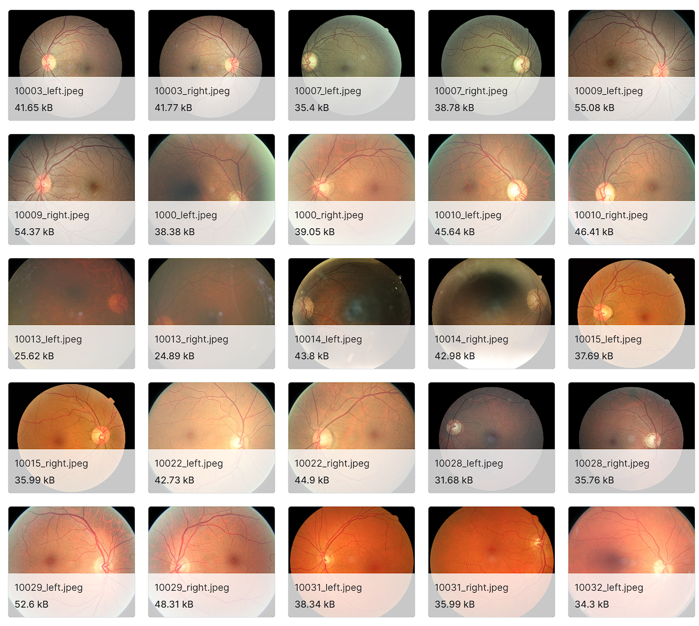
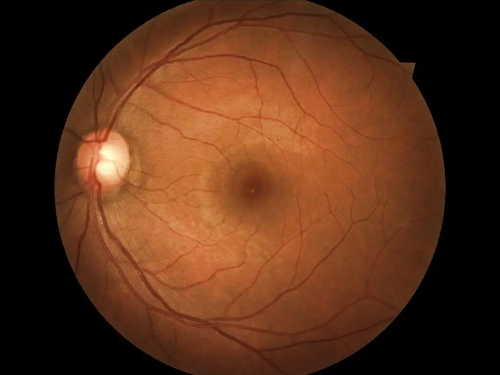
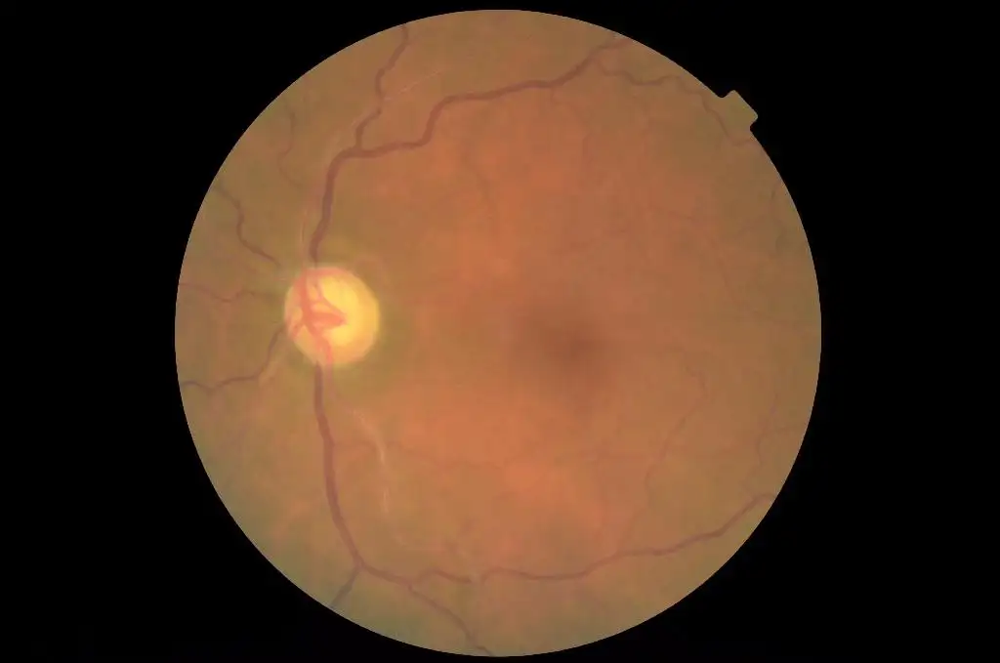
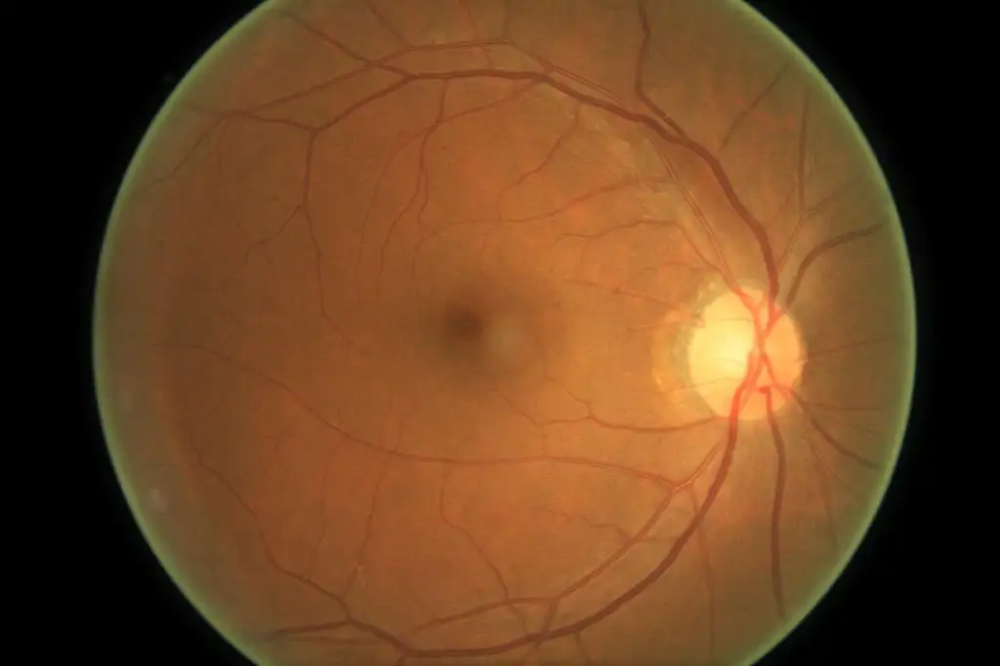
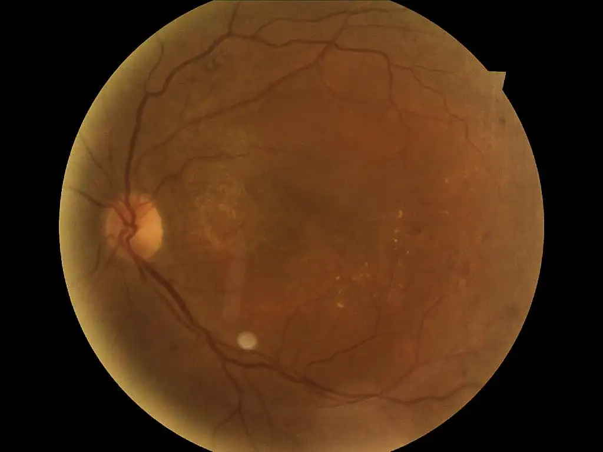
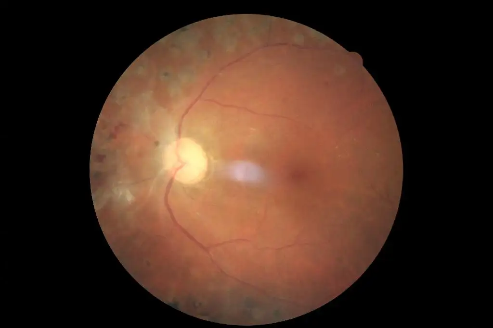

# Diabetic Retinopathy Arranged

<div align="center">
    <a href="https://github.com/openmedlab/"></a>
</div>
<p style="text-align:center;font-size:10px;"><em></em></p>

## Dataset Information

The Diabetic Retinopathy Arranged dataset is a fundus photography dataset for diabetic retinopathy classification. The dataset is sourced from the Alibaba Tianchi platform and includes five categories: 0 - No DR, 1 - Mild, 2 - Moderate, 3 - Severe, and 4 - Proliferative DR. It contains a total of 35,127 images, with corresponding fundus photographs for each category.

This dataset has significant clinical implications for the automatic grading and diagnosis of diabetic retinopathy. Diabetic retinopathy is a common complication of diabetes that can lead to vision loss and even blindness. Traditional diagnostic methods rely on manual interpretation of fundus photographs by doctors, which is inefficient and subject to subjective factors. Using this dataset, high-accuracy AI models can be trained to achieve rapid screening and automatic grading of diabetic retinopathy. This helps doctors improve diagnostic efficiency and alleviates the shortage of screening specialists to some extent, making it highly promising for clinical applications.

## Dataset Meta Information

| Dimensions | Modality | Task Type       | Anatomical Structures | Anatomical Area | Number of Categories | Data Volume | File Format |
|------------|----------|-----------------|-----------------------|-----------------|----------------------|-------------|-------------|
| 2D         | Fundus   | Classification  | Retina                | Eye             | 5                    | 35127        | JPEG        |


### Resolution Details


| Dataset Statistics | size         |
|--------------------|--------------|
| min                | (1024, 1024) |
| median             | (1024, 683)  |
| max                | (400, 315)   |

## Label Information Statistics

| Diabetic Retinopathy | 0 - No DR | 1 - Mild | 2 - Moderate | 3 - Severe | 4 - Proliferative DR |
|----------------------|-----------|----------|--------------|-----------|----------------------|
| Occurrences          | 25810     | 2443     | 5292         | 873       | 708                  |
| Percentage           | 73.48%    | 6.95%    | 15.07%       | 2.49%     | 2.02%                |


## Visualization

<div align="center">
    <a href="https://github.com/openmedlab/"></a>
</div>
<p style="text-align:center;font-size:10px;"><em>0 - No DR</em></p>

<div align="center">
    <a href="https://github.com/openmedlab/"></a>
</div>
<p style="text-align:center;font-size:10px;"><em>1 - Mild</em></p>

<div align="center">
    <a href="https://github.com/openmedlab/"></a>
</div>
<p style="text-align:center;font-size:10px;"><em>2 - Moderate</em></p>

<div align="center">
    <a href="https://github.com/openmedlab/"></a>
</div>
<p style="text-align:center;font-size:10px;"><em>3 - Severe</em></p>

<div align="center">
    <a href="https://github.com/openmedlab/"></a>
</div>
<p style="text-align:center;font-size:10px;"><em>4 - Proliferative DR</em></p>

## File Structure

The official dataset provides two zip files:

1. **SegRap2023_Training_Set_120cases.zip**: This contains the split masks for each category and 2 image modalities, including 2 images + 45 OAR masks + 2 GTV masks, totaling 49 nifti files.

2. **SegRap2023_Training_Set_120cases_OneHot_Labels.zip**: This is divided into two tasks, each containing the integrated multi-class mask file for each case.

``` 
Dataset
│
├── Diabetic
│   ├── 0
│   │   ├── 10_left.jpeg
│   │   ├── 10_right.jpeg
│   └── ...
│   ├── 1
│   │   ├── 15_left.jpeg
│   │   ├── 17_right.jpeg
│   └── ...
│   ├── 2
│   │   ├── 78_left.jpeg
│   │   ├── 79_right.jpeg
│   └── ...
│   ├── 3
│   │   ├── 99_left.jpeg
│   │   ├── 99_right.jpeg
│   └── ...
│   ├── 4
│   │   ├── 16_left.jpeg
│   │   ├── 16_right.jpeg
│   └── ...
```


## Source Information

Official Website: https://tianchi.aliyun.com/dataset/93926

Download Link: https://tianchi.aliyun.com/dataset/93926

Article Address: TBD

Publication Date: 2021-03

## Citation

``` 
@misc{Tianchi,
author = {Alibaba Tianchi Platform},
title = {Diabetic Retinopathy Arranged Dataset},
year = {2023},
publisher = {Alibaba Cloud},
journal = {Tianchi},
howpublished = {\url{https://tianchi.aliyun.com/dataset/93926}},
note = {Accessed: 2021-03-10},
keywords = {dataset, diabetic retinopathy, medical image classification},
}
```

Original introduction article is [here](https://zhuanlan.zhihu.com/p/693153956).