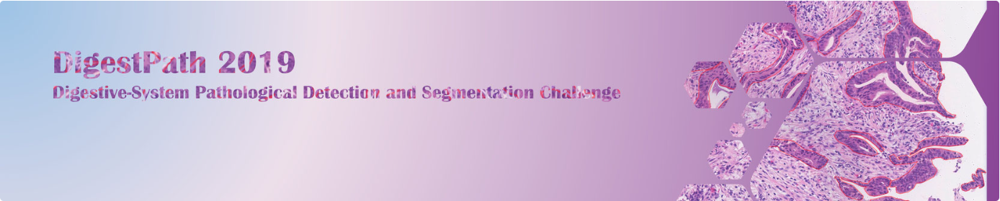
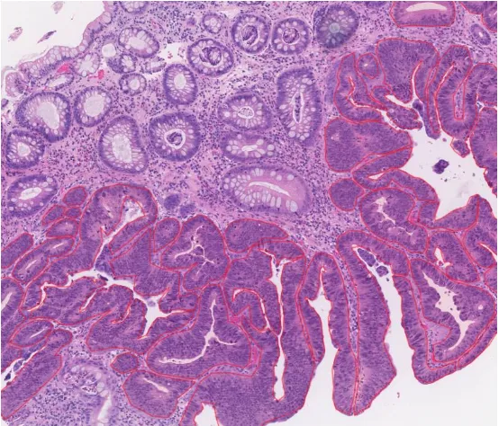
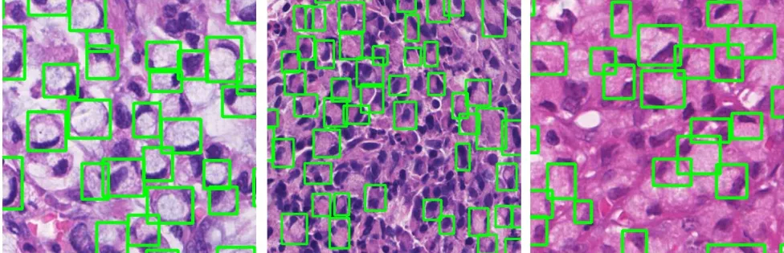

# DigestPath2019

<div align="center">
    <a href="https://github.com/openmedlab/"></a>
</div>
<p style="text-align:center;font-size:10px;"><em></em></p>

## Dataset Information

DigestPath 2019 (Digestive-System Pathological Detection and Segmentation Challenge) is the first dataset focused on the detection of signet ring cells and tissue screening in colonoscopy images from the digestive system, providing publicly available pathological images with expert-level annotations. The dataset consists of positive and negative samples. The positive samples involve 20 whole slide images (WSIs) with annotated bounding boxes of signet ring cells, recorded in XML format. Negative samples are derived from 79 WSIs, which may contain other tumor cells besides signet ring cells. All signet ring cells are precisely marked by pathologists and accompanied by rectangular bounding boxes. The images are sourced from two organs, the stomach mucosa and the intestines. Some positive images in the dataset may not be fully annotated due to the manual annotation challenge and may carry certain noise. Furthermore, to validate the accuracy of the methods, a test set of 227 images from 56 patients is introduced, including 27 images with signet ring cells and samples from 11 patients. The test set also aims to assess false-positive responses to normal areas by including negative samples affected by health and other cancers.

Early detection of signet ring cell carcinoma, a rare adenocarcinoma with a poor prognosis, is vital for improving patient survival rates. Although the detection of signet ring cells is critical, there has been a lack of specialized public datasets to support research in this field until now. With the rise of digital pathology, remote analysis of high-resolution WSIs has become possible, which is especially beneficial for regions with limited resources. However, manual analysis of WSIs remains time-consuming and labor-intensive due to their vast size (up to 100,000 x 100,000 pixels), limiting the application of remote diagnostics in regions with a shortage of human resources. Developing medical models that can automatically detect, segment, and classify target cells in pathological images presents a promising method to address this challenge.

## Dataset Meta Information

| Dimensions | Modality | Task Type                             | Anatomical Area | Number of Categories | Data Volume | File Format |
|------------|----------|---------------------------------------|-----------------|----------------------|-------------|-------------|
| 2D         | Pathology Image      | Segmentation/Detection/Classification | Cell            | 1                    | 250         | PNG         |


### Resolution Details

| Dataset Statistics | size        |
|--------------------|-------------|
| min                | (2516, 4297)  |
| median             | (4637, 4456)  |
| max                | (22701, 19314)  |

## Label Information Statistics

| Category          | Retinal Vessel |
|-------------------|--------------|
| Number of Images  | 250          |
| Availability      | 100%         |
| Small Vessel Count| 24987         |
| Medium Vessel Count| 2446102        |
| Large Vessel Count| 117096644        |

## Visualization

<div align="center">
    <a href="https://github.com/openmedlab/"></a>
</div>
<p style="text-align:center;font-size:10px;"><em></em></p>

<div align="center">
    <a href="https://github.com/openmedlab/"></a>
</div>
<p style="text-align:center;font-size:10px;"><em>DigestPath2019 example.</em></p>

## File Structure

The file structure of the DigestPath2019 dataset is as follows. The DigestPath2019 dataset consists of two folders: "images" and "masks", where the former contains the images, and the latter contains the corresponding annotations.

``` 
MoNuSeg       
├── images            
│       ├── 01.png
│       ├── 02.png
│       └──  ...
├── masks            
│       ├── 01.png
│       ├── 02.png
│       └──  ...
```

## Authors and Institutions

Yanfei Zuo (Histo Pathology Diagnostic Center, Shanghai, China )

Hongsheng Li (SenseTime Research, Chinese University of Hong Kong, Hong Kong, China)

Chaofu Wang (Ruijin Hospital, Shanghai, China)

Zhe Wang, (Xijing Hospital, Xi'an, China)

Li Zhang (Shanghai Songjiang District Central Hospital, Shanghai, China)


## Source Information

Official Website: https://digestpath2019.grand-challenge.org/Home/

Download Link: https://digestpath2019.grand-challenge.org/Dataset/

Article Address: https://doi.org/10.1016/j.media.2022.102485

Publication Date: 2019

## Citation

``` 
@article{da2022digestpath,
  title={DigestPath: A benchmark dataset with challenge review for the pathological detection and segmentation of digestive-system},
  author={Da, Qian and Huang, Xiaodi and Li, Zhongyu and Zuo, Yanfei and Zhang, Chenbin and Liu, Jingxin and Chen, Wen and Li, Jiahui and Xu, Dou and Hu, Zhiqiang and others},
  journal={Medical Image Analysis},
  volume={80},
  pages={102485},
  year={2022},
  publisher={Elsevier}
}
```

Original introduction article is [here](https://zhuanlan.zhihu.com/p/681076261).