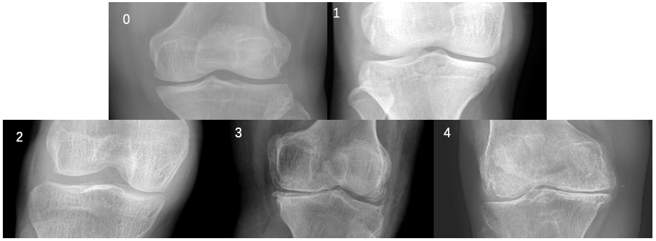

# Digital Knee X-ray Images

<div align="center">
    <a href="https://github.com/openmedlab/"></a>
</div>
<p style="text-align:center;font-size:10px;"><em></em></p>

## Dataset Information

The Digital Knee X-ray Images dataset contains 1,650 digital X-ray images of knee joints, sourced from renowned hospitals and diagnostic centers. The X-rays were captured using a PROTEC PRS 500E X-ray machine, and the original images are 8-bit grayscale. Each knee X-ray image is manually annotated by two medical experts according to the Kellgren and Lawrence grading system. A novel method based on pixel density has been developed to automatically extract the joint cartilage area (area of interest).

This dataset holds significant importance in the medical field as it aids researchers and clinicians in better understanding and diagnosing knee joint diseases, especially osteoarthritis (OA). Combining automated and manual annotations, this dataset provides a valuable resource for developing and validating new medical image analysis algorithms.

## Dataset Meta Information

| Dimensions | Modality  | Task Type      | Anatomical Structures  | Number of Categories | Data Volume | File Format |
|------------|-----------|----------------|------------------------|----------------------|-------------|-------------|
| 2D         | X-Ray     | Classification | Knee                   | 5                    | 1650        | PNG         |

The dataset provides two versions of annotations, each containing annotations for 1,650 X-ray images.

### Resolution Details

| Dataset Statistics | size               |
|--------------------|--------------------|
| min                | (300, 162)         |
| median             | (338.327, 161.887) |
| max                | (640, 161)         |

Minimum size: (300, 162), filename: ModerateG3 (162).png, maximum size: (640, 161), filename: ModerateG3 (181).png.

## Label Information Statistics

| Grading Scale    | Normal  | Doubtful   | Mild   | Moderate  | Severe   |
|------------------|---------|------------|--------|-----------|----------|
| Severity Code    | 0       | 1          | 2      | 3         | 4        |
| MedicalExpert-I  | 514     | 477        | 232    | 221       | 206      |
| MedicalExpert-II | 503     | 488        | 232    | 221       | 206      |


## Visualization


<div align="center">
    <a href="https://github.com/openmedlab/"></a>
</div>
<p style="text-align:center;font-size:10px;"><em>0-4 represents different levels from normal to severe.</em></p>

## File Structure

``` 
MedicalExpert-I/
|-- 0Normal/
|   |-- NormalG0 (1).png
|   |-- NormalG0 (2).png
|   |-- ...
|-- 1Doubtful/
|   |-- ...
|-- 2Mild/
|   |-- ...
|-- 3Moderate/
|   |-- ...
|-- 4Severe/
|   |-- ...
MedicalExpert-II/
|-- 0Normal/
|   |-- NormalG0 (1).png
|   |-- NormalG0 (2).png
|   |-- ...
|-- 1Doubtful/
|   |-- ...
|-- 2Mild/
|   |-- ...
|-- 3Moderate/
|   |-- ...
|-- 4Severe/
|   |-- ...
```

## Authors and Institutions

Shivanand Gornale (Rani Channamma University)

Pooja Patravali (Rani Channamma University)


## Source Information

Official Website: https://data.mendeley.com/datasets/t9ndx37v5h/1

Download Link: https://data.mendeley.com/datasets/t9ndx37v5h/1

Article Address: https://data.mendeley.com/datasets/t9ndx37v5h/1

Publication Date: 2020-6-23

## Citation

``` 
@misc{gornale_shivanand_2020_41241861,
author       = {Gornale, Shivanand and
Patravali, Pooja},
title        = {Digital Knee X-ray Images},
year         = {2020},
publisher    = {Mendeley Data},
doi          = {10.17632/t9ndx37v5h.1},
version      = {V1},
url          = {https://doi.org/10.17632/t9ndx37v5h.1}
}
```

Original introduction article is [here](https://zhuanlan.zhihu.com/p/703354362).