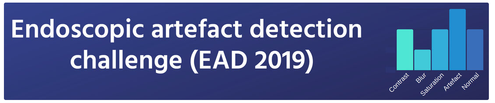

# Endoscopy Artifact Detection (EAD 2019)

<div align="center">
    <a href="https://github.com/openmedlab/"></a>
</div>
<p style="text-align:center;font-size:10px;"><em></em></p>

## Dataset Information

The EAD 2019 (Endoscopy Artifact Detection) dataset focuses on the detection and segmentation of artifacts in endoscopic videos and is a comprehensive multimodal dataset. It brings together videos from 6 different data centers, covering a variety of tissue types such as gastroscopy, cystoscopy, gastroesophageal, and colonoscopy, as well as various imaging modes including white light, fluorescence, and narrow-band imaging. The dataset includes about 2000 frames of training videos and 500 frames of testing videos, which involve a variety of artifact types such as pixel saturation and motion blur. To improve the generalizability of algorithms, the dataset has been specifically designed with a generalization challenge video set of about 200 frames from different data centers. All video frames have been meticulously annotated by experts, including bounding boxes and semantic segmentation masks, aimed at promoting precise identification and segmentation of artifacts, and enhancing the quality and accuracy of endoscopic image analysis.

Endoscopy is a clinical tool commonly used for early detection of various cancers (such as nasopharyngeal, esophageal adenocarcinoma, gastric, colorectal, and bladder cancer) as well as for treatment and minimally invasive surgery (such as laparoscopic surgery). This device, whether rigid or flexible, is a long, thin tubular instrument with a light source and camera that allows doctors to observe the inside of organs through a screen. However, endoscopic video frames are often affected by a variety of artifacts, such as pixel saturation, motion blur, defocusing, specular reflections, bubbles, and debris. These not only make diagnosis difficult but also affect necessary subsequent analysis, such as video stitching and frame retrieval. Therefore, accurately detecting these artifacts is crucial for improving the quality of endoscopic video frames and developing reliable computer-assisted endoscopic tools, thereby improving patient care.

## Dataset Meta Information

| Dimensions | Modality  | Task Type               | Anatomical Structures | Number of Categories | Data Volume | File Format |
|------------|-----------|-------------------------|-----------------------|----------------------|-------------|-------------|
| 2D         | Endoscopy | Detection, Segmentation | Esophagus, colon, stomach, bladder, liver         | 7                    | 2991        | jpg, tif    |


### Resolution Details

| Dataset Statistics | size        |
|--------------------|-------------|
| min                | 1920x1080  |
| median             | 659x369   |
| max                | 774x434   |

## Label Information Statistics

Artifact detection training set (total 2147)

| Artifact Type | Ratio  |
|---------------|--------|
| Specularity   | 32.12% |
| Saturation    | 6.41%  |
| Artifact      | 29.23% |
| Blur          | 3.84%  |
| Contrast      | 8.93%  |
| Bubbles       | 16.93% |
| Instrument    | 2.5%   |

Artifact detection test set (total 195)

| Artifact Type | Ratio   |
|---------------|---------|
| Specularity   | 51.78%  |
| Saturation    | 4.04%   |
| Artifact      | 26.29%  |
| Blur          | 1.87%   |
| Contrast      | 3.44%   |
| Bubbles       | 10.73%  |
| Instrument    | 1.85%   |

Generalization set (total 52)

| Artifact Type | Ratio   |
|---------------|---------|
| Specularity   | 56%     |
| Saturation    | 4.33%   |
| Artifact      | 26.18%  |
| Blur          | 0.98%   |
| Contrast      | 1.77%   |
| Bubbles       | 7.58%   |
| Instrument    | 3.15%   |

Artifact segmentation training set (total 475)

| Artifact Type | Ratio   |
|---------------|---------|
| Specularity   | 20.61%  |
| Saturation    | 20.55%  |
| Artifact      | 18.48%  |
| Bubbles       | 18.88%  |
| Instrument    | 21.48%  |

Artifact segmentation test set (total 122)

| Artifact Type | Ratio   |
|---------------|---------|
| Specularity   | 25.96%  |
| Saturation    | 18.95%  |
| Artifact      | 28.07%  |
| Bubbles       | 16.49%  |
| Instrument    | 10.53%  |

## Visualization

<div align="center">
    <a href="https://github.com/openmedlab/"></a>
</div>
<p style="text-align:center;font-size:10px;"><em></em></p>

## File Structure

The official file structure is as follows: the `trainingData_detection` folder contains data for object detection, divided into `images` subfolder for storing images and `annotations` subfolder for storing corresponding annotation files. The `trainingData_semanticSegmentation` folder contains data for semantic segmentation, where the `original_images` subfolder stores the original images, and the `segmentation_masks` subfolder stores the corresponding segmentation masks.

``` 
Dataset
│
├── trainingData_detection
│   ├── 00000.jpg
│   ├── 00000.txt
│   └── ...
├── trainingData_semanticSegmentation
│   ├── 0_original_images
│       ├──00000.jpg
│       ├──00000_batch2.jpg
│       └── ...
│   ├── 00000.tif
│   ├── 00000_batch2.tif
│   └── ...
```

## Authors and Institutions

Sharib Ali (Institute of Biomedical Engineering, Department of Engineering Science, University of Oxford, UK)

Felix Zhou (Ludwig Institute for Cancer Research, University of Oxford, UK)

Christian Daul (University of Lorraine, CNRS, France)

Maxim Loshchenov (Prokhorov General Physics Institute of the Russian Academy of Sciences, Russia)


## Source Information

Official Website: https://ead2019.grand-challenge.org/EAD2019/

Download Link: https://github.com/sharib-vision/EAD2019/tree/master

Article Address: https://arxiv.org/abs/1905.03209

Publication Date: 2019-08

## Citation

``` 
@article{SREP2020:ali,
title ={An objective comparison of detection and segmentation algorithms for artefacts in clinical endoscopy.},
author= {Ali, S., Zhou, F., Braden, B. et al.},
journal={Scientific Reports},
year={2020},
volume={10},
pages={2748},
doi={https://doi.org/10.1038/s41598-020-59413-5}
}

@misc{EAD2019endoscopyDatasetI,   

title={Endoscopy artifact detection (EAD 2019) challenge dataset},

author={Sharib Ali and Felix Zhou and Christian Daul and Barbara Braden and Adam Bailey and Stefano Realdon and James East and Georges Wagnières and Victor Loschenov and Enrico Grisan and Walter Blondel and Jens Rittscher},
year={2019},
eprint={1905.03209},
archivePrefix={arXiv},
 primaryClass={cs.CV}
}

@misc{EAD2019endoscopyDatasetII,
    title={A deep learning framework for quality assessment and restoration in video endoscopy},
    author={Sharib Ali and Felix Zhou and Adam Bailey and Barbara Braden and James East and Xin Lu and Jens Rittscher},
    year={2019},
    eprint={1904.07073},
    archivePrefix={arXiv},
    primaryClass={cs.CV}
}
```

Original introduction article is [here](https://zhuanlan.zhihu.com/p/656550928).